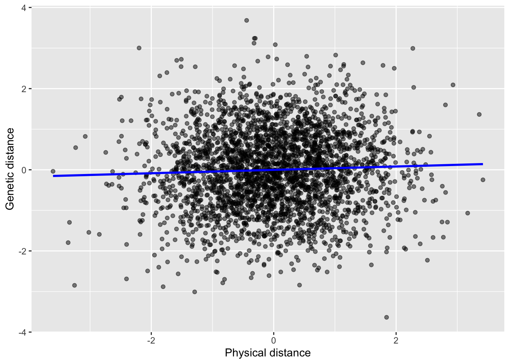

# Decision-making with frequentist estimates

Note: add correct way to get binomial probabilitiy based on likelihood of the observation under the null for p-value

We have randomly sampled 100 people from a population of 10,000 and found that 8 of the 100 tested positive for a viral infection. Our frequentist estimate of the proportion infected is 0.08. We have quantified uncertainty about that estimate represented by the standard error (SE = 0.027) and confidence intervals. Based on the confidence interval, we can be 95% confident that the true proportion infected is between 0.026 and 0.134.

So there we have it. We have an estimate and have quantified uncertainty about the estimate with frequentist methods. What do we do with this information? Recall that our goal is to determine whether the prevalence of the infection is greater than 10%, a threshold that would trigger public health interventions. What should we conclude?

The decision in front of us is the crux of scientific inference. We gather structured observations to test ideas, which we can represent by numerical quantities. In this case, the quantity is a simple proportion. In other cases, we might have a causal hypothesis about how one variable affects another variable. We can represent those ideas with numerical quantities as well, and we'll start doing that in a few chapters. But before we get there, we need to address this question of how we make a *decision* about a scientific idea based on our sample data. In this chapter, we'll take a look at the tools to make decisions about hypotheses when estimates are made with frequentist methods.

## Framework of classical hypothesis testing

### State null and alternative hypotheses

Classical hypothesis testing boils down to this. How likely are the observed sample data under the hypothesis that nothing interesting is going on? The idea that nothing interesting is going on is called the **null hypothesis**, abbreviated $H_{0}$, which represents a hypothesis of "no effect". Indeed, the word *null* means *nothing*.

Consider some examples of null hypotheses in practice. If you're comparing the effect of a drug on blood pressure relative to a control (e.g., placebo), the null hypothesis is that there is no effect of the drug. If you're examining the effect of greenspace around a person's home on their mental health status, the null hypothesis is that there's no effect of green space. If you're examining the effect of pollution on the number of fish, the null hypothesis is that there's no effect.

This is straightforward for situations where one has a causal hypothesis, but what about our case of describing the prevalence of a disease. In cases of description, the typical approach is to define the null hypothesis as a particular numerical value. For example, we could the null hypothesis that the prevalence is exactly 10%, which is the cutoff for triggering public health interventions.

What if we conclude the prevalence is *not* 10%? In such a case, we reject the null hypothesis and conclude the data support the **alternative hypothesis**, $H_A$. The alternative hypothesis is simply the opposite of the null hypothesis. There is an effect of the drug on blood pressure, there is an effect of greenspace on mental health, there is an effect of pollution on fish population size, and the prevalence of the viral illness is not 10%.

Because we are using data to inform our decision about hypotheses, we need to define null and alternative hypotheses as specific quantitative values of the parameter(s) of interest. For example, to test if the prevalence of the viral illness exceeds 10%, we could test the following statistical hypotheses:

$$
H_0: p_{infected}=0.10 \\
H_A: p_{infected}>0.10
$$ 

Here the null hypothesis is that 10% of the population is infected, and the alternative hypothesis is that greater than 10% are infected, reflecting values that would trigger interventions. The alternative hypothesis in this case is directional, specifying values only greater than 10%. This is called a **one-sided** hypothesis. Once our statistical hypotheses are specified numerically, we confront the hypotheses with data we've collected to see which hypothesis is more consistent with the data.

Defining statistical hypotheses numerically is straightforward for simple questions of description, but it can also be done when making causal hypotheses. For example, if we are examining the effect of pollution on fish populations, we could frame our statistical hypotheses numerically in this way:

$$
H_0: \mu_{polluted}-\mu_{unpolluted}=0 \\
H_A: \mu_{polluted}-\mu_{unpolluted}\neq0
$$ 

Here we've identified the mean number of fish in polluted and unpolluted waters as the parameters of interest. The null hypothesis says the difference in the mean number of fish between polluted and unpolluted areas is 0, meaning there is no difference between the means, which is what we might expect if pollution has no effect on fish populations. In this case the hypothesis is **two-sided** because it does not specify directionality of a potential effect, allowing for the possibility that fish are more populated in polluted than unpolluted areas, or vice-versa. For reasons we will see later, it is generally more conservative (and often more appropriate for causal hypotheses) to use two-sided tests.

Ultimately the precise way in which null and alternative hypotheses are framed depends on the research question and the parameters that best represent the scientific hypothesis being tested. Sometimes those parameters are simple means and proportions, and other times they will be values from more complex quantitative models, such as linear models that we'll turn our attention to in a few chapters.

### Assume the null hypothesis is true

So far we have seen that hypothesis testing involves flipping a scientific hypothesis on its head by forming a null hypothesis that assumes *no effect*, or that nothing interesting is going on. As if that wasn't peculiar enough, we now presume that the null hypothesis is true. Why do that?

To understand the focus on a null hypothesis, it's critical to remember that the foundation of frequentist inference is the idea that probability is defined in terms of long-run frequency. The concept of the sampling distribution illustrates this idea nicely. Consider that we're testing the hypothesis that pollution affects fish population size by comparing the mean number of fish between polluted and unpolluted areas. The frequentist approach assumes there is some true value for the difference in the mean population size between these areas. We can estimate the difference in the means between areas in each sample, but the challenge we face is that we are likely to find *some* difference in the means between areas even if only by chance. Indeed, the sampling distribution shows us that the estimates of any quanity from random samples will form a probability distribution around the true value of the parameter. Estimates close to the true parameter are most likely, but deviations from the truth happen because of sampling error.

Now, in practice we don't know the true difference in the means, which is why we're doing the study in the first place! Without knowing the true difference in the means, we can't describe the actual sampling distribution. But what we can do is assume the parameter takes on a particular value. If we do that, we can describe the sampling distribution based on that assumed parameter value and the estimated standard error, and then we can ask how likely it is that we'd see the particular estimate in our sample data under that assumption.

Fundamentally, frequentist hypothesis testing is basically about asking how likely the observed data are from a sample under some assumed parameter value. But what value should we assume for the parameter? Should we assume a value that reflects our scientific hypothesis? Perhaps the scientific hypothesis is that pollution will reduce fish populations because of toxicity effects on survival and reproduction. Makes sense. But what parameter value would best reflect that hypothesis? Should we assume the mean population size is 200 in polluted waters and 500 in unpolluted waters, such that the difference of the means is 300? Or what about a smaller effect, such as 467 in unpolluted waters and 425 in polluted waters, for a difference of 42?

Hopefully you see the problem. There's an infinite number of possible values that the parameter could take on to be consistent with our scientific hypothesis. Frequentists solve this problem by isolating the *one* parameter value that would *not* be consistent with teh scientific model, namely that there's no difference in fish populations between polluted and unpolluted waters. In other words, the null hypothesis! The only numerical value for the difference in the means consistent with the null hypothesis is 0. It's much more tractable to form the sampling distribution around the null hypothesis, and then quantify how likely the data are in light of that null hypothesis. The idea is that if the data aren't all that likely under the null hypothesis, then maybe the null hypothesis is wrong!

So ultimately the frequentist approach focuses on the null hypothesis because we can isolate a single parameter value for the null hypothesis to form a sampling distribution and quantify the likelihood of our data from that sampling distribution. The sampling distribution for the null hypothesis is called the **null distribution**. If the sample data are relatively likely under the null distribution, then we can conclude the data are consistent with the null hypothesis. If the sample data are very unlikely under the null distribution, then we will reject the null hypothesis and conclude the data support the alternative hypothesis, which is just the inverse of the null.

Assuming the null hypothesis is true is not an intuitive approach given that our scientific hypothesis is that there *is* an effect of pollution, but under the frequentist approach, it's the most practical option. If your head is spinning and you're thinking there are some problems with this approach, stay tuned! We'll address some of those challenges, but first let's finish working through the process.

### Quantify the likelihood of the data under the null hypothesis: P-values

Once we have defined the null hypothesis and have the data in hand, we can go ahead and quantify how likely the data are assuming the null hypothesis is true. Remember: the general idea here is that when we randomly sample from populations, we always expect some deviation between a sample estimate and the true parameter value because of sampling error. We can minimize that sampling error by maximizing sample sizes, but it never completely goes away. With a defined null hypothesis, we can quantify the probability of observing the data from our particular sample occurring simply by chance with a **P-value**.

Let's quantify a P-value for our question about the prevalence of the viral infection. To keep things simple for now, we're going to test the null hypothesis that the proportion infected is exactly 10%, with a two-sided alternative hypothesis that the proportion infected is not 10%:

$$
H_0: p_{infected}=0.10 \\
H_A: p_{infected}\neq0.10
$$

We observed 8 out of 100 infected, for an estimated prevalence of 8%. The question now before us is how likely that observation is under the null hypothesis that the prevalence is 10%, which we will quantify as a P-value. Actually, this isn't *quite* a P-value. Sorry, but it gets just a tad more complicated (and confusing). Rather than simply quantifying the probability of the observed data (the estimated prevalence of 8%) under the null distribution, we actually quantify the probability of the observed data *or data that are more extreme than the observed data relative to the null hypothesis*. What values are more extreme than 8% relative to the null hypothesized value of 10% when we take a sample of N = 100? Well, 7%, 6%, 5%, 4%, and so on. And because we are assuming a two-sided alternative hypothesis, values of 12%, 13%, 14%, etc. are equally or more extreme than 8% in relationship to the null hypothesized value.

Why do this? Why not just quantify the probability of the data point we observed under the null hypothesis that $p_{infected} = 0.1$ and call it good? We know how to do that with the `dbinom` function:


``` r
#exact probability of 8 out of 100 positives when p = 0.1
dbinom(x = 8, size = 100, prob = 0.1)
```

```
## [1] 0.114823
```

Indeed, the probability of 8 positives out of 100 tests when the prevalence is 10\$ is exactly 0.115. But we don't stop there for a couple reasons. First, the goal of null hypothesis testing is to understand how unusual the data are relative to the null hypothesized value, and we can't really tell how unusual the observation is without considering how likely more extreme observations would have been. Think of those observations as a sort of reference point. Second, consider a scenario where we had sampled more than 100 people. For example, assume we conducted N = 1000 tests. With 1000 tests there is much more resolution on the parameter space, where we can estimate prevalence down to the thousandths in comparison to the hundredths with a sample size of 100. That means the probability of any given outcome is lower with N = 1000 tests than N = 100 tests, simply because there are more possible outcomes. Indeed, the exact probability of 80 positives out of 1000 tests with p = 0.1 is only 0.004. That observation alone is unusual in large part because there are so many possible outcomes. This problem gets even worse for continuous distributions, where we can't quantify the probability of any single outcome at all because there are an infinite number of possible outcomes!

The solution to this issue is the quantify the probability of a range of possible values. Because the goal of null hypothesis testing is to try to identify if the data are unusual under the null hypothesis, we focus specifically on the probability of all outcomes *at least* as extreme as the data we observed. Thus, the P-value is defined as the probability of sample estimates at least as extreme as the one we observed relative to the null hypothesis, all conditional on the null hypothesis being true. And when we use a two-sided alternative hypothesis, we consider observations that are at least as extreme as the one we observed both above and below the null hypothesized value.


``` r
#all possible values of positive tests out of N = 100
x <- seq(from = 0, to = 100, by = 1)

#probability of each outcome assuming prevalence is 11%
p.hat <- dbinom(x = x, size = 100, prob = 0.10)

#combine into a data frame
d <- cbind.data.frame(x, p.hat)
d$pval <- ifelse(d$x <= 8 | d$x >=12, TRUE, FALSE)

#plot the sampling distribution
ggplot(d, aes(x = x, y = p.hat, fill = pval)) +
  geom_col(width = 1, color = "black", show.legend=FALSE) + 
 scale_fill_manual(values = c("TRUE" = "darkorange", "FALSE" = "steelblue")) +
  labs(x = "Number of positives out of N = 100", y = "Probability") +
  xlim(0,30) +
  theme_classic()
```

<div class="figure" style="text-align: center">

<p class="caption">(\#fig:a02_chunk02)Null distribution of the prevalence of infection based on a sample of N = 100 assuming the true prevalence is 10%. The values highlighted in orange make up the P-value for a two-sided hypothesis test when there are X = 8 positives.</p>
</div>

Figure \@ref(fig:a02_chunk02) illustrates the null distribution assuming the true prevalence is 10%, and it highlights the values used to quantify the P-value. This includes the actual observation of 8 positive tests, plus all lower values, as well as observations of 12 and above. We can quantify the P-value in this way:


``` r
sum(dbinom(x = c(0:8, 12:100), size = 100, prob=0.1))
```

```
## [1] 0.6178408
```

Here we see the p-value is 0.62. In other words, there was a 62% chance of seeing 8 or fewer positive tests, or 12 or more positive tests, if the true prevalence was exactly 10%.

Now in our particular circumstance, it is probably more appropriate to use a one-sided test because we are explicitly interested in the the possibility that the prevalence of the infection is *above* 10%. In such a case, we specify our statistical hypotheses in this way:

$$
H_0: p_{infected}=0.10 \\
H_A: p_{infected}>0.10
$$ 

A one-sided tests requires a different approach to quantify the P-value than a two-sided test. Whereas we include observations in both tails of the null distribution to quantify the P-value for a two-sided test, we include only values into the tail specified by the alternative hypothesis in a one-sided test. For our case of 8 out of 100 tests, that means we need to include the probability of getting 8, 9, 10, 11, 12, and so on out of 100 positives, which is illustrated in Figure \@ref(fig:a02_chunk04).


``` r
#all possible values of positive tests out of N = 100
x <- seq(from = 0, to = 100, by = 1)

#probability of each outcome assuming prevalence is 11%
p.hat <- dbinom(x = x, size = 100, prob = 0.10)

#combine into a data frame
d <- cbind.data.frame(x, p.hat)
d$pval <- ifelse(d$x >= 8, TRUE, FALSE)

#plot the sampling distribution
ggplot(d, aes(x = x, y = p.hat, fill = pval)) +
  geom_col(width = 1, color = "black", show.legend=FALSE) + 
 scale_fill_manual(values = c("TRUE" = "darkorange", "FALSE" = "steelblue")) +
  labs(x = "Number of positives out of N = 100", y = "Probability") +
  xlim(0,30) +
  theme_classic()
```

<div class="figure" style="text-align: center">

<p class="caption">(\#fig:a02_chunk04)Null distribution of the prevalence of infection based on a sample of N = 100 assuming the true prevalence is 10%. The values highlighted in orange make up the P-value for a one-sided hypothesis test when there are X = 8 positives.</p>
</div>

The P-value for the one-sided test is:


``` r
sum(dbinom(x = 8:100, size = 100, prob=0.1))
```

```
## [1] 0.7939491
```

We see that the P-value for a two-sided hypothesis test is 0.79. In other words, there was a 79% chance of seeing observations of 8 or more positive tests when the true prevalence is 10%.

### Making a decision based on the P-value and significance value

Hypothesis testing involves making a decision between two competing statistical hypotheses: the null and alternative. Indeed, these hypotheses are defined in a way to be mutually exclusive. If the prevalence of the disease is 10% (null hypothesis), then it must be some value other than 10% (alternative hypothesis). The goal is to determine if the data are more consistent with one hypothesis than another.

To accomplish this goal, the P-value is used to examine the likelihood of the data under the null hypothesis. The idea is that if the P-value is high, it means that the data are very consistent with the null hypothesis, and so perhaps the null hypothesis is true. Indeed, we saw the P-value was 0.79 when considering the null hypothesis that the prevalence of the infection is 10% against the alternative that the prevalence is greater than 10%. In other words, there was a 79% of seeing our data, or more extreme observations, if the prevalence is really 10%. Because that set of observations is quite likely under the null hypothesis, we conclude that the data support the null hypothesis and are inconsistent with the alternative hypothesis that the prevalence is greater than 10%.

But when should we conclude the opposite, that the data *don't* support the null hypothesis. Remember the **significance value** from the last chapter? The significance value, $\alpha$, represents a specific probability of observations being in the tails of the null distribution. In null hypothesis testing, the significance value represents the threshold for rejecting the null hypothesis. The most typical value of $\alpha$ is 0.05, such that if the P-value is below 0.05, one should conclude that the data do not support the null hypothesis. The idea is that if there's a less than 5% chance of seeing the observed data (or more extreme observations) under the null hypothesis, then maybe the null hypothesis isn't true. Those observations are so rare that we typically reject the null hypothesis and conclude that the data supports the alternative hypothesis.

For example, suppose that instead of finding X = 8 positives out of N = 100 tests, we find X = 17 positives instead. Let's compute the P-value under the null that the prevalence is 10% and the alternative that the prevalence is greater than 10%:


``` r
sum(dbinom(x = 17:100, size = 100, prob=0.1))
```

```
## [1] 0.02059881
```

<div class="figure" style="text-align: center">

<p class="caption">(\#fig:a02_chunk07)Null distribution of the prevalence of infection based on a sample of N = 100 individuals assuming the true prevalence is 10%. The values highlighted in orange make up the P-value for a one-sided hypothesis test when there are X = 17 positives.</p>
</div>

We see the P-value in this case with X = 17 positives is only 2%. Figure \@ref(fig:a02_chunk07) illustrates the null distribution and highlights the values used to compute the P-value in this case. The interpretation here is that there was only a 2% chance of getting 17 or greater positives if the true prevalence was 10%. Because the P-value is below the significance value of 0.05, we would reject the null hypothesis and conclude the data support the alternative hypothesis that the prevalence is greater than 10%.

### Decision errors happen

If you think about it, the sampling distribution tells us that we *should* see the observations outer 5% of the null distribution exactly 5% of the time *when the null hypothesis is true*. Indeed, extreme observations happen just by chance! We're simply concluding that our one sample estimate in those tails is not a chance event, but we could be wrong. How often will we be wrong in this case? Well, exactly 5% of the time, or whatever level we set for the signfiicance value.

This kind of error, where we reject a null hypothesis that is actually true, is (boringly) called a **Type I error**. The idea is simply that if we can imagine the null hypothesis is actually true and we repeat our sampling process thousands of times, we would see extreme observations in the outer 5% of the null distribution exactly 5% of the time.

We can also make the opposite error, namely *failing* to reject a null hypothesis that is false. This is called a **Type II error**, and unlike a Type I error, the probability of a Type II error is not straightforward. In general, the probability of a Type II error is most common under the following circumstances:

-   The quantities being estimated are estimated with low precision (i.e., high standard error). Remembering that the standard error is a ratio of the standard deviation (variability among observations) to teh sample size, we know that precision is lowest when there is high variability int he observations and low sample size. In other words, low sample size and high variability in the observations both contribute to a greater likelihood of a Type II error.
-   The **effect size** is small. Imagine you are comparing the difference in mean population size of those fish between polluted and unpolluted areas. The magnitude of the difference in the mean population between polluted and unpolluted areas is the effect size. When effect sizes are small, in this case only a small difference in the population sizes between areas, then the probability of a Type II error is greater.
-   Low significance value. There's nothign special about a significane value of 0.05. Indeed, one could set it higher or lower, but there's a trade-off. Lowering the significance value will decrese the probability of a Type I error, but at the same time it will increase the probability of a Type II error!

The probability of a Type II error is referred to as $\beta$, and the inverse if the probability of a Type II error ($1-\beta$) is called the *power* of a statistical test. The general goal when designing a study for a classical hypothesis test is to maximize power, or in other words, minimize the probability of making a Type II error. Researchers can only control some aspects of study design that affect power, namely the sample size (increase power by increasing sample size) and significance value (increase power by increasing the significance vqlue, but of course at greater risk of committing a Type I error).

## Making decisions with confidence intervals

Statistical hypotheses can be evaluated without P-values, namely by using confidence intervals. Recall in the last chapter we estimated the 95% confidence interval for the true proportion infected was 2.7 - 13.3% based on our 8 observed positives. Note that our null hypothesized value of 10% is in the 95% confidence interval, so in other words it is considered a plausible value of the proportion infected based on our sample data. In this case, we would conclude with the confidence interval alone that the data are consistent with the null hypothesis that 10% of individuals are infected.

In some ways the 95% confidence interval gives you more information than a null hypothesis test of a single value. How so? Well, the range of values in the 95% confidence intervals defines the values of the paramter for which you would *not* reject the null hypothesis at a significance value of 5% (specifically when assuming a two-sided alternative hypothesis). In other words, suppose we defined the null hypothesis as $p_{infected} = 0.124%$ and the alternative as $p_{infected} \neq 0.124$. Because 12.4% is in the 95% confidence interval, we would not reject the null hypothesis in that case. Any time the null hypothesis is between 2.4% and 13.3%, we wouldn't reject it at the 5% significance levels.

We can interpret confidence intervals in the same way at any degree of confidence. The corollary is that the interval is defining the range of parameter values for which we wouldn't reject the null hypothesis at the significance value being used.

## Issues with the null hypothesis framework

Does your brain hurt after reading to this point? Don't feel bad if it does. Decision theory with frequentist inference is not the most intuitive set of ideas! In this section we take a brief look at some of the flaws and criticisms of classic hypothesis testings.

### Significance testing reinforces binary thinking

In my decade plus of teaching null hypothesis testing and emphasizing that scientists and statisticians are not in the business of certainty, I have continued to see students take a box-checking type of approach to making decisions about null hypotheses. "If the P-value is less than 0.05, reject the null hypothesis and accept the alternative hypothesis. If the P-value is greater than or equal to 0.05, accept the null hypothesis." This is classic binary thinking - that the data we collect will produce a P-value that we can use to make a definitive either/or decision about our statistical hypotheses. 

I don't blame students of statistics for thinking this way. The competition between two diametrically opposed hypotheses and the predominance of a standard threshold for the significance value (0.05) reinforces the misconception that the results of statistical analyses can be boiled down to "significant" (i.e., P < 0.05, reject the null) or "not significant" (P > 0.05, accept the null). I thought this way myself when I was learning statistics. It took years of practice (and teaching) to really understand these concepts and the nuances of interpretation. 

Although it must be true that null hypotheses (or any hypothesis) are either right or wrong, statistical evidence can never get us to the point where we can conclude with certainty that a null hypothesis is right or wrong. We have to think about hypotheses probabilistically in light of the evidence in front of us. Null hypothesis testing gives students of statistics the illusion that we can conduct statistical tests and find "the answer" based on a P-value. 

### Statistical testing reinforces gamification in science

Why is the significance value typically 0.05? Why not 0.047? Or 0.09? We could clearly trace the history of the significance value set at 0.05 to early frequentist statisticians, but it's just not my goal. There's ultimately no good reason to set the value to 0.05. It's arbitrary. 

One of the problems with using an arbitrary threshold - and this is related to the idea that significance testing reinforces binary thinking - is that scientists know what they have to do to find a significant result. The last thing scientists want to see when fitting a statistical model on their computer is the output "P = 0.72". Not significant, not publishable. Sadly that has been the state of science publishing, and it has reinforced bad behavior. 

What kind of behaviors? Basically the culture of publishing has incentivized research practices to achieve significant results rather than to achieve trustworthy results. Any scientist who does their own statistical analysis knows that there are often many ways one could analyze the data to shed light on a hypothesis. Some scientists - again, encouraged by the incentives of publishing, which affects promotions, grant seeking, and more - have engaged in what is called **p-hacking**, essentially the practice of analyzing the data multiple ways in hopes that one of those ways produces something like "P = 0.003" on their computer screen. This is thought to explain why the **reproducibility** crisis in some fields, where the findings from many studies that have been published cannot be replicated. 

### Statistical significance is not the same thing as practical significance

I once reviewed a paper where the researchers were interested in whether the genetic distance between individuals in a wildlife population (basically the inverse of genetic relatedness) was related to the physical distance between them. The data looked like Figure \@ref(fig:a02_chunk08), which shows N = 3000 data points and a line that summarizes the relationship between genetic distance and physical distance. If you fit a model to test the null hypothesis that the slope of that line is exactly 0, you would compute a P-value of P = 0.02, leading one to reject the null hypothesis and conclude that the genetic distance is positively related to physical distance. And that's exactly what the authors did.

Hopefully you can see the problem. Although the finding is "statistically significant", the strength of the relationship between genetic and physical distance is rather unimpressive. This is an important lesson. Statistical significance is not equivalent to practical significance in one's field. 

Why do we see cases like this? The problem is that P-values are affected by sample size in frequentist statistical tests. Increasing the sample size reduces the standard error, which increases the precision with which even a small effect size can be detected. 

It's important to note that not finding statistical significance does not rule out practical importance. Because P-values are affected by sample size, one might find what appears to be a strong effect even with a P-value above 0.05. Consider our example of fish populations and pollution. Suppose you find a mean difference in fish populations of 100 between polluted and unpolluted waterssuch as a mean difference of N = 40 individuals between polluted and unpolluted waters. Also assume the standard deviation of population size among locations is 50. If these estimates were made with a sample size of N = 50 polluted and unpolluted locations each, the P-value would be 0.0002. However, if the same estimates were made with a sample size of N = 10 polluted and unpolluted locations each, the P-value would be 0.08. Same effect size, but a borderline P-value when the sample size is low. Rather than outright accepting the null hypotheses, a better practice would be to consider the effect size in light of the low sample size.

<div class="figure" style="text-align: center">

<p class="caption">(\#fig:a02_chunk08)Simulated relationship of genetic distance to physical distance between individuals in a wildlife population. There are 3000 data points and the P-value for the null hypothesis that the slope of the line relating genetic distance to physical distance is P = 0.02, which would lead to rejecting the null hypothesis.</p>
</div>

### Type I errors become more likely with multiple tests
 
Consider again the case of estimating the prevalence of a respiratory illness. Suppose that for each person brought in for a random test, you collect 10 measurements about each individual to investigate potential differences between infected and non-infected individuals. This might include individual's sex, weight, BMI, exposure history, and so on. After the test results come back, you conduct a hypothesis test comparing the infected and non-infected groups for each of those 10 measurements. You use the standard significance value of 0.05 for each test, and so the probability of making a Type I error (rejecting a true null hypothesis) is 0.05 for each test. What's the probability of making at least one Type I error?

The most efficient solution to this question is to quantify the probability of making no Type I errors, and then applying the not rule to find the probability of at least one Type I error. When we conduct 10 tests each with a 0.05 probability of a Type I error, the probability of making no Type I errors is $(1-0.05)^{10}$, and so the probability of making at least one Type I error is $1 - (1-0.05)^{10}=0.40$. Wow - a 40% chance of making at least one Type I errors when we conduct 10 tests. This is the problem of making **multiple comparisons**. For each additional hypothesis test, the probability of making at least one Type I error increases. 

The probability of making at least one Type I error across a *family* of tests is sometimes called the **family-wise Type I error rate**, and it can be quantified as $1-(1 - \alpha)^N$, where $\alpha$ is the significance level for each test and N is the number of tests. When multiple tests are conducted in a single study, the probability of a spurious result increases with each additional test. One way to combat this is by applying a correction to maintain the family-wise error rate at 0.05. One popular correction is the **Bonferonni correction**, which is applied by using a corrected significance for each test that is based on the number of tests: $0.05/N$. Thus, if we were to conduct 10 tests, we could use a corrected alpha of $0.05/10=0.005$ for each test to maintain the family-wise Type I error rate at 0.05. 

### The null hypothesis is almost certainly wrong

Consider the null hypothesis that the prevalence of a disease is 10%. The claim is that the prevalence is *exactly* $10.\bar{0}\%$. That hypothesis is almost certainly wrong. If the prevalence was 9.9%, or 10.3%, we should technically reject teh null hypothesis. If you're evaluating the effect of some new drug on an outcome, the likelihood that the drug has *exactly* no impact is very low. At best all we can do with frequentist hypothesis tests is say that there's either enough information to reject the null hypothesis, or there is not. But why test a null hypothesis that is almost certainly not true to begin with?

### The null hypothesis focuses on data you did not observe

Recall the P-value does not just measure the likelihood of the data you actually observed, assuming the null hypothesis is true. It measures the likelihood of the data you observed, *or data equally or more extreme*, assuming the null hypothesis is true. Why should we be asking about the probability of data we didn't actually observed? 

Moreover, because the P-value is quantified based on tail regions of the sampling distribution more extreme than the observed data, scientists can game the system by changing the type of tail region to include. This could be done by conducting a one-tailed hypothesis tests, which will cut the P-value exactly in half, increasing the likelihoood of rejecting the null hypothesis, or by using a different kind of probability distribution for null distribution that has lower probability in the tail. 

### A single null and alternative hypothesis is too constraining

Recall that our epidemiological goal was to examine whether the prevalence of the disease was greater than 10%. We want to know this because public health measures will be implemented at that level. But how do test whether the prevalence of disease is greater than 10% in a null hypothesis framework? The null hypothesis requires a specific value for the parameter of interest. That's why we set the null hypothesis to exactly 10% rather than looking at a set of possible values. We *were* able to specify a set of possible values for the alternative hypothesis, but remember that in the end, null hypothesis significance testing is a test of the null hypothesis, not the alternative hypothesis. 

### The P-value is not the probability we want

I'll save the best for last. When we conduct a scientific study, what we really want to know is the probability that a scientific hypothesis is true. We represent those scientific hypotheses by quantitative parameters that we can estimate from data, but with null hypothesis significance testing, we never actually quantify the probability of a hypothesis. P-values are frequently interpreted as the probability that the null hypothesis is true, but that interpretation is wrong. A P-value is the probability of observing the data or more extreme observations *all conditional on the null hypothesis being true*. P-values are conditional probabilities: P(data | hypothesis). What we really want is the reverse conditional probability: P(hypothesis | data), but P-values don't give us that.


