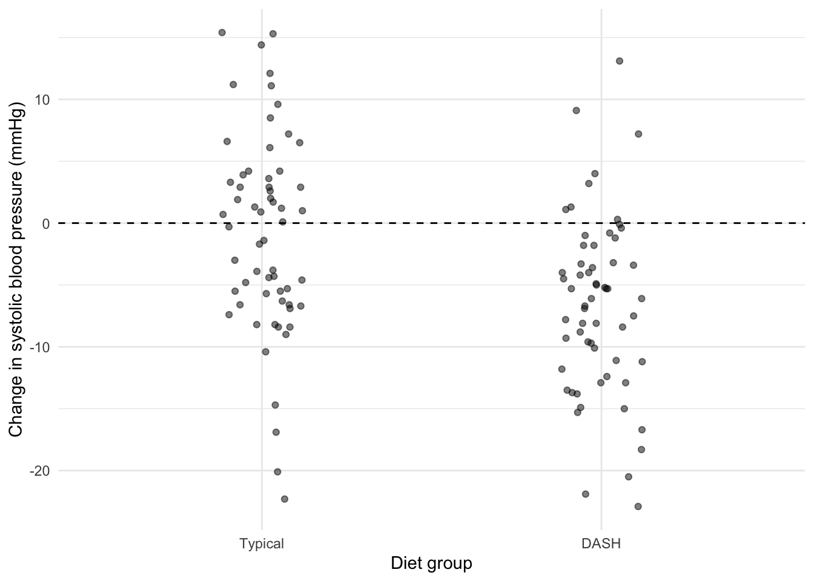

# Scientific workflow: Connecting ideas to data


The collection and analysis of data is a means to an end. I could devote the next year of my life to visiting city parks and recording the number of bird species that I see at each park, but who cares? In doing science, our goal is to use empirical data to derive understanding about how the world works. Understanding about what, exactly? That's up to you! Knowledge and understanding aren't gained from the data alone. The analysis and interpretation of data is only meaningful in light of a **research question**.

In science, a research question is a question about how the natural world works, and therefore a question that can be addressed with empirical data. In this chapter, I will describe different types of research questions one can ask and elements of what makes for a *good* research question. Then I will provide a high-level overview of how we will go about using data to provide insight into our questions. Together, the process of defining a research question and using data to address the question is what I will refer to as **scientific workflow**.

## Research questions

### Clarify your primary goal: description, prediction, or explanation?

A good research question clearly identifies the main task for using data. Do you want to describe some aspect of the world? Do you want to forecast a future event? Or, do you want to explain some phenomenon? Again, these are not necessarily mutually exclusive goals, but many research questions will fall into one of these buckets.

Consider the general topic of birds and city parks again. There are plenty of research questions one could ask about that study system. Table \@ref(tab:c02c01) provides a classification of research questions by primary goal, illustrating how different types of questions align with descriptions, predictions, and explanations.

<table class="table table table-striped table-hover table-condensed" style="margin-left: auto; margin-right: auto; margin-left: auto; margin-right: auto;">
<caption>(\#tab:c02c01)(\#tab:c02c01) Examples of description, prediction, and explanation questions.</caption>
 <thead>
  <tr>
   <th style="text-align:left;"> Description </th>
   <th style="text-align:left;"> Prediction </th>
   <th style="text-align:left;"> Explanation </th>
  </tr>
 </thead>
<tbody>
  <tr>
   <td style="text-align:left;"> What is the average number of bird species in city parks? </td>
   <td style="text-align:left;"> How many bird species will be in a park with particular attributes, such as size, amount of forest, or number of visitors? </td>
   <td style="text-align:left;"> Does increasing the amount of forest in a park cause the number of bird species to increase? </td>
  </tr>
  <tr>
   <td style="text-align:left;"> How different are the types of bird species from park to park? </td>
   <td style="text-align:left;"> What will the total number of birds be in the park next year? </td>
   <td style="text-align:left;"> Does restricting visitor access increase the number of bird species? </td>
  </tr>
</tbody>
</table>

### Identify the scope of inference: The who, what, when, and where of your study.

Let's take a look at one of the simple descriptive research questions from Table \@ref(tab:c02c01): What is the average number of bird species in city parks? Now, this isn't the most Earth-shattering research question, but it's simplicity will help make it clear why it's important to be specific about your question. The design of your research - how you go about collecting the data - should follow clearly from your research question. This requires you to clearly define the scope of inference for your question, namely who the question is about, what needs to be measured, when you need to measure it, and where you need to measure it.

The "who" and "what" parts of our research question are rather clear. We want to know about birds (who), and specifically, the mean number of city parks (what). But we need more. Where and when will we measure the mean number of bird species? We've answered the where question in part: city parks. But what city parks? Every city park in the world? City parks in Prague, Czech Republic? Moreover, when will you do the measuring? All we need to do is add some more detail on when and where. For example: What is the *current* mean number of bird species in city parks *within the boundary of Chicago, IL*?

Why do we need such specificity in our research questions? At the most basic level, specificity will help make it clear how to approach the process of collecting data. But at a broader level, the who, what, when, and where also defines the scope of inference of your research question. In statistics, the scope of inference is defined by the **population**. It's the entire group that we want to generalize about when asking a research question. In some cases, the population is rather small. For example, I might define the population as three particular city parks in Chicago: Union Park, Arrigo Park, and Eckhart Park. In other cases, the population will be very large, such as all the parks in Chicago.

Why does this matter? Defining the population, or the scope of your question, affects the types of generalizations you can make based on your research. Suppose I'm working on a research question involving causation, such as "What is the effect of screen time on cognitive performance?" In this case the hypothesis might be that the amount of time people spend on their phones, tablets, computers, and other devices affects there performance on cognitive tests. A study finding an effect of screen time on cognitive performance would be of great interest to the public. But what's the population for the study? If you address this question with a study on children, then you can't use the study to make generalizations about the effect of screen time on cognitive performance in adults. If you are interested in the effect of screen time on cognitive performance in adults, and you collect data from children, you're not really addressing the question.

So let's make this clear: When you state a research question, it is crucial to define the who, what, when, and where of your research question. These components don't necessarily need to be stated all at once in a single sentence. For example, it it's ok to frame your question as "What's the mean number of birds in Chicago city parks?", and then then clarify the timescale and the particular city parks you want to generalize about. Some of those details would be included in the Methods section of a paper on your study. Nonetheless, it's important to think about these questions as you start to articulate your research questions because it will help you design the methods of collecting data, and it will clarify the scope of inferences you can make based on your study.

I teach a statistics class as part of a biology curriculum. Most students who take my class are biology majors, but sometimes students from other majors that require statistics enroll in my course. In any given semester, I might ask: What proportion of the students in my class are biology majors? That’s a research question. It may not be a very interesting research question because it’s purely descriptive, but simple descriptions are often useful. For example, I could report the fraction of non-biology majors taking my statistics course to administrators who want to know how my department contributes to academic programs other than biology.

There are many examples like this. A company might first want to summarize the wages of their employees before considering a pay increase. A hospital might track the proportion of patients who return with post-surgical complications. A conservation biologist might calculate the average population size of a species in different habitat types.

In this chapter we'll look at some basic numerical and graphical quantities that can be used to describe data. But before we dig in, I want to distinguish between two scenarios with very difficult implications for how we should interpret *descriptive statistics*. Consider my question about the proportion of students in my statistics class majoring in biology. That question is very specific about *who* I want to make conclusions about. What proportion of the students in *my class* are biology majors? This is an example of a research question that is very limited in scope. In a typical semester, I have about 25 students in my statistics class. For my research question, those 25 students represent the **population** of interest.

The population defines the group from which data will be collected and inferences will be drawn. This is a critical concept because the population of interest defines the scope of inferences that can be made with data. All scientific studies involve making inferences with data, so it's critical that we define who we're making inferences about, and therefore who we *can't* make inferences about. For example, suppose I find that 60% of students in my class are biology majors. I can't use that observation to draw any conclusions about the proportion of biology majors in other statistics classes. Similarly, if a company wishes to describe the wages of its employees, the population is clearly its employees, and the data collected can't be used to describe wages at other companies.

### Make it interesting

Remember how science is a public process? The knowledge gained from science is not decided by any one individual. Thus, if you want your science to contribute to the advancement of knowledge, your science has to be of interest to others.

I'm not going to claim to be the final authority about what makes a question interesting; any given research question can be of interest to some and not to others. That said, I think interesting questions tend to have broader appeal to the public, addressing longstanding uncertainty or real-world problems (e.g., climate change, social equity). "What factors caused the evolution of *Homo sapiens* from our chimpanzee ancestors?" is an interesting question because many people want to know where human beings came from. "How does the SARS-CoV-2 virus infect people?" was an interesting question in 2019 because it had direct relevance for policy decisions about how to slow the COVID-19 pandemic.

Questions about causal explanation tend to be of greater interest than descriptive questions. Consider the causal questions in Table \@ref(tab:c02c01). Although they require some more detail on timescale and the population of interest, those questions could be of interest to others because they can inform public policy about urban design and biodiversity (and because a lot of people think birds are cool). If we know that adding forest will change the type of bird species present, then we might prioritize restoring forest to some parks to support certain species of birds.

Contrast the causal questions in Table \@ref(tab:c02c01) with this question: "How many bird species are in Union Park?". That's a valid research question, but it's purely descriptive and much more narrow in scope, and thus probably of less interest. Now, that's not to say descriptive research questions are never of interest! In 2018 the New York Times, the paper of record in the United States, "[published an article](https://www.nytimes.com/2018/10/06/nyregion/squirrels-central-park.html)" about a research team that was attempting to answer the question "How many squirrels are in Central Park?". That's a purely descriptive research question, but it happened to be about a species and a place that is of broad public appeal.

### Make it answerable with data

Remember that the confrontation of ideas with empirical data is really what distinguishes science from non-science. Thus, good *scientific* research questions are ones that can be addressed by collecting and analyzing data. My question about the amount of forest in urban parks and the types of birds can clearly be addressed by collecting data on forest cover and the types of birds present.

The challenge here is that even though a question might address a phenomenon in the natural world, there might not be an obvious type of empirical data that can settle the question. Questions about opinion are challenging for this reason. "What is the best style of pizza?" New York style? Chicago deep dish? Neapolitan? Detroit? This is an extremely important question! The problem is that there's not a definitive empirical definition of "best". Whereas I can clearly count bird species and ask where the number of bird species is maximized, I cannot clearly define what makes the "best pizza" because it is a matter of opinion. This is not to say that questions about opinion are off limits. "What style of pizza do people like the most?" is a question that we can address by collecting data on public opinion. Similarly, "What style of pizza is purchased the most in the world?" can clearly be addressed with data. Sometimes a question needs to be revised to make it more precise and tractable.

### Ground it in theory

Good research questions focused on explanation tend to follow logically from broader scientific theories. A scientific **theory** is a broad explanation about some aspect of the natural world. In other words, theories are explanations for *why* something happens the way it does. The theory of evolution is a well-substantiated set of ideas about how living things change over time. The theory or relativity is a well-substantiated set of ideas about space, time, and gravity. Good questions tend to fall under these broader theories, connecting a specific situation (the focus of your research question) to a more general idea about how the world works.

Consider the causal question in Table \@ref(tab:c02c01): "Does increasing the size of parks increase the number of bird species?". One relevant theory in ecology for this question is the theory of island biogeography. According to this theory, the number of species in patches of habitat should be determined by the balance of species immigrating to the patch and going extinct from the patch. The theory suggests that the size and proximity of habitat patches to other habitat play an important role in affecting immigration and extinction, and thus the number of species. In line with this theory, I might hypothesize that bird diversity in urban parks will be affected by the size of the parks and their proximity to other parks. A **hypothesis** is a specific statement about a particular system of interest that is grounded in a broader theory. In this case, the specific situation is about urban parks and birds, and my idea about urban parks and birds is grounded in island biogeography theory.

I can take this one step further and make a **prediction** about what I expect to observe in the data if my hypothesis is true. For example, I might predict that bird diversity is greatest in the biggest parks and parks that are the least isolated from other parks. If I don't find that pattern in the data, then I might want to revisit the broader theory. Maybe island biogeography theory is not sufficient, and I need to consider other broader ideas that could be applied to the specific case of urban parks and birds. Maybe it's not just the size of the habitat patch that matters, but also the types of vegetation in the patch, for example.

The key here is that your research question should have a logical connection to broader ideas in your discipline. Those broader ideas typically occur in a nested hierarchy. For example, the theory of island biogeography is part of the broader theory of biogeography, which consist of the set of ideas that help us explain the distribution of species on Earth. The logical connection between your research question and hypothesis to these broader ideas is critical to make your question coherent and relevant to other scientists.

### Make sure it's feasible

Good research questions are logistically feasible. Consider this extreme case: "What is the effect of removing humans from the Earth on biodiversity?" It's certainly an interesting question to ponder what biodiversity would look like if there were no humans, but this is not a feasible research study. Clearly it is not ethical to experimentally remove humans from the Earth, and even an observational design examining specific geographic areas where humans don't live would be challenging because human impacts on biodiversity occur across massive spatial scales (e.g., global climate change). Any comparison of areas with and without humans also carries the caveat that the places without humans don't really address the question, which is about how *removing* humans affects biodiversity.

Feasibility also matters at a smaller scale. For questions about urban parks and birds, I have to consider whether I can find enough urban parks that vary in the characteristics of interest to answer the question. Do I have the appropriate expertise to identify birds? Do I have access to the resources required to pull off the project (funding, equipment, time, etc.)? If my research question involves a temporal component, such as how urban park characteristics cause change in bird communities, will I be able to monitor bird populations for enough time to see a change, should one occur (potentially years, if not decades)? If I don't have the resources to do sampling on my own, is there an adequate dataset that's publicly available?

So good research questions are ones that are interesting, addressable with data, and grounded in theory, but also logistically feasible. This book will directly address how to design a study and analyze the data given a research question, and I suspect you will have a much better sense for the feasibility of particular research questions after exploring those issues.

### Avoid analyzing the data before stating your question

Sometimes researchers try to look for patterns in the data before clarifying their question and hypothesis. In the literature this has been called HARKing, or "hypothesizing after the results are known" ([Kerr 1998](https://journals.sagepub.com/doi/abs/10.1207/s15327957pspr0203_4)). The main problem with this research practice is that it increases the risk of making erroneous conclusions. As we will find out in coming chapters, sometimes patterns in the data occur simply by chance, in which case researchers will propose a causal hypothesis for a pattern that actually isn't real. Also remember that patterns in the data don't always reflect direct causal effects, as we saw with beta carotene and lung cancer risk.

So is it every OK to search for patterns in the data? Yes, absolutely. Consider this question: *"Why do some people recover more quickly from viral infections than others?"* The nature of this question is clearly causal. Indeed, the interest is in *explaining* why some people recover faster from viruses than others. Yet, no potential explanation has been proposed! This type of causal question is really a starting point. If there is little theoretical work on the question in the primary literature, then some initial exploratory analysis might be warranted, in which patterns of viral recovery among people are simply described. These questions are sometimes called "reverse causal questions" ([Gelman and Imbens 2013](https://www.nber.org/papers/w19614), [Bailey et al. 2024](https://www.nature.com/articles/s41562-024-01939-z)), in contrast to "forward causal questions" where a clear cause and effect are specified. Reverse causal questions can have an important place in science because identifying patterns can motivate or inform the development of more specific causal hypotheses.

The field of data science is very much focused on pattern recognition in the data, often for the goal of prediction. Consider this question: *"Does exercise predict a person's recovery time from viral infections?"* This question is clearly about prediction - "predict" is right in the question. Here the goal is to determine if the amount of exercise predict's a person's recovery. Maybe people who exercise more recover from viruses more rapidly. That doesn't mean exercise *causes* faster recovery, as exercise might be caused by some other factor that also affects viral recovery. Noncausal associations in the data can be very helpful for making accurate predictions, such as who is most likely to suffer from depression, who is most likely to earn a PhD, or whether the stock market is likely to tumble in the next five years. But it's critical to state up front that the goal in these causes is prediction and *not* causal explanations.

Consider this commonly used example. Suppose you want to predict how many people will go swimming at the beach. You scour through the data, and you find that one of the strongest predictors of whether people will swim is if they are wearing shorts. Great! You can collect data on shorts-wearing that will accurately predict the number of people swimming at your beach. But of course, wearing shorts doesn't cause swimming. Warm temperature is probably a common cause of shorts-wearing and swimming.

So it's really important to state your research question first, and to make it clear what your goal is. Causal questions in particular should be highly specific and grounded in theory. *"Does smoking slow a person's recovery time from viral respiratory infections"*. That's a very specific, forward causal question grounded in theory with a clearly identified cause (smoking) and effect (recovery time). If your questions are more about description or prediction, you simply need to be clear about that goal to avoid confusion.

::: {.alert .alert-block .alert-info}
<b>Explore More</b>

Huntington-Klein. The effect. Lipowski. E.E. 2008. Developing great research questions. Am J Health-Syst. Pharm.

Farrugia, P. et al. 2010. Research questions, hypotheses and objectives. Canadian Journal of Surgery.
:::

## Connecting ideas to data

Identifying a good research question is hard. What comes after the question isn’t much easier, but it is at least goal-driven: once you know what you want to learn, you can design a study and analysis that have a chance of answering it. In this section, I sketch an overview of **scientific workflow**, starting with a research question and showing how it guides decisions about study design, data collection, and data analysis. The goal here is not to provide a deep dive on components of the workflow, but rather to sketch the *big picture* of how to connect data to ideas. We will work through the details of each component of the reserach design and analysis steps in the remainder of the book. As an example for our big picture overview, we’ll use a question from the medical literature on diet and blood pressure:

> *Does a DASH diet lower systolic blood pressure compared to a typical diet?*

DASH stands for Dietary Approaches to Stop Hypertension and emphasizes fruits and vegetables. This topic has been studied extensively (e.g., Appel et al. 1997: <https://www.nejm.org/doi/full/10.1056/NEJM199704173361601>), but the design and data used are synthetic so we can focus on workflow rather than details of any one study.

The image below describes a high-level overview of scientific workflow showing how connections can be made between ideas and data. The figure is a simplified version of a workflow published by Deffner et al. (2024). The arrows illustrate logical connections between different components of a research project, linking elements that are largely “science side” (idea generation) and “statistics side” (data collection and analysis). The general idea is that theory should inform a research question and assumptions about causal relationships among variables relevant to the question (the **generative model**). Given a research question and causal assumptions, we can design a study and analysis, and then use the results to update our understanding of the system. The workflow emphasizes that science is iterative: conclusions from data can revise our beliefs and refine theory.


Let’s walk through these components using our example question on the DASH diet and systolic blood pressure.

### Theory

**Theory** represents scientific knowledge that motivates the research question and informs the causal effects we think are plausible. There is a vast literature on cardiovascular disease and the risks of high blood pressure. Theory and prior evidence has suggested that diet should influence cardiovascular health via multiple physiological pathways, and more specifically, that that increasing fruit and vegetable intake (as emphasized in DASH) could reduce hypertension.

Theory also reminds us that diet is not the only factor expected to affect blood pressure. Age, exercise, smoking history, medication use, stress, and many other factors have been linked to hypertension. Indeed, most processes in the natural and social sciences are *multicausal*, meaning there's more than one cause of an outcome of interest. The challenge we face is that some factors create roadblocks to understanding the causal effects we actually care about. As just one example, consider the possibility that diet and exercise both influence blood pressure. That's not necessarily a problem, but it becomes a huge problem if diet and exercise are causally related to each other. For example, perhaps people vary in their degree of health consciousness, and people who are more health conscious tend to eat lots of fruits and vegetables and also exercise a lot. If we find a relationship between diet and blood pressure, is that because diet is having a causal effect on blood pressure, or is it actually an effect of exercise, and people who exercise a lot tend to have more healthy diets? In this example, health consciousness confounds the analysis, and we need to be aware of the issue so that we can use a research design or analysis to addresses the issue.

In this book we will use a variety of examples from across the sciences. I don't expect the reader to have deep knowledge of theory in those various fields, and I will do my best to provide sufficient theoretical background so that we can keep the focus on research design and analysis. But my point here is that effective research design and analysis requires knowledge of theory and prior research in your field.

### Research question

What is your question? This one is pretty straightforward:

> Does a DASH diet lower systolic blood pressure relative to a typical diet?

As discussed earlier in the chapter, a good research question is grounded in theory and has a clearly defined scope of inference (who, what, when, and where).

### Generative model

A **generative model** is a simplified story about how the data could be generated. In this book, we’ll express causal assumptions using **directed acyclic graphs (DAGs)**. DAGs are graphical models that represent variables as nodes and causal relationships as arrows. They include not only the causal effect(s) of interest (here the effect of diet on change in blood pressure), but also those other factors that could confound the analysis.

The structure of a DAG is informed by one's domain knowledge - the body of theory and prior research in your particular field. Recall that in real-world settings, we expect that people vary in health consciousness, and that health consciousness affects both diet and exercise. We can use a DAG to communicate those causal assumptions. Below is a simple DAG that includes the variables health consciousness, diet, exercise, and blood pressure.


``` r
dag_obs <- dagitty('
dag {
bb="0,0,1,1"

"Health consciousness" [pos="0.25,-0.5"]
Exercise              [pos="0.3,0"]
"Diet" [pos="0.2,0.0"]
"Change in systolic BP" [pos="0.25,0.50"]

"Health consciousness" -> Exercise
"Health consciousness" -> "Diet"
Exercise -> "Change in systolic BP"
"Diet" -> "Change in systolic BP"
}
')

ex <- edges(dag_obs)

# Highlight the confounding structure (backdoor paths into Diet and BP)
highlight_obs <- (ex$v == "Health consciousness" & ex$w == "Diet") |
                 (ex$v == "Health consciousness" & ex$w == "Exercise") |
                 (ex$v == "Exercise" & ex$w == "Change in systolic BP")

rethinking::drawdag(
  dag_obs,
  col_arrow = ifelse(highlight_obs, "firebrick", "black")
)
```

<div class="figure" style="text-align: center">

<p class="caption">(\#fig:c02c02)Observational setting: health consciousness confounds the relationship between diet and blood pressure change</p>
</div>

This DAG implies that a simple association between diet and blood pressure change could reflect not only the effect of diet, but also differences in health consciousness and exercise between people who eat different diets. This is the basic idea of **confounding**: other variables can create associations that complicate causal interpretation. The confounding pathway is highlighted in red in the DAG. One value of creating a DAG like this is that it tells the researcher and scientific community alike that the confounding effect of health consciousness must be controlled either as part of the study design or statistical analysis.

### Study design

Given a research question and generative model, we should then make decisions about how to collect data. In this book we will differentiate between two main types of study designs: **experiments** and **observational studies**. Essentially, experiments involve collecting data from individuals to which treatments (such as diet) have been randomly assigned. In contrast, observational studies involve collecting data from individuals in their natural settings without randomly assigning treatments.

Experiments are more powerful than observational studies for identifying causal effects because the process of randomizing treatments to individuals breaks up confounding between the treatment and other variables that affect the outcome of interest. Remember the generative model for the blood pressure example identified health consciousness as a confounding variable. People who eat more fruits and vegetables may be more health conscious and exercise a lot, and an association between diet and blood pressure may in part reflect the causal effect of exercise. But we're not interested in the effect of exercise for this study. We want to know the effect of *diet*.

Experiments offer a design solution. If we can *randomly* assign diets to individuals in an experiment, then we expect to have individuals of varying health consciousness (and thus exercise level) in each diet treatment. Randomization of diet to individuals blocks the arrow from health consciousness to diet in the DAG, such that any association between change in blood pressure and diet would be attributed to *diet*. If we used an observational design where we simply recorded diet and blood pressure among individuals in their natural settings - where people freely choose their diets and exercise levels - we would need to use statistical model that controls for the confounding effect of health consciousness.

We'll learn how to use statistical models with controls later in the book, but for now let's keep things simple and assume we use an experiment. Imagine we recruit 120 adults with elevated blood pressure, and we randomly assign 60 to a DASH diet and 60 to a typical diet. Each person maintains their diet for 8 weeks, and then we measure the change in systolic blood pressure from before to after the study. Pairing the measurements of blood pressure on each individual is a useful design approach because it helps control for other differences among individuals that could affect blood pressure.

### Estimand

To use data to answer a research question, we need to identify the **estimand**: the target quantity (or quantities) we want to learn about from the data that will address the research question. For our blood pressure study, we define the estimand as the difference in the average change in systolic blood pressure during the study between the DASH diet and the typical diet. Importantly, estimands are *not* the quantities computed from a particular sample. They are quantities we want to know about in the **population of interest**.

### Target population

Every research question needs a defined scope of inference called the **target population** (the who, what, when, and where discussed earlier in this chapter). For our blood pressure study, we might define the target population as adults with elevated blood pressure recruited from clinics in the United States during a defined time period. Target populations vary from study to study, but identifying the target population is essential because it determines who we can—and cannot—make claims about based on the study.

### Sample data

One of the fundamental problems of statistics is that we typically cannot measure every individual in the target population. Instead, we collect data from a **sample** of individuals drawn from the target population. For reasons we will discuss later, ideally we select individuals *randomly* from the population to be included in the sample. Because we observe only a subset of randomly-drawn individuals, the quantities we compute based on the sample data will vary from sample to sample. This is a major source of uncertainty in the quantities we estimate from sample data, and it's a topic we will address throughout the book.

Let's take a look at how the sample data might look for our study. Datasets are generally organized in tables with rows representing subjects and columns representing variables. Below are the first eight lines of a synthetic dataset, each having observations for five variables:

-   `id` = a unique ID code for each subject

-   `diet` = the type of diet randomly assigned to the individual

-   `sbp_pre` = systolic blood pressure measured at the beginning of the study

-   `sbp_post` = systolic blood pressure measured at the end of the study

-   `sbp_change` = difference in systolic blood pressure between the beginning and end of the study.

<div style="border: 1px solid #ddd; padding: 0px; overflow-y: scroll; height:300px; overflow-x: scroll; width:100%; "><table class="table table table-striped table-hover table-condensed" style="width: auto !important; margin-left: auto; margin-right: auto; margin-left: auto; margin-right: auto;">
<caption>(\#tab:c02c03)(\#tab:c02c03) Toy dataset for the DASH example (synthetic values): one row per participant.</caption>
 <thead>
  <tr>
   <th style="text-align:center;position: sticky; top:0; background-color: #FFFFFF;"> id </th>
   <th style="text-align:center;position: sticky; top:0; background-color: #FFFFFF;"> diet </th>
   <th style="text-align:center;position: sticky; top:0; background-color: #FFFFFF;"> sbp.pre </th>
   <th style="text-align:center;position: sticky; top:0; background-color: #FFFFFF;"> sbp.post </th>
   <th style="text-align:center;position: sticky; top:0; background-color: #FFFFFF;"> sbp.change </th>
  </tr>
 </thead>
<tbody>
  <tr>
   <td style="text-align:center;"> 1 </td>
   <td style="text-align:center;"> DASH </td>
   <td style="text-align:center;"> 156.2 </td>
   <td style="text-align:center;"> 163.5 </td>
   <td style="text-align:center;"> 7.2 </td>
  </tr>
  <tr>
   <td style="text-align:center;"> 2 </td>
   <td style="text-align:center;"> DASH </td>
   <td style="text-align:center;"> 137.0 </td>
   <td style="text-align:center;"> 146.1 </td>
   <td style="text-align:center;"> 9.1 </td>
  </tr>
  <tr>
   <td style="text-align:center;"> 3 </td>
   <td style="text-align:center;"> DASH </td>
   <td style="text-align:center;"> 151.7 </td>
   <td style="text-align:center;"> 145.5 </td>
   <td style="text-align:center;"> -6.1 </td>
  </tr>
  <tr>
   <td style="text-align:center;"> 4 </td>
   <td style="text-align:center;"> DASH </td>
   <td style="text-align:center;"> 149.0 </td>
   <td style="text-align:center;"> 148.2 </td>
   <td style="text-align:center;"> -0.8 </td>
  </tr>
  <tr>
   <td style="text-align:center;"> 5 </td>
   <td style="text-align:center;"> DASH </td>
   <td style="text-align:center;"> 142.0 </td>
   <td style="text-align:center;"> 120.1 </td>
   <td style="text-align:center;"> -21.9 </td>
  </tr>
  <tr>
   <td style="text-align:center;"> 6 </td>
   <td style="text-align:center;"> DASH </td>
   <td style="text-align:center;"> 119.8 </td>
   <td style="text-align:center;"> 115.6 </td>
   <td style="text-align:center;"> -4.2 </td>
  </tr>
  <tr>
   <td style="text-align:center;"> 7 </td>
   <td style="text-align:center;"> DASH </td>
   <td style="text-align:center;"> 141.2 </td>
   <td style="text-align:center;"> 128.8 </td>
   <td style="text-align:center;"> -12.4 </td>
  </tr>
  <tr>
   <td style="text-align:center;"> 8 </td>
   <td style="text-align:center;"> DASH </td>
   <td style="text-align:center;"> 137.8 </td>
   <td style="text-align:center;"> 128.4 </td>
   <td style="text-align:center;"> -9.3 </td>
  </tr>
  <tr>
   <td style="text-align:center;"> 9 </td>
   <td style="text-align:center;"> DASH </td>
   <td style="text-align:center;"> 151.4 </td>
   <td style="text-align:center;"> 147.8 </td>
   <td style="text-align:center;"> -3.6 </td>
  </tr>
  <tr>
   <td style="text-align:center;"> 10 </td>
   <td style="text-align:center;"> DASH </td>
   <td style="text-align:center;"> 144.3 </td>
   <td style="text-align:center;"> 144.6 </td>
   <td style="text-align:center;"> 0.3 </td>
  </tr>
  <tr>
   <td style="text-align:center;"> 11 </td>
   <td style="text-align:center;"> DASH </td>
   <td style="text-align:center;"> 145.1 </td>
   <td style="text-align:center;"> 136.7 </td>
   <td style="text-align:center;"> -8.4 </td>
  </tr>
  <tr>
   <td style="text-align:center;"> 12 </td>
   <td style="text-align:center;"> DASH </td>
   <td style="text-align:center;"> 141.2 </td>
   <td style="text-align:center;"> 154.3 </td>
   <td style="text-align:center;"> 13.1 </td>
  </tr>
  <tr>
   <td style="text-align:center;"> 13 </td>
   <td style="text-align:center;"> DASH </td>
   <td style="text-align:center;"> 147.3 </td>
   <td style="text-align:center;"> 144.1 </td>
   <td style="text-align:center;"> -3.3 </td>
  </tr>
  <tr>
   <td style="text-align:center;"> 14 </td>
   <td style="text-align:center;"> DASH </td>
   <td style="text-align:center;"> 147.3 </td>
   <td style="text-align:center;"> 137.7 </td>
   <td style="text-align:center;"> -9.6 </td>
  </tr>
  <tr>
   <td style="text-align:center;"> 15 </td>
   <td style="text-align:center;"> DASH </td>
   <td style="text-align:center;"> 119.4 </td>
   <td style="text-align:center;"> 115.0 </td>
   <td style="text-align:center;"> -4.5 </td>
  </tr>
  <tr>
   <td style="text-align:center;"> 16 </td>
   <td style="text-align:center;"> DASH </td>
   <td style="text-align:center;"> 166.2 </td>
   <td style="text-align:center;"> 157.4 </td>
   <td style="text-align:center;"> -8.8 </td>
  </tr>
  <tr>
   <td style="text-align:center;"> 17 </td>
   <td style="text-align:center;"> DASH </td>
   <td style="text-align:center;"> 157.4 </td>
   <td style="text-align:center;"> 140.6 </td>
   <td style="text-align:center;"> -16.7 </td>
  </tr>
  <tr>
   <td style="text-align:center;"> 18 </td>
   <td style="text-align:center;"> DASH </td>
   <td style="text-align:center;"> 152.6 </td>
   <td style="text-align:center;"> 148.6 </td>
   <td style="text-align:center;"> -4.0 </td>
  </tr>
  <tr>
   <td style="text-align:center;"> 19 </td>
   <td style="text-align:center;"> DASH </td>
   <td style="text-align:center;"> 140.3 </td>
   <td style="text-align:center;"> 139.9 </td>
   <td style="text-align:center;"> -0.4 </td>
  </tr>
  <tr>
   <td style="text-align:center;"> 20 </td>
   <td style="text-align:center;"> DASH </td>
   <td style="text-align:center;"> 158.3 </td>
   <td style="text-align:center;"> 153.3 </td>
   <td style="text-align:center;"> -4.9 </td>
  </tr>
  <tr>
   <td style="text-align:center;"> 21 </td>
   <td style="text-align:center;"> DASH </td>
   <td style="text-align:center;"> 146.1 </td>
   <td style="text-align:center;"> 141.0 </td>
   <td style="text-align:center;"> -5.0 </td>
  </tr>
  <tr>
   <td style="text-align:center;"> 22 </td>
   <td style="text-align:center;"> DASH </td>
   <td style="text-align:center;"> 148.0 </td>
   <td style="text-align:center;"> 141.3 </td>
   <td style="text-align:center;"> -6.7 </td>
  </tr>
  <tr>
   <td style="text-align:center;"> 23 </td>
   <td style="text-align:center;"> DASH </td>
   <td style="text-align:center;"> 133.3 </td>
   <td style="text-align:center;"> 132.1 </td>
   <td style="text-align:center;"> -1.2 </td>
  </tr>
  <tr>
   <td style="text-align:center;"> 24 </td>
   <td style="text-align:center;"> DASH </td>
   <td style="text-align:center;"> 167.6 </td>
   <td style="text-align:center;"> 149.3 </td>
   <td style="text-align:center;"> -18.3 </td>
  </tr>
  <tr>
   <td style="text-align:center;"> 25 </td>
   <td style="text-align:center;"> DASH </td>
   <td style="text-align:center;"> 150.6 </td>
   <td style="text-align:center;"> 151.8 </td>
   <td style="text-align:center;"> 1.3 </td>
  </tr>
  <tr>
   <td style="text-align:center;"> 26 </td>
   <td style="text-align:center;"> DASH </td>
   <td style="text-align:center;"> 172.9 </td>
   <td style="text-align:center;"> 157.6 </td>
   <td style="text-align:center;"> -15.3 </td>
  </tr>
  <tr>
   <td style="text-align:center;"> 27 </td>
   <td style="text-align:center;"> DASH </td>
   <td style="text-align:center;"> 170.8 </td>
   <td style="text-align:center;"> 165.5 </td>
   <td style="text-align:center;"> -5.3 </td>
  </tr>
  <tr>
   <td style="text-align:center;"> 28 </td>
   <td style="text-align:center;"> DASH </td>
   <td style="text-align:center;"> 150.7 </td>
   <td style="text-align:center;"> 148.9 </td>
   <td style="text-align:center;"> -1.8 </td>
  </tr>
  <tr>
   <td style="text-align:center;"> 29 </td>
   <td style="text-align:center;"> DASH </td>
   <td style="text-align:center;"> 157.7 </td>
   <td style="text-align:center;"> 151.6 </td>
   <td style="text-align:center;"> -6.1 </td>
  </tr>
  <tr>
   <td style="text-align:center;"> 30 </td>
   <td style="text-align:center;"> DASH </td>
   <td style="text-align:center;"> 170.7 </td>
   <td style="text-align:center;"> 150.2 </td>
   <td style="text-align:center;"> -20.5 </td>
  </tr>
  <tr>
   <td style="text-align:center;"> 31 </td>
   <td style="text-align:center;"> DASH </td>
   <td style="text-align:center;"> 143.7 </td>
   <td style="text-align:center;"> 135.8 </td>
   <td style="text-align:center;"> -7.8 </td>
  </tr>
  <tr>
   <td style="text-align:center;"> 32 </td>
   <td style="text-align:center;"> DASH </td>
   <td style="text-align:center;"> 152.0 </td>
   <td style="text-align:center;"> 146.7 </td>
   <td style="text-align:center;"> -5.3 </td>
  </tr>
  <tr>
   <td style="text-align:center;"> 33 </td>
   <td style="text-align:center;"> DASH </td>
   <td style="text-align:center;"> 146.9 </td>
   <td style="text-align:center;"> 146.9 </td>
   <td style="text-align:center;"> -0.1 </td>
  </tr>
  <tr>
   <td style="text-align:center;"> 34 </td>
   <td style="text-align:center;"> DASH </td>
   <td style="text-align:center;"> 154.0 </td>
   <td style="text-align:center;"> 150.0 </td>
   <td style="text-align:center;"> -4.0 </td>
  </tr>
  <tr>
   <td style="text-align:center;"> 35 </td>
   <td style="text-align:center;"> DASH </td>
   <td style="text-align:center;"> 152.2 </td>
   <td style="text-align:center;"> 148.8 </td>
   <td style="text-align:center;"> -3.4 </td>
  </tr>
  <tr>
   <td style="text-align:center;"> 36 </td>
   <td style="text-align:center;"> DASH </td>
   <td style="text-align:center;"> 164.0 </td>
   <td style="text-align:center;"> 165.1 </td>
   <td style="text-align:center;"> 1.1 </td>
  </tr>
  <tr>
   <td style="text-align:center;"> 37 </td>
   <td style="text-align:center;"> DASH </td>
   <td style="text-align:center;"> 157.1 </td>
   <td style="text-align:center;"> 143.5 </td>
   <td style="text-align:center;"> -13.7 </td>
  </tr>
  <tr>
   <td style="text-align:center;"> 38 </td>
   <td style="text-align:center;"> DASH </td>
   <td style="text-align:center;"> 139.3 </td>
   <td style="text-align:center;"> 126.4 </td>
   <td style="text-align:center;"> -12.9 </td>
  </tr>
  <tr>
   <td style="text-align:center;"> 39 </td>
   <td style="text-align:center;"> DASH </td>
   <td style="text-align:center;"> 156.9 </td>
   <td style="text-align:center;"> 148.9 </td>
   <td style="text-align:center;"> -8.1 </td>
  </tr>
  <tr>
   <td style="text-align:center;"> 40 </td>
   <td style="text-align:center;"> DASH </td>
   <td style="text-align:center;"> 140.1 </td>
   <td style="text-align:center;"> 134.8 </td>
   <td style="text-align:center;"> -5.3 </td>
  </tr>
  <tr>
   <td style="text-align:center;"> 41 </td>
   <td style="text-align:center;"> DASH </td>
   <td style="text-align:center;"> 136.1 </td>
   <td style="text-align:center;"> 139.4 </td>
   <td style="text-align:center;"> 3.2 </td>
  </tr>
  <tr>
   <td style="text-align:center;"> 42 </td>
   <td style="text-align:center;"> DASH </td>
   <td style="text-align:center;"> 159.3 </td>
   <td style="text-align:center;"> 144.4 </td>
   <td style="text-align:center;"> -14.9 </td>
  </tr>
  <tr>
   <td style="text-align:center;"> 43 </td>
   <td style="text-align:center;"> DASH </td>
   <td style="text-align:center;"> 135.5 </td>
   <td style="text-align:center;"> 120.6 </td>
   <td style="text-align:center;"> -15.0 </td>
  </tr>
  <tr>
   <td style="text-align:center;"> 44 </td>
   <td style="text-align:center;"> DASH </td>
   <td style="text-align:center;"> 153.7 </td>
   <td style="text-align:center;"> 151.9 </td>
   <td style="text-align:center;"> -1.8 </td>
  </tr>
  <tr>
   <td style="text-align:center;"> 45 </td>
   <td style="text-align:center;"> DASH </td>
   <td style="text-align:center;"> 140.0 </td>
   <td style="text-align:center;"> 128.8 </td>
   <td style="text-align:center;"> -11.2 </td>
  </tr>
  <tr>
   <td style="text-align:center;"> 46 </td>
   <td style="text-align:center;"> DASH </td>
   <td style="text-align:center;"> 167.0 </td>
   <td style="text-align:center;"> 157.3 </td>
   <td style="text-align:center;"> -9.7 </td>
  </tr>
  <tr>
   <td style="text-align:center;"> 47 </td>
   <td style="text-align:center;"> DASH </td>
   <td style="text-align:center;"> 158.5 </td>
   <td style="text-align:center;"> 155.4 </td>
   <td style="text-align:center;"> -3.2 </td>
  </tr>
  <tr>
   <td style="text-align:center;"> 48 </td>
   <td style="text-align:center;"> DASH </td>
   <td style="text-align:center;"> 145.2 </td>
   <td style="text-align:center;"> 132.3 </td>
   <td style="text-align:center;"> -12.9 </td>
  </tr>
  <tr>
   <td style="text-align:center;"> 49 </td>
   <td style="text-align:center;"> DASH </td>
   <td style="text-align:center;"> 159.6 </td>
   <td style="text-align:center;"> 145.8 </td>
   <td style="text-align:center;"> -13.8 </td>
  </tr>
  <tr>
   <td style="text-align:center;"> 50 </td>
   <td style="text-align:center;"> DASH </td>
   <td style="text-align:center;"> 155.1 </td>
   <td style="text-align:center;"> 145.1 </td>
   <td style="text-align:center;"> -10.1 </td>
  </tr>
  <tr>
   <td style="text-align:center;"> 51 </td>
   <td style="text-align:center;"> DASH </td>
   <td style="text-align:center;"> 136.0 </td>
   <td style="text-align:center;"> 124.8 </td>
   <td style="text-align:center;"> -11.1 </td>
  </tr>
  <tr>
   <td style="text-align:center;"> 52 </td>
   <td style="text-align:center;"> DASH </td>
   <td style="text-align:center;"> 147.5 </td>
   <td style="text-align:center;"> 134.0 </td>
   <td style="text-align:center;"> -13.5 </td>
  </tr>
  <tr>
   <td style="text-align:center;"> 53 </td>
   <td style="text-align:center;"> DASH </td>
   <td style="text-align:center;"> 138.8 </td>
   <td style="text-align:center;"> 137.8 </td>
   <td style="text-align:center;"> -1.0 </td>
  </tr>
  <tr>
   <td style="text-align:center;"> 54 </td>
   <td style="text-align:center;"> DASH </td>
   <td style="text-align:center;"> 155.4 </td>
   <td style="text-align:center;"> 143.5 </td>
   <td style="text-align:center;"> -11.8 </td>
  </tr>
  <tr>
   <td style="text-align:center;"> 55 </td>
   <td style="text-align:center;"> DASH </td>
   <td style="text-align:center;"> 142.3 </td>
   <td style="text-align:center;"> 134.8 </td>
   <td style="text-align:center;"> -7.5 </td>
  </tr>
  <tr>
   <td style="text-align:center;"> 56 </td>
   <td style="text-align:center;"> DASH </td>
   <td style="text-align:center;"> 147.2 </td>
   <td style="text-align:center;"> 140.3 </td>
   <td style="text-align:center;"> -6.9 </td>
  </tr>
  <tr>
   <td style="text-align:center;"> 57 </td>
   <td style="text-align:center;"> DASH </td>
   <td style="text-align:center;"> 135.2 </td>
   <td style="text-align:center;"> 112.3 </td>
   <td style="text-align:center;"> -22.9 </td>
  </tr>
  <tr>
   <td style="text-align:center;"> 58 </td>
   <td style="text-align:center;"> DASH </td>
   <td style="text-align:center;"> 138.5 </td>
   <td style="text-align:center;"> 133.2 </td>
   <td style="text-align:center;"> -5.2 </td>
  </tr>
  <tr>
   <td style="text-align:center;"> 59 </td>
   <td style="text-align:center;"> DASH </td>
   <td style="text-align:center;"> 151.6 </td>
   <td style="text-align:center;"> 155.6 </td>
   <td style="text-align:center;"> 4.0 </td>
  </tr>
  <tr>
   <td style="text-align:center;"> 60 </td>
   <td style="text-align:center;"> DASH </td>
   <td style="text-align:center;"> 138.0 </td>
   <td style="text-align:center;"> 129.9 </td>
   <td style="text-align:center;"> -8.1 </td>
  </tr>
  <tr>
   <td style="text-align:center;"> 61 </td>
   <td style="text-align:center;"> Typical </td>
   <td style="text-align:center;"> 148.3 </td>
   <td style="text-align:center;"> 140.1 </td>
   <td style="text-align:center;"> -8.2 </td>
  </tr>
  <tr>
   <td style="text-align:center;"> 62 </td>
   <td style="text-align:center;"> Typical </td>
   <td style="text-align:center;"> 152.0 </td>
   <td style="text-align:center;"> 160.5 </td>
   <td style="text-align:center;"> 8.5 </td>
  </tr>
  <tr>
   <td style="text-align:center;"> 63 </td>
   <td style="text-align:center;"> Typical </td>
   <td style="text-align:center;"> 147.6 </td>
   <td style="text-align:center;"> 147.7 </td>
   <td style="text-align:center;"> 0.1 </td>
  </tr>
  <tr>
   <td style="text-align:center;"> 64 </td>
   <td style="text-align:center;"> Typical </td>
   <td style="text-align:center;"> 146.5 </td>
   <td style="text-align:center;"> 152.6 </td>
   <td style="text-align:center;"> 6.1 </td>
  </tr>
  <tr>
   <td style="text-align:center;"> 65 </td>
   <td style="text-align:center;"> Typical </td>
   <td style="text-align:center;"> 129.2 </td>
   <td style="text-align:center;"> 128.9 </td>
   <td style="text-align:center;"> -0.3 </td>
  </tr>
  <tr>
   <td style="text-align:center;"> 66 </td>
   <td style="text-align:center;"> Typical </td>
   <td style="text-align:center;"> 146.7 </td>
   <td style="text-align:center;"> 149.6 </td>
   <td style="text-align:center;"> 2.9 </td>
  </tr>
  <tr>
   <td style="text-align:center;"> 67 </td>
   <td style="text-align:center;"> Typical </td>
   <td style="text-align:center;"> 128.4 </td>
   <td style="text-align:center;"> 138.0 </td>
   <td style="text-align:center;"> 9.6 </td>
  </tr>
  <tr>
   <td style="text-align:center;"> 68 </td>
   <td style="text-align:center;"> Typical </td>
   <td style="text-align:center;"> 163.8 </td>
   <td style="text-align:center;"> 167.1 </td>
   <td style="text-align:center;"> 3.3 </td>
  </tr>
  <tr>
   <td style="text-align:center;"> 69 </td>
   <td style="text-align:center;"> Typical </td>
   <td style="text-align:center;"> 138.0 </td>
   <td style="text-align:center;"> 139.0 </td>
   <td style="text-align:center;"> 1.0 </td>
  </tr>
  <tr>
   <td style="text-align:center;"> 70 </td>
   <td style="text-align:center;"> Typical </td>
   <td style="text-align:center;"> 151.8 </td>
   <td style="text-align:center;"> 144.4 </td>
   <td style="text-align:center;"> -7.4 </td>
  </tr>
  <tr>
   <td style="text-align:center;"> 71 </td>
   <td style="text-align:center;"> Typical </td>
   <td style="text-align:center;"> 156.2 </td>
   <td style="text-align:center;"> 158.9 </td>
   <td style="text-align:center;"> 2.6 </td>
  </tr>
  <tr>
   <td style="text-align:center;"> 72 </td>
   <td style="text-align:center;"> Typical </td>
   <td style="text-align:center;"> 150.1 </td>
   <td style="text-align:center;"> 144.8 </td>
   <td style="text-align:center;"> -5.3 </td>
  </tr>
  <tr>
   <td style="text-align:center;"> 73 </td>
   <td style="text-align:center;"> Typical </td>
   <td style="text-align:center;"> 166.2 </td>
   <td style="text-align:center;"> 181.6 </td>
   <td style="text-align:center;"> 15.4 </td>
  </tr>
  <tr>
   <td style="text-align:center;"> 74 </td>
   <td style="text-align:center;"> Typical </td>
   <td style="text-align:center;"> 139.8 </td>
   <td style="text-align:center;"> 140.6 </td>
   <td style="text-align:center;"> 0.7 </td>
  </tr>
  <tr>
   <td style="text-align:center;"> 75 </td>
   <td style="text-align:center;"> Typical </td>
   <td style="text-align:center;"> 155.3 </td>
   <td style="text-align:center;"> 146.9 </td>
   <td style="text-align:center;"> -8.4 </td>
  </tr>
  <tr>
   <td style="text-align:center;"> 76 </td>
   <td style="text-align:center;"> Typical </td>
   <td style="text-align:center;"> 138.3 </td>
   <td style="text-align:center;"> 149.4 </td>
   <td style="text-align:center;"> 11.1 </td>
  </tr>
  <tr>
   <td style="text-align:center;"> 77 </td>
   <td style="text-align:center;"> Typical </td>
   <td style="text-align:center;"> 175.5 </td>
   <td style="text-align:center;"> 169.8 </td>
   <td style="text-align:center;"> -5.7 </td>
  </tr>
  <tr>
   <td style="text-align:center;"> 78 </td>
   <td style="text-align:center;"> Typical </td>
   <td style="text-align:center;"> 158.3 </td>
   <td style="text-align:center;"> 143.6 </td>
   <td style="text-align:center;"> -14.7 </td>
  </tr>
  <tr>
   <td style="text-align:center;"> 79 </td>
   <td style="text-align:center;"> Typical </td>
   <td style="text-align:center;"> 145.9 </td>
   <td style="text-align:center;"> 135.5 </td>
   <td style="text-align:center;"> -10.4 </td>
  </tr>
  <tr>
   <td style="text-align:center;"> 80 </td>
   <td style="text-align:center;"> Typical </td>
   <td style="text-align:center;"> 159.4 </td>
   <td style="text-align:center;"> 157.8 </td>
   <td style="text-align:center;"> -1.7 </td>
  </tr>
  <tr>
   <td style="text-align:center;"> 81 </td>
   <td style="text-align:center;"> Typical </td>
   <td style="text-align:center;"> 136.1 </td>
   <td style="text-align:center;"> 130.7 </td>
   <td style="text-align:center;"> -5.5 </td>
  </tr>
  <tr>
   <td style="text-align:center;"> 82 </td>
   <td style="text-align:center;"> Typical </td>
   <td style="text-align:center;"> 168.1 </td>
   <td style="text-align:center;"> 169.8 </td>
   <td style="text-align:center;"> 1.7 </td>
  </tr>
  <tr>
   <td style="text-align:center;"> 83 </td>
   <td style="text-align:center;"> Typical </td>
   <td style="text-align:center;"> 136.1 </td>
   <td style="text-align:center;"> 132.3 </td>
   <td style="text-align:center;"> -3.8 </td>
  </tr>
  <tr>
   <td style="text-align:center;"> 84 </td>
   <td style="text-align:center;"> Typical </td>
   <td style="text-align:center;"> 131.3 </td>
   <td style="text-align:center;"> 114.5 </td>
   <td style="text-align:center;"> -16.9 </td>
  </tr>
  <tr>
   <td style="text-align:center;"> 85 </td>
   <td style="text-align:center;"> Typical </td>
   <td style="text-align:center;"> 149.3 </td>
   <td style="text-align:center;"> 145.0 </td>
   <td style="text-align:center;"> -4.3 </td>
  </tr>
  <tr>
   <td style="text-align:center;"> 86 </td>
   <td style="text-align:center;"> Typical </td>
   <td style="text-align:center;"> 160.2 </td>
   <td style="text-align:center;"> 172.3 </td>
   <td style="text-align:center;"> 12.1 </td>
  </tr>
  <tr>
   <td style="text-align:center;"> 87 </td>
   <td style="text-align:center;"> Typical </td>
   <td style="text-align:center;"> 149.9 </td>
   <td style="text-align:center;"> 144.3 </td>
   <td style="text-align:center;"> -5.5 </td>
  </tr>
  <tr>
   <td style="text-align:center;"> 88 </td>
   <td style="text-align:center;"> Typical </td>
   <td style="text-align:center;"> 140.9 </td>
   <td style="text-align:center;"> 134.2 </td>
   <td style="text-align:center;"> -6.7 </td>
  </tr>
  <tr>
   <td style="text-align:center;"> 89 </td>
   <td style="text-align:center;"> Typical </td>
   <td style="text-align:center;"> 164.1 </td>
   <td style="text-align:center;"> 161.1 </td>
   <td style="text-align:center;"> -3.0 </td>
  </tr>
  <tr>
   <td style="text-align:center;"> 90 </td>
   <td style="text-align:center;"> Typical </td>
   <td style="text-align:center;"> 179.0 </td>
   <td style="text-align:center;"> 190.2 </td>
   <td style="text-align:center;"> 11.2 </td>
  </tr>
  <tr>
   <td style="text-align:center;"> 91 </td>
   <td style="text-align:center;"> Typical </td>
   <td style="text-align:center;"> 126.5 </td>
   <td style="text-align:center;"> 117.5 </td>
   <td style="text-align:center;"> -9.0 </td>
  </tr>
  <tr>
   <td style="text-align:center;"> 92 </td>
   <td style="text-align:center;"> Typical </td>
   <td style="text-align:center;"> 167.7 </td>
   <td style="text-align:center;"> 171.9 </td>
   <td style="text-align:center;"> 4.2 </td>
  </tr>
  <tr>
   <td style="text-align:center;"> 93 </td>
   <td style="text-align:center;"> Typical </td>
   <td style="text-align:center;"> 144.3 </td>
   <td style="text-align:center;"> 137.4 </td>
   <td style="text-align:center;"> -6.9 </td>
  </tr>
  <tr>
   <td style="text-align:center;"> 94 </td>
   <td style="text-align:center;"> Typical </td>
   <td style="text-align:center;"> 161.8 </td>
   <td style="text-align:center;"> 157.2 </td>
   <td style="text-align:center;"> -4.6 </td>
  </tr>
  <tr>
   <td style="text-align:center;"> 95 </td>
   <td style="text-align:center;"> Typical </td>
   <td style="text-align:center;"> 128.1 </td>
   <td style="text-align:center;"> 123.3 </td>
   <td style="text-align:center;"> -4.8 </td>
  </tr>
  <tr>
   <td style="text-align:center;"> 96 </td>
   <td style="text-align:center;"> Typical </td>
   <td style="text-align:center;"> 146.9 </td>
   <td style="text-align:center;"> 151.1 </td>
   <td style="text-align:center;"> 4.2 </td>
  </tr>
  <tr>
   <td style="text-align:center;"> 97 </td>
   <td style="text-align:center;"> Typical </td>
   <td style="text-align:center;"> 138.5 </td>
   <td style="text-align:center;"> 141.4 </td>
   <td style="text-align:center;"> 2.9 </td>
  </tr>
  <tr>
   <td style="text-align:center;"> 98 </td>
   <td style="text-align:center;"> Typical </td>
   <td style="text-align:center;"> 144.1 </td>
   <td style="text-align:center;"> 150.7 </td>
   <td style="text-align:center;"> 6.6 </td>
  </tr>
  <tr>
   <td style="text-align:center;"> 99 </td>
   <td style="text-align:center;"> Typical </td>
   <td style="text-align:center;"> 137.1 </td>
   <td style="text-align:center;"> 143.6 </td>
   <td style="text-align:center;"> 6.5 </td>
  </tr>
  <tr>
   <td style="text-align:center;"> 100 </td>
   <td style="text-align:center;"> Typical </td>
   <td style="text-align:center;"> 154.4 </td>
   <td style="text-align:center;"> 169.7 </td>
   <td style="text-align:center;"> 15.3 </td>
  </tr>
  <tr>
   <td style="text-align:center;"> 101 </td>
   <td style="text-align:center;"> Typical </td>
   <td style="text-align:center;"> 164.6 </td>
   <td style="text-align:center;"> 163.2 </td>
   <td style="text-align:center;"> -1.4 </td>
  </tr>
  <tr>
   <td style="text-align:center;"> 102 </td>
   <td style="text-align:center;"> Typical </td>
   <td style="text-align:center;"> 144.1 </td>
   <td style="text-align:center;"> 121.8 </td>
   <td style="text-align:center;"> -22.3 </td>
  </tr>
  <tr>
   <td style="text-align:center;"> 103 </td>
   <td style="text-align:center;"> Typical </td>
   <td style="text-align:center;"> 147.3 </td>
   <td style="text-align:center;"> 140.9 </td>
   <td style="text-align:center;"> -6.3 </td>
  </tr>
  <tr>
   <td style="text-align:center;"> 104 </td>
   <td style="text-align:center;"> Typical </td>
   <td style="text-align:center;"> 136.7 </td>
   <td style="text-align:center;"> 128.5 </td>
   <td style="text-align:center;"> -8.2 </td>
  </tr>
  <tr>
   <td style="text-align:center;"> 105 </td>
   <td style="text-align:center;"> Typical </td>
   <td style="text-align:center;"> 161.9 </td>
   <td style="text-align:center;"> 157.6 </td>
   <td style="text-align:center;"> -4.4 </td>
  </tr>
  <tr>
   <td style="text-align:center;"> 106 </td>
   <td style="text-align:center;"> Typical </td>
   <td style="text-align:center;"> 156.7 </td>
   <td style="text-align:center;"> 164.0 </td>
   <td style="text-align:center;"> 7.2 </td>
  </tr>
  <tr>
   <td style="text-align:center;"> 107 </td>
   <td style="text-align:center;"> Typical </td>
   <td style="text-align:center;"> 131.2 </td>
   <td style="text-align:center;"> 124.7 </td>
   <td style="text-align:center;"> -6.6 </td>
  </tr>
  <tr>
   <td style="text-align:center;"> 108 </td>
   <td style="text-align:center;"> Typical </td>
   <td style="text-align:center;"> 167.8 </td>
   <td style="text-align:center;"> 159.3 </td>
   <td style="text-align:center;"> -8.4 </td>
  </tr>
  <tr>
   <td style="text-align:center;"> 109 </td>
   <td style="text-align:center;"> Typical </td>
   <td style="text-align:center;"> 136.0 </td>
   <td style="text-align:center;"> 137.9 </td>
   <td style="text-align:center;"> 1.9 </td>
  </tr>
  <tr>
   <td style="text-align:center;"> 110 </td>
   <td style="text-align:center;"> Typical </td>
   <td style="text-align:center;"> 137.4 </td>
   <td style="text-align:center;"> 141.0 </td>
   <td style="text-align:center;"> 3.6 </td>
  </tr>
  <tr>
   <td style="text-align:center;"> 111 </td>
   <td style="text-align:center;"> Typical </td>
   <td style="text-align:center;"> 132.3 </td>
   <td style="text-align:center;"> 128.4 </td>
   <td style="text-align:center;"> -3.9 </td>
  </tr>
  <tr>
   <td style="text-align:center;"> 112 </td>
   <td style="text-align:center;"> Typical </td>
   <td style="text-align:center;"> 135.7 </td>
   <td style="text-align:center;"> 137.0 </td>
   <td style="text-align:center;"> 1.3 </td>
  </tr>
  <tr>
   <td style="text-align:center;"> 113 </td>
   <td style="text-align:center;"> Typical </td>
   <td style="text-align:center;"> 145.8 </td>
   <td style="text-align:center;"> 147.8 </td>
   <td style="text-align:center;"> 2.0 </td>
  </tr>
  <tr>
   <td style="text-align:center;"> 114 </td>
   <td style="text-align:center;"> Typical </td>
   <td style="text-align:center;"> 156.4 </td>
   <td style="text-align:center;"> 157.3 </td>
   <td style="text-align:center;"> 0.9 </td>
  </tr>
  <tr>
   <td style="text-align:center;"> 115 </td>
   <td style="text-align:center;"> Typical </td>
   <td style="text-align:center;"> 141.5 </td>
   <td style="text-align:center;"> 134.9 </td>
   <td style="text-align:center;"> -6.6 </td>
  </tr>
  <tr>
   <td style="text-align:center;"> 116 </td>
   <td style="text-align:center;"> Typical </td>
   <td style="text-align:center;"> 147.6 </td>
   <td style="text-align:center;"> 151.5 </td>
   <td style="text-align:center;"> 3.9 </td>
  </tr>
  <tr>
   <td style="text-align:center;"> 117 </td>
   <td style="text-align:center;"> Typical </td>
   <td style="text-align:center;"> 146.6 </td>
   <td style="text-align:center;"> 126.5 </td>
   <td style="text-align:center;"> -20.1 </td>
  </tr>
  <tr>
   <td style="text-align:center;"> 118 </td>
   <td style="text-align:center;"> Typical </td>
   <td style="text-align:center;"> 164.1 </td>
   <td style="text-align:center;"> 167.0 </td>
   <td style="text-align:center;"> 2.9 </td>
  </tr>
  <tr>
   <td style="text-align:center;"> 119 </td>
   <td style="text-align:center;"> Typical </td>
   <td style="text-align:center;"> 177.5 </td>
   <td style="text-align:center;"> 178.7 </td>
   <td style="text-align:center;"> 1.2 </td>
  </tr>
  <tr>
   <td style="text-align:center;"> 120 </td>
   <td style="text-align:center;"> Typical </td>
   <td style="text-align:center;"> 137.2 </td>
   <td style="text-align:center;"> 151.6 </td>
   <td style="text-align:center;"> 14.4 </td>
  </tr>
</tbody>
</table></div>

### Statistical model

A **statistical model** is a mathematical description designed to connect the sample data to the estimand and measure uncertainty in the quantities we estimate. Below is an example statistical model that could be used for the blood pressure study. The first line of the model says that the change in blood pressure (*c*) for each individual *i* follows a normal probability distribution with mean $\mu_i$ and standard deviation $\sigma$. The second line says the expected mean blood pressure change for each individual *i* is defined by the mean for its diet treatment, $\alpha_{diet}$. The third and fourth lines mathematically represent our prior knowledge about the parameters in the model before looking at the data.

$$
\begin{array}{l}
c_i \sim \mathrm{Normal}(\mu_i, \sigma) \\
\mu_i = \alpha_{diet} \\ 
\alpha_{diet} \sim \mathrm{Normal}(0, 5) \\
\sigma \sim \mathrm{Exponential}(0.1)
\end{array}
$$

Don't worry about the details here. For now, the point is to show you that we'll need a mathematical tool to connect the data to the research idea, and that's the statistical model. Here the model allows us to estimate the mean change in blood pressure for each diet group, which can then be used to estimate the difference in blood pressure change between groups (the estimand). The model also allows for additional sources of variation in blood pressure change among individuals (represented by the standard deviation). These sources of variation could be any number of things, such as differences among individuals in medication, exercise, age, and so on. We don't need to enumerate all those sources of variation individually, but we do need a way to say - mathematically - that diet isn't the only source of variation in blood pressure change. We will build statistical models carefully later in the book.

### Estimate

An **estimate** is a numerical quantity computed from the sample data. For this study design, the estimate of the estimand is the the difference in the mean change in systolic blood pressure between the DASH and typical diet groups based on the sample data. The graph below shows the observed change in blood pressure for all 120 individuals in the study, separated by diet type. We can clearly see that individuals within each diet treatment vary in their blood pressure change, which is exactly what we expect because people vary in ways other than diet that might affect their blood pressure. But notice how the cloud of points tends to hover around 0 for the Typical diet, whereas individuals in the DASH treatment tend to have more of a reduction in blood pressure. In other words, it appears qualitatively that the *average* change in blood pressure during the study looks more substantial for the DASH diet than the typical diet.


``` r
ggplot(d_toy, aes(x = diet, y = sbp.change)) +
  geom_hline(yintercept = 0, linetype = "dashed") +
  geom_jitter(width = 0.12, height = 0, alpha = 0.5) +
  #geom_point(
  #  data = diet_summ,
  #  aes(x = diet, y = mu),
  #  inherit.aes = FALSE,
  #  size = 3
  #) +
  #geom_errorbar(
  #  data = diet_summ,
  #  aes(x = diet, ymin = lwr, ymax = upr),
  #  inherit.aes = FALSE,
  #  width = 0.15
  #) +
  labs(x = "Diet group", y = "Change in systolic blood pressure (mmHg)") +
  theme_minimal()
```




But we can't just rely on our eyes to detect patterns. We need to estimate the parameters in the statistical model, and specifically the estimand, the difference in blood pressure change between diets. We'll spend a great deal of time learning how to do this later in the book, for now I went ahead and fit the statistical model with the sample data so you can see the types of outputs you can expect. The graph below represents two outputs germain to the reserach question. In the left panel we see probability distributions for the average blood pressure change for each diet group. A probability distribution is just a technical term for saying some values of the mean blood pressure change are more likely than others. The figure suggests that the most likely values of blood pressure change are around -6.5 mmHg for the DASH diet, and -1 mmHg for the typical diet. The probability distributions emphasize that we can't be *certain* about the particular value of the mean blood pressure change in each group, but we can say - based on the data we collected - that some values are more likely than others. And it appears that the mean blood pressure decrease was more substantial in the DASH diet than the typical diet.


How substantial? We can estimate that too. Indeed, the difference in mean blood pressure change between diets is the estimand, so we definitely need to estimate the quantity. The panel on the right represents our estimate, being the probability distribution for the difference in mean blood pressure change between diets. Here we can see it's most likely that the DASH diet reduces systolic blood pressure by about 5-6 mmHg more than the typical diet. Importantly, we see it's extremely unlikely that the two diets have the same mean blood pressure change (represented by the value 0). Again, we can't be certain about the exact magnitude of the difference, but we can make probabilistic statements. Ultimately the inferences we make about our research question with data require *probabalistic reasoning*.

### Summary

Overall the synthetic study here suggests it's very *likely* that the DASH diet leads to greater reductions in systolic blood pressure than the typical diet. Thus we've come full circle. We started with a research question informed by theory, used a generative model to inform our research design and analysis, and fit a statistical model that allows us to make an inference about the research question in the target population of interest. Of course the science doesn't end there. This particular study has updated our knowledge on the effect of diet on blood pressure change, and it raises plenty of new questions that could be addressed next (e.g., What explains the variation in blood pressure change within the DASH diet? What are the physiological mechanisms underlying the blood pressure reduction with the DASH diet? How would variation in fruit and vegetable intake affect blood pressure reduction, and how much fruit and vegetable intake should be recommend to maximize blood pressure reduction?). In this way we see that science is an iterative process.

::: {.alert .alert-block .alert-info}
<b>Scientific workflow example</b>

-   **Research question:** Does a DASH diet lower systolic blood pressure compared to a typical diet?
-   **Theory:** Diet can plausibly influence blood pressure via physiological pathways.
-   **Generative model:** Factors like health consciousness can confound the relationship between diet and blood pressure and need to be considered in the study design and analysis to estimate the causal effect of diet.
-   **Estimand:** The difference in average systolic blood pressure change under DASH vs typical diet in the <i>target population</i>
-   **Target population:** The group we want to generalize about (e.g., adults with elevated blood pressure eligible for the study).
-   **Study design:** Randomized experiment assigning participants to DASH or typical diet and measuring systolic blood pressure before and after.
-   **Sample data:** The subset of individuals from the population selected for the study. One row per participant including diet group and blood pressure measurements.
-   **Statistical model:** A model that connects sample data to the estimand and allows us to describe uncertainty in our estimates.
-   **Estimate:** The difference in mean blood pressure change between diets based on the sample data and described with uncertainty.
:::

That's basically the whole ball game in one short chapter. The rest of the book will flesh out the details for each step of the workflow, building up a toolkit you can use to connect your own research questions to empirical data.
