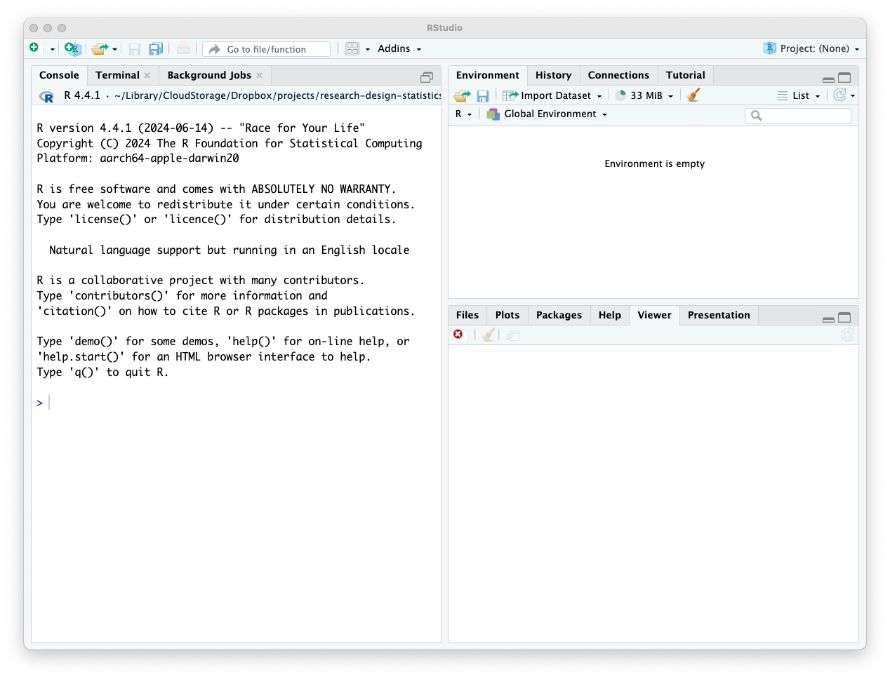
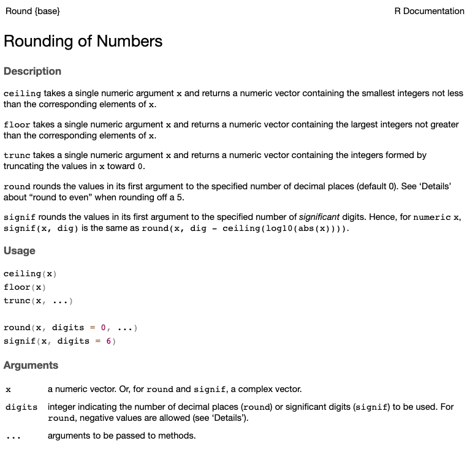

# Introduction to Data and R

At its core, science is a process of seeking knowledge by leveraging observations of empirical data. Given a research question, scientists need to make decisions about how to collect and analyze data to address that question. In this chapter, we begin learning how to work with data. We begin with an overview of the structure of datasets and different types of variables, then I'll introduce R software for storing and manipulating data.

## An introduction to data

In scientific research, **data** consist of information collected via observation or measurement. That's a pretty broad definition! For example, as I write I'm looking out a window and can observe snow covering pine trees in my backyard. That's clearly an observation, so does it qualify as data? I usually make pizza for my family on Friday nights, and to do so I have to measure the weight or volume of flour, water, salt, and yeast. Are those measurements data?

For our purposes, these kinds of observations and measurements don't really qualify as data. In scientific research, data has the distinction of consisting of multiple observations or measurements that can be used to draw conclusions. At my university, courses in statistics address a general education goal on **quantitative reasoning**. Ultimately data are structured measurements or observations that can be used in reasoning, such as making a decision about a hypothesis.

<div class="figure" style="text-align: center">

<p class="caption">(\#fig:c03c01)Unstriped (left) and striped color morphs of red-backed salamanders.</p>
</div>

Let's start by examining an example dataset. A **dataset** is simply a collection of data, often with multiple types. This example dataset is about a phenomenon in biology called tail autotomy, which is the ability of organisms like salamanders and lizards to drop their tail when attacked by a predator. The tail continues to move after it's severed, which is thought to be an adaptation to avoid being eaten. In this case, tail autotomy data was collected for red-backed salamanders (*Plethodon cinereus*), including two different color morphs (striped and unstriped) that are known to differ in behavioral and physiological traits (Figure \@ref(fig:c03c01)). The dataset was collected by a former undergraduate student in my lab, [Dr. Banan Otaibi](https://surgery.arizona.edu/person/banan-wael-otaibi-md), now a surgeon at the University of Arizona. Dr. Otaibi's research question focused on whether tail autotomy behavior differs between color morphs.

<div style="border: 1px solid #ddd; padding: 0px; overflow-y: scroll; height:300px; overflow-x: scroll; width:100%; "><table class="table table table-striped table-hover table-condensed" style="width: auto !important; margin-left: auto; margin-right: auto; margin-left: auto; margin-right: auto;">
<caption>(\#tab:c03c02)(\#tab:c03c02) Dataset on tail autotomy in red-backed salamanders.</caption>
 <thead>
  <tr>
   <th style="text-align:center;position: sticky; top:0; background-color: #FFFFFF;"> individual </th>
   <th style="text-align:center;position: sticky; top:0; background-color: #FFFFFF;"> morph </th>
   <th style="text-align:center;position: sticky; top:0; background-color: #FFFFFF;"> tail.sec </th>
   <th style="text-align:center;position: sticky; top:0; background-color: #FFFFFF;"> tail.vel </th>
   <th style="text-align:center;position: sticky; top:0; background-color: #FFFFFF;"> mass.g </th>
   <th style="text-align:center;position: sticky; top:0; background-color: #FFFFFF;"> length.cm </th>
   <th style="text-align:center;position: sticky; top:0; background-color: #FFFFFF;"> easting </th>
   <th style="text-align:center;position: sticky; top:0; background-color: #FFFFFF;"> northing </th>
  </tr>
 </thead>
<tbody>
  <tr>
   <td style="text-align:center;"> 16O300 </td>
   <td style="text-align:center;"> striped </td>
   <td style="text-align:center;"> 110 </td>
   <td style="text-align:center;"> 3.0 </td>
   <td style="text-align:center;"> 0.8 </td>
   <td style="text-align:center;"> 3.9 </td>
   <td style="text-align:center;"> 350827 </td>
   <td style="text-align:center;"> 4699989 </td>
  </tr>
  <tr>
   <td style="text-align:center;"> 16O301 </td>
   <td style="text-align:center;"> striped </td>
   <td style="text-align:center;"> 160 </td>
   <td style="text-align:center;"> 2.3 </td>
   <td style="text-align:center;"> 0.7 </td>
   <td style="text-align:center;"> 4.0 </td>
   <td style="text-align:center;"> 350827 </td>
   <td style="text-align:center;"> 4699989 </td>
  </tr>
  <tr>
   <td style="text-align:center;"> 16O302 </td>
   <td style="text-align:center;"> striped </td>
   <td style="text-align:center;"> 250 </td>
   <td style="text-align:center;"> 2.8 </td>
   <td style="text-align:center;"> 0.9 </td>
   <td style="text-align:center;"> 3.9 </td>
   <td style="text-align:center;"> 350831 </td>
   <td style="text-align:center;"> 4699988 </td>
  </tr>
  <tr>
   <td style="text-align:center;"> 16O303 </td>
   <td style="text-align:center;"> striped </td>
   <td style="text-align:center;"> 360 </td>
   <td style="text-align:center;"> 3.3 </td>
   <td style="text-align:center;"> 1.0 </td>
   <td style="text-align:center;"> 4.0 </td>
   <td style="text-align:center;"> 350831 </td>
   <td style="text-align:center;"> 4699988 </td>
  </tr>
  <tr>
   <td style="text-align:center;"> 16O304 </td>
   <td style="text-align:center;"> striped </td>
   <td style="text-align:center;"> 220 </td>
   <td style="text-align:center;"> 4.6 </td>
   <td style="text-align:center;"> 0.6 </td>
   <td style="text-align:center;"> 3.4 </td>
   <td style="text-align:center;"> 350831 </td>
   <td style="text-align:center;"> 4699988 </td>
  </tr>
  <tr>
   <td style="text-align:center;"> 16O306 </td>
   <td style="text-align:center;"> striped </td>
   <td style="text-align:center;"> 120 </td>
   <td style="text-align:center;"> 3.0 </td>
   <td style="text-align:center;"> 0.6 </td>
   <td style="text-align:center;"> 3.3 </td>
   <td style="text-align:center;"> 352128 </td>
   <td style="text-align:center;"> 4702166 </td>
  </tr>
  <tr>
   <td style="text-align:center;"> 16O308 </td>
   <td style="text-align:center;"> striped </td>
   <td style="text-align:center;"> 310 </td>
   <td style="text-align:center;"> 3.5 </td>
   <td style="text-align:center;"> 1.2 </td>
   <td style="text-align:center;"> 4.2 </td>
   <td style="text-align:center;"> 352121 </td>
   <td style="text-align:center;"> 4702172 </td>
  </tr>
  <tr>
   <td style="text-align:center;"> 16O309 </td>
   <td style="text-align:center;"> striped </td>
   <td style="text-align:center;"> 220 </td>
   <td style="text-align:center;"> 2.6 </td>
   <td style="text-align:center;"> 0.8 </td>
   <td style="text-align:center;"> 3.7 </td>
   <td style="text-align:center;"> 352122 </td>
   <td style="text-align:center;"> 4702174 </td>
  </tr>
  <tr>
   <td style="text-align:center;"> 16O310 </td>
   <td style="text-align:center;"> striped </td>
   <td style="text-align:center;"> 360 </td>
   <td style="text-align:center;"> 2.4 </td>
   <td style="text-align:center;"> 0.7 </td>
   <td style="text-align:center;"> 3.6 </td>
   <td style="text-align:center;"> 352116 </td>
   <td style="text-align:center;"> 4702169 </td>
  </tr>
  <tr>
   <td style="text-align:center;"> 16O311 </td>
   <td style="text-align:center;"> striped </td>
   <td style="text-align:center;"> 410 </td>
   <td style="text-align:center;"> 2.6 </td>
   <td style="text-align:center;"> 0.9 </td>
   <td style="text-align:center;"> 3.8 </td>
   <td style="text-align:center;"> 352119 </td>
   <td style="text-align:center;"> 4702170 </td>
  </tr>
  <tr>
   <td style="text-align:center;"> 16O312 </td>
   <td style="text-align:center;"> striped </td>
   <td style="text-align:center;"> 190 </td>
   <td style="text-align:center;"> 2.2 </td>
   <td style="text-align:center;"> 1.0 </td>
   <td style="text-align:center;"> 3.8 </td>
   <td style="text-align:center;"> 352110 </td>
   <td style="text-align:center;"> 4702167 </td>
  </tr>
  <tr>
   <td style="text-align:center;"> 16O314 </td>
   <td style="text-align:center;"> striped </td>
   <td style="text-align:center;"> 460 </td>
   <td style="text-align:center;"> 2.9 </td>
   <td style="text-align:center;"> 0.8 </td>
   <td style="text-align:center;"> 3.5 </td>
   <td style="text-align:center;"> 352089 </td>
   <td style="text-align:center;"> 4702122 </td>
  </tr>
  <tr>
   <td style="text-align:center;"> 16O315 </td>
   <td style="text-align:center;"> striped </td>
   <td style="text-align:center;"> 420 </td>
   <td style="text-align:center;"> 2.2 </td>
   <td style="text-align:center;"> 0.5 </td>
   <td style="text-align:center;"> 3.4 </td>
   <td style="text-align:center;"> 352090 </td>
   <td style="text-align:center;"> 4702135 </td>
  </tr>
  <tr>
   <td style="text-align:center;"> 16O316 </td>
   <td style="text-align:center;"> striped </td>
   <td style="text-align:center;"> 440 </td>
   <td style="text-align:center;"> 4.0 </td>
   <td style="text-align:center;"> 0.6 </td>
   <td style="text-align:center;"> 3.3 </td>
   <td style="text-align:center;"> 352088 </td>
   <td style="text-align:center;"> 4702129 </td>
  </tr>
  <tr>
   <td style="text-align:center;"> 16O317 </td>
   <td style="text-align:center;"> striped </td>
   <td style="text-align:center;"> 400 </td>
   <td style="text-align:center;"> 3.4 </td>
   <td style="text-align:center;"> 0.9 </td>
   <td style="text-align:center;"> 4.0 </td>
   <td style="text-align:center;"> 352071 </td>
   <td style="text-align:center;"> 4702177 </td>
  </tr>
  <tr>
   <td style="text-align:center;"> 17O300 </td>
   <td style="text-align:center;"> striped </td>
   <td style="text-align:center;"> 180 </td>
   <td style="text-align:center;"> 3.5 </td>
   <td style="text-align:center;"> 1.1 </td>
   <td style="text-align:center;"> 4.4 </td>
   <td style="text-align:center;"> 351010 </td>
   <td style="text-align:center;"> 4700176 </td>
  </tr>
  <tr>
   <td style="text-align:center;"> 17O302 </td>
   <td style="text-align:center;"> striped </td>
   <td style="text-align:center;"> 270 </td>
   <td style="text-align:center;"> 3.8 </td>
   <td style="text-align:center;"> 0.5 </td>
   <td style="text-align:center;"> 3.2 </td>
   <td style="text-align:center;"> 350989 </td>
   <td style="text-align:center;"> 4700122 </td>
  </tr>
  <tr>
   <td style="text-align:center;"> 17O303 </td>
   <td style="text-align:center;"> striped </td>
   <td style="text-align:center;"> 50 </td>
   <td style="text-align:center;"> 1.7 </td>
   <td style="text-align:center;"> 0.6 </td>
   <td style="text-align:center;"> 3.6 </td>
   <td style="text-align:center;"> 350962 </td>
   <td style="text-align:center;"> 4700106 </td>
  </tr>
  <tr>
   <td style="text-align:center;"> 17O304 </td>
   <td style="text-align:center;"> striped </td>
   <td style="text-align:center;"> 340 </td>
   <td style="text-align:center;"> 3.2 </td>
   <td style="text-align:center;"> 0.8 </td>
   <td style="text-align:center;"> 4.0 </td>
   <td style="text-align:center;"> 350946 </td>
   <td style="text-align:center;"> 4700091 </td>
  </tr>
  <tr>
   <td style="text-align:center;"> 17O305 </td>
   <td style="text-align:center;"> striped </td>
   <td style="text-align:center;"> 300 </td>
   <td style="text-align:center;"> 3.2 </td>
   <td style="text-align:center;"> 1.0 </td>
   <td style="text-align:center;"> 4.1 </td>
   <td style="text-align:center;"> 350939 </td>
   <td style="text-align:center;"> 4700088 </td>
  </tr>
  <tr>
   <td style="text-align:center;"> 16O305 </td>
   <td style="text-align:center;"> unstriped </td>
   <td style="text-align:center;"> 10 </td>
   <td style="text-align:center;"> 0.5 </td>
   <td style="text-align:center;"> 0.4 </td>
   <td style="text-align:center;"> 3.1 </td>
   <td style="text-align:center;"> 352130 </td>
   <td style="text-align:center;"> 4702168 </td>
  </tr>
  <tr>
   <td style="text-align:center;"> 16O307 </td>
   <td style="text-align:center;"> unstriped </td>
   <td style="text-align:center;"> 0 </td>
   <td style="text-align:center;"> 0.0 </td>
   <td style="text-align:center;"> 0.9 </td>
   <td style="text-align:center;"> 3.6 </td>
   <td style="text-align:center;"> 352119 </td>
   <td style="text-align:center;"> 4702157 </td>
  </tr>
  <tr>
   <td style="text-align:center;"> 16O313 </td>
   <td style="text-align:center;"> unstriped </td>
   <td style="text-align:center;"> 20 </td>
   <td style="text-align:center;"> 0.8 </td>
   <td style="text-align:center;"> 0.4 </td>
   <td style="text-align:center;"> 2.9 </td>
   <td style="text-align:center;"> 352090 </td>
   <td style="text-align:center;"> 4702123 </td>
  </tr>
  <tr>
   <td style="text-align:center;"> 16O318 </td>
   <td style="text-align:center;"> unstriped </td>
   <td style="text-align:center;"> 10 </td>
   <td style="text-align:center;"> 1.1 </td>
   <td style="text-align:center;"> 0.6 </td>
   <td style="text-align:center;"> 3.3 </td>
   <td style="text-align:center;"> 352075 </td>
   <td style="text-align:center;"> 4702046 </td>
  </tr>
  <tr>
   <td style="text-align:center;"> 17O301 </td>
   <td style="text-align:center;"> unstriped </td>
   <td style="text-align:center;"> 70 </td>
   <td style="text-align:center;"> 1.9 </td>
   <td style="text-align:center;"> 0.5 </td>
   <td style="text-align:center;"> 3.3 </td>
   <td style="text-align:center;"> 350990 </td>
   <td style="text-align:center;"> 4700114 </td>
  </tr>
  <tr>
   <td style="text-align:center;"> 17O306 </td>
   <td style="text-align:center;"> unstriped </td>
   <td style="text-align:center;"> 70 </td>
   <td style="text-align:center;"> 2.0 </td>
   <td style="text-align:center;"> 0.3 </td>
   <td style="text-align:center;"> 2.8 </td>
   <td style="text-align:center;"> 350910 </td>
   <td style="text-align:center;"> 4700059 </td>
  </tr>
  <tr>
   <td style="text-align:center;"> 17O307 </td>
   <td style="text-align:center;"> unstriped </td>
   <td style="text-align:center;"> 10 </td>
   <td style="text-align:center;"> 0.9 </td>
   <td style="text-align:center;"> 0.8 </td>
   <td style="text-align:center;"> 4.2 </td>
   <td style="text-align:center;"> 350910 </td>
   <td style="text-align:center;"> 4700057 </td>
  </tr>
  <tr>
   <td style="text-align:center;"> 17O308 </td>
   <td style="text-align:center;"> unstriped </td>
   <td style="text-align:center;"> 30 </td>
   <td style="text-align:center;"> 1.7 </td>
   <td style="text-align:center;"> 0.8 </td>
   <td style="text-align:center;"> 4.0 </td>
   <td style="text-align:center;"> 350887 </td>
   <td style="text-align:center;"> 4700003 </td>
  </tr>
  <tr>
   <td style="text-align:center;"> 17O309 </td>
   <td style="text-align:center;"> unstriped </td>
   <td style="text-align:center;"> 50 </td>
   <td style="text-align:center;"> 1.2 </td>
   <td style="text-align:center;"> 1.0 </td>
   <td style="text-align:center;"> 3.9 </td>
   <td style="text-align:center;"> 350889 </td>
   <td style="text-align:center;"> 4699994 </td>
  </tr>
  <tr>
   <td style="text-align:center;"> 17O310 </td>
   <td style="text-align:center;"> unstriped </td>
   <td style="text-align:center;"> 50 </td>
   <td style="text-align:center;"> 1.3 </td>
   <td style="text-align:center;"> 0.6 </td>
   <td style="text-align:center;"> 3.4 </td>
   <td style="text-align:center;"> 350893 </td>
   <td style="text-align:center;"> 4700009 </td>
  </tr>
  <tr>
   <td style="text-align:center;"> 17O311 </td>
   <td style="text-align:center;"> unstriped </td>
   <td style="text-align:center;"> 0 </td>
   <td style="text-align:center;"> 0.0 </td>
   <td style="text-align:center;"> 0.5 </td>
   <td style="text-align:center;"> 3.5 </td>
   <td style="text-align:center;"> 350855 </td>
   <td style="text-align:center;"> 4699997 </td>
  </tr>
  <tr>
   <td style="text-align:center;"> 17O312 </td>
   <td style="text-align:center;"> unstriped </td>
   <td style="text-align:center;"> 0 </td>
   <td style="text-align:center;"> 0.0 </td>
   <td style="text-align:center;"> 0.8 </td>
   <td style="text-align:center;"> 4.0 </td>
   <td style="text-align:center;"> 350871 </td>
   <td style="text-align:center;"> 4700003 </td>
  </tr>
  <tr>
   <td style="text-align:center;"> 17O313 </td>
   <td style="text-align:center;"> unstriped </td>
   <td style="text-align:center;"> 50 </td>
   <td style="text-align:center;"> 1.6 </td>
   <td style="text-align:center;"> 0.8 </td>
   <td style="text-align:center;"> 3.9 </td>
   <td style="text-align:center;"> 350838 </td>
   <td style="text-align:center;"> 4700072 </td>
  </tr>
  <tr>
   <td style="text-align:center;"> 17O314 </td>
   <td style="text-align:center;"> unstriped </td>
   <td style="text-align:center;"> 20 </td>
   <td style="text-align:center;"> 0.6 </td>
   <td style="text-align:center;"> 0.4 </td>
   <td style="text-align:center;"> 3.0 </td>
   <td style="text-align:center;"> 350982 </td>
   <td style="text-align:center;"> 4700003 </td>
  </tr>
  <tr>
   <td style="text-align:center;"> 17O315 </td>
   <td style="text-align:center;"> unstriped </td>
   <td style="text-align:center;"> 20 </td>
   <td style="text-align:center;"> 0.6 </td>
   <td style="text-align:center;"> 0.6 </td>
   <td style="text-align:center;"> 3.4 </td>
   <td style="text-align:center;"> 350957 </td>
   <td style="text-align:center;"> 4699969 </td>
  </tr>
  <tr>
   <td style="text-align:center;"> 17O316 </td>
   <td style="text-align:center;"> unstriped </td>
   <td style="text-align:center;"> 50 </td>
   <td style="text-align:center;"> 1.8 </td>
   <td style="text-align:center;"> 0.5 </td>
   <td style="text-align:center;"> 3.5 </td>
   <td style="text-align:center;"> 350795 </td>
   <td style="text-align:center;"> 4699993 </td>
  </tr>
  <tr>
   <td style="text-align:center;"> 17O317 </td>
   <td style="text-align:center;"> unstriped </td>
   <td style="text-align:center;"> 50 </td>
   <td style="text-align:center;"> 2.0 </td>
   <td style="text-align:center;"> 0.6 </td>
   <td style="text-align:center;"> 3.6 </td>
   <td style="text-align:center;"> 350789 </td>
   <td style="text-align:center;"> 4700005 </td>
  </tr>
  <tr>
   <td style="text-align:center;"> 17O318 </td>
   <td style="text-align:center;"> unstriped </td>
   <td style="text-align:center;"> 40 </td>
   <td style="text-align:center;"> 0.8 </td>
   <td style="text-align:center;"> 0.5 </td>
   <td style="text-align:center;"> 3.4 </td>
   <td style="text-align:center;"> 350811 </td>
   <td style="text-align:center;"> 4700018 </td>
  </tr>
  <tr>
   <td style="text-align:center;"> 17O319 </td>
   <td style="text-align:center;"> unstriped </td>
   <td style="text-align:center;"> 50 </td>
   <td style="text-align:center;"> 1.9 </td>
   <td style="text-align:center;"> 0.4 </td>
   <td style="text-align:center;"> 3.1 </td>
   <td style="text-align:center;"> 350806 </td>
   <td style="text-align:center;"> 4700007 </td>
  </tr>
  <tr>
   <td style="text-align:center;"> 17O320 </td>
   <td style="text-align:center;"> unstriped </td>
   <td style="text-align:center;"> 80 </td>
   <td style="text-align:center;"> 1.4 </td>
   <td style="text-align:center;"> 0.5 </td>
   <td style="text-align:center;"> 3.3 </td>
   <td style="text-align:center;"> 350812 </td>
   <td style="text-align:center;"> 4700030 </td>
  </tr>
</tbody>
</table></div>

### Variables and observations

The first thing to notice about the tail autotomy dataset is that it's organized as a table, where each column represents a unique **variable** and each row represents a unique **observation**. A variable is simply a particular type of data, where the observations or measurements can vary. There are eight variables and 40 observations for each variable in the example dataset. Each variable has a unique name. The number of observations for a variable is called the **sample size**, which is denoted $n$ or $N$.

Data are often organized in this tabular format, whether it is in spreadsheet software like Google Sheets or Microsoft Excel, or as we'll see later in this chapter, statistical software like R. Other names for the tabular format of datasets include a **data matrix** or **dataframe**. They all have the common structure of variables in columns and observations in rows. The observations are also referenced under different names, such as measurements, cases, or individuals.

### Types of variables

Variables can be distinguished between two general types, each with subtypes:

1.  ***Quantitative variables*** Quantitative variables are defined by the observations taking on a range of numeric values. In fact, a synonymous name for a quantitative variable is **numeric**. Some quantitative variables have observations that only take on **discrete** values, such as the number of amino acids composing a protein. In the example dataset, `tail.sec`, the number of seconds an autotomized tail moved, is discrete because seconds was recorded as integer values. Other variables are measured on a **continuous** scale down to any number of decimal places. For example, mass (`mass.g`), length (`length.cm`), and tail velocity (`tail.vel`, the maximum observed number of tail oscillations) are continuous variables. Although there are quantitative variables that by definition can only be discrete (e.g., number of amino acids, number of salamanders in a woodland), sometimes the difference between discrete and continuous is just a matter of measurement. For example. `tail.sec` could have been measured as a continuous variable (e.g., 3.4 sec), but in this case the measurements were rounded to the nearest second, making it discrete.

2.  ***Qualitative variables*** Qualitative variables are defined by the observations being classified into different categories. Indeed, qualitative variables are often referred to as **categorical**, or **factor** variables. Like quantitative variables, there are different types of qualitative variables. These subcategories reflect whether or not the categories of a variable have an inherent order. When the categories do not have an order, the variable is called **nominal**. In the example dataset, color morph (`morph`) is a nominal variable because the categories, striped and unstriped, do not have an order. Other categorical variables have order, such as the life stages of ticks (larva, nymph, adult). Life stage is an **ordinal** variable, reflecting the ordering in which individuals move through the different life stages. Qualitative variables can also be differentiated by the number of categories making up the variable. Variables with only two categories, such as `morph` (striped and unstriped) are called **binary** variables.

Sometimes it's hard to classify a variable definitively. For example, consider `individual` in the example dataset. This is simply an alphanumeric code assigned as a unique id for each individual in the dataset. The last few digits of the code are indeed ordered, but the order isn't meaningful.

### Relationships between variables

When we ask research questions about causality, we can generally define two types of variables: the variables inducing a causal effect, and the variable receiving the effect. In the scientific literature, people refer to these different types of variables with different names, so it's a good idea to become familiar with some of the most common terms.

A variable inducing a causal effect is often referred to as an **explanatory variable**. For example, we might conduct a study on how different types of medication affect blood pressure. In this case, medication type is the explanatory variable. Another common term people use for an explanatory variable is the **exposure variable**. Here the idea is that the type of medication an individual is exposed to has a causal effect on blood pressure.

The variable receiving causal effects is often referred to as the **response variable**. In the example on medication and blood pressure, blood pressure is the response variable. Another common term for a response variable is an **outcome variable**.

I will generally use these terms throughout the book, but note these are not the only terms you'll see when reading about statistical analyses. For example, some people refer to explanatory variables as **independent variables** and response variables as **dependent variables**. I'm going to avoid using those terms as I tend to think they're confusing because sometimes there are relationships among explanatory variables (i.e., they are *not* independent).

Like questions about causality, questions about prediction are also focused on relationships between variables, with the caveat that those relationships may or may not be causal. The research question on tail autotomy is a good example. In that case, color morph is the explanatory variable, and we measured two different response variables, total tail movement time (`tail.sec`) and initial tail velocity (`tail.vel`). Color morph may well predict tail autotomy, but that relationship is not likely to be directly causal. Perhaps there’s a common genetic variant that causes both color morph and the degree of tail autotomy via physiological pathways. We’ll explore examples like this in later chapters.

### Variable naming conventions and metadata

It's good practice to use a consistent naming style for your variables. Notice that each of the variable names in the example database are lower-case. Some names have multiple words or abbreviations separated by a period (e.g., `tail.vel`). Spaces are not always handleded well in statistical software, so it's good practice to avoid them. Other conventions to separate components of a variable name work just fine; for example one could use an underscore (`tail_vel`), or capitalizing the first letter of each part `tailVel`). The most important thing is to be consistent in your approach.

It's also a good idea to get in the habit of generating metadata for your datasets. Metadata is a description of the dataset, including variable definitions, their units of measure, and more. Here's some metadata describing the variables in the example dataset:

<table class="table table table-striped table-hover table-condensed" style="width: auto !important; margin-left: auto; margin-right: auto; margin-left: auto; margin-right: auto;">
<caption>(\#tab:c03c03)(\#tab:c03c03) Variable descriptions for the tail autotomy dataset.</caption>
 <thead>
  <tr>
   <th style="text-align:left;"> Variable </th>
   <th style="text-align:left;"> Description </th>
  </tr>
 </thead>
<tbody>
  <tr>
   <td style="text-align:left;"> individual </td>
   <td style="text-align:left;"> Unique identification code for each individual salamander. </td>
  </tr>
  <tr>
   <td style="text-align:left;"> morph </td>
   <td style="text-align:left;"> Color morph (striped or unstriped) for each salamander. </td>
  </tr>
  <tr>
   <td style="text-align:left;"> tail.sec </td>
   <td style="text-align:left;"> Total tail movement time (seconds). </td>
  </tr>
  <tr>
   <td style="text-align:left;"> tail.vel </td>
   <td style="text-align:left;"> Initial tail movement velocity, measured as the maximum observed oscillations per second. </td>
  </tr>
  <tr>
   <td style="text-align:left;"> mass.g </td>
   <td style="text-align:left;"> Mass in grams </td>
  </tr>
  <tr>
   <td style="text-align:left;"> length.cm </td>
   <td style="text-align:left;"> Snout-vent-length in cm </td>
  </tr>
  <tr>
   <td style="text-align:left;"> easting </td>
   <td style="text-align:left;"> Longitudinal geographic coordinate in UTM zone 18 projection (meters). </td>
  </tr>
  <tr>
   <td style="text-align:left;"> northing </td>
   <td style="text-align:left;"> Latitudinal geographic coordinate in UTM zone 18 projection (meters). </td>
  </tr>
</tbody>
</table>

## Introduction to R

Statistical software is a means to an end. Ultimately our goal is to do good science, and to do that, we must collect, analyze, and interpret data. In this book, I use the statistical platform R to conduct analyses and create graphical outputs of data. You can find many types of software to perform basic data analyses commonly taught as part of an introductory statistics course. Some are free, and some are not. Some have a graphical user interface where you can point and click to select analyses (e.g., SPSS, JMP), some are spreadsheet-based (e.g., Excel, Google Sheets), and others are code-based, requiring the user to write their own computer code scripts to perform analyses. R is 100% free, code-based, and widely used in science. In this section, I will introduce you to the basic data processing skills needed to use R.

### Installing R and RStudio

**R** is a code-based engine for data processing and analysis, and **RStudio** is an interface often used to work in R. Although you can use R by itself, RStudio makes it much easier, allowing you to efficiently write, save, and execute scripts of R code. So while all of the code in this book can be executed directly in R, I strongly encourage working with R via RStudio. Like R, RStudio is free.

If you want to install R and RStudio on your own computer, start by downloading and installing R from <https://www.r-project.org/>. Click the "CRAN" or "download R" link, and then choose any mirror to access a download link for your platform (e.g., macOS, Windows, Linux). Once you have installed R, head over to from <https://posit.co/download/rstudio-desktop/> and click the the link to Install RStudio, then follow the instructions.

There are also ways of using R and RStudio via cloud-based platforms, such as [Posit Cloud](https://posit.cloud). With Posit Cloud, you don't need to install R or RStudio to your hard drive, and your code can be easily shared with others. Although it is often handy to have R and RStudio directly on your hard drive, many courses setup spaces for students to with with R and RStudio via Posit Cloud, so it's worth mentioning here.

### The RStudio Interface

When initially opened, the RStudio interface includes three sections (Figure \@ref(fig:c03c04)). The console pane is on the left side, which is where you work with the R environment by typing in or executing code. For numerical data processing, output of your code will generally be displayed in the console (though not always automatically). Graphical output will be displayed in the output pane on the bottom right when viewing the Plots tab. Other tabs in the bottom right allow one to navigate to files on your hard drive, examine help documents, and more. The section at the top right is the Environment pane, which shows the objects that you have loaded in R. We'll dig in first on how to compose and execute code in the R Console.

<div class="figure" style="text-align: center">

<p class="caption">(\#fig:c03c05)RStudio interface showing the R console (left), working environment (top right), and output (bottom right) panes.</p>
</div>

### Basic data manipulation in R

#### R as a Calculator

Let's start simple by using R as a calculator. When you start R, you'll see some background on the version of R you're using and some related information. Below all that you'll see a greater than sign (`>`). This is the command prompt, and it's where you will type in code that you want to execute. For example, you can do a basic arithmetic such as 2+2 by simply typing in 2+2 and pressing enter.


``` r
2+2
```

```
## [1] 4
```

In the book, I've highlighted R code and like that above in a gray block. Every time I include a chunk of R code, you'll see the command prompt and code to be executed in gray, followed by the output (also in gray), which is the result of the code. So for a simple computation of 2 + 2, you see the command prompt, the 2 + 2 code, and then the output of 4. R prints a number next to the output, here being [1] for the first line of output.

If you want to include notes in your R code that are not executed as code, all you have to do is add a hash sign (\#) before the text of your note, like this:


``` r
2+2 #simple addition
```

```
## [1] 4
```

Here I've added the note `"simple addition"`, which is ignored by R because I included a number sign before the text "simple addition". See what happens if you don't include the number sign to specify your note:


``` r
2+2 simple addition
```

```
## Error in parse(text = input): <text>:1:5: unexpected symbol
## 1: 2+2 simple
##         ^
```

The dreaded red warning text! When output is highlighted in red, that's usually R's way of telling you there's a problem. Here the problem is that R doesn't know what to do with the word "simple". There's no number sign signifying "simple addition" as a note that should be ignored, so R assumes it's part of your code. Also note that R doesn't even get to "addition", it stops executing your code at "simple" because it doesn't know how to proceed.

OK, so that's some background on how to execute a simple arithmetic function and include a note. Now go ahead and perform some basic arithmetic computations:


``` r
4*3 #simple multiplication
```

```
## [1] 12
```


``` r
20/4 #simple division
```

```
## [1] 5
```


``` r
log(42) #the natural log function
```

```
## [1] 3.73767
```


``` r
sqrt(4) #the square root function
```

```
## [1] 2
```


``` r
4^3 #raising 4 to the third power
```

```
## [1] 64
```

We're on our way! In the preceding examples, you can see that some text in R is actually meaningful and does not lead to an error. For example, `log(42)` computes the natural log of 42, and `sqrt(4)` computes the square root of four. In this case, `log` and `sqrt`" are built-in functions in R. More on that soon!

#### Objects

As you can see, it's pretty straightforward to use R as a calculator, but R can do much more. One of the most useful aspects of R is storing data as objects. As a very simple example, suppose we want to assign a value of 4 to a variable that we'll call `x`:


``` r
x <- 4
```

Here we have defined `x` as 4 with the left arrow, which is a less than sign followed by a dash. The arrow indicates the flow of information, with x on the left being defined as 4. There's nothing special about "x" here. For example, I could have defined "y" as 4:


``` r
y <- 4
```

Or, you can define the object `Taylor.Swift` as 4:


``` r
Taylor.Swift <- 4
```

Note that I didn't include a space between "Taylor" and "Swift". Try it with a space and see what happens:


``` r
Taylor Swift <- 4
```

```
## Error in parse(text = input): <text>:1:8: unexpected symbol
## 1: Taylor Swift
##            ^
```

No good. R doesn't like spaces, so when I define objects that involve more than one word, I usually either include a period or underline between them, or I don't include any characters between them but distinguish components of a variable name by capitalization.


``` r
Taylor.Swift <- 4
Taylor_Swift <- 4
TaylorSwift <- 4
taylorSwift <- 4
```

Notice that R is case sensitive! The objects `TaylorSwift` and `taylorSwift` are unique!

OK, great. So I've defined a whole bunch of objects as the value 4. Wait. How do I know each of these objects is 4? Well, type the object name into the R prompt and execute it, and you should see the result is 4:


``` r
x
```

```
## [1] 4
```


``` r
Taylor.Swift
```

```
## [1] 4
```

Cool! So R will store numeric values - data - symbolically. Quick note: R is case-sensitive. See what happens when you don't capitalize the T and S in `Taylor.Swift`:


``` r
taylor.swift
```

```
## Error:
## ! object 'taylor.swift' not found
```

The red text of death. Bummer. This is going to be a major source of frustration as you develop your coding skills. The smallest errors, like a lower-case character when it should be upper-case, will cause your code to fail. If you're hoping to work on your attention to detail, this is going to be a good way to do that!

When we define objects, we can start to use them in functions. For example, what's the square root of `Taylor.Swift`?


``` r
sqrt(Taylor.Swift)
```

```
## [1] 2
```

Clearly it's 2, because `Taylor.Swift` is 4, and the square root of 4 is 2. How about `x + y`?


``` r
x + y
```

```
## [1] 8
```

Right on - `x` and `y` were both defined as 4, so `x + y` is 8. Note that we can define these output of these arithmetic functions as new objects:


``` r
z <- x + y
z
```

```
## [1] 8
```

Here we defined "z" as `x + y`, so `z` is 8. Note that objects can be used to pretty much any degree of complexity:


``` r
z**(x+y)/(Taylor.Swift - x**y*z)
```

```
## [1] -8208.031
```

Finally, objects don't have to be numbers. There are different types of objects in R. All of the objects we just defined are called numeric, because they are just numbers. We can also define objects as characters, which are simply strings of text and defined by quotation marks:


``` r
> ## Character objects have quotation marks
> singer <- "Taylor Swift"
> singer
[1] "Taylor Swift"
```

Another type of object that we'll encounter a lot in statistics are factor variables, which are categorical variables. I will describe those later.

#### Functions

R has built-in functions that allow you to quickly perform calculations. We've already seen this, such as when we quantified the square root of 4 with the `sqrt` function. Remember that functions are usually called in R by specifying the name of the function followed by round brackets that enclose the arguments of the function:


``` r
> sqrt(4)
[1] 2
```

The `sqrt` function is very simple in that it has a single argument, which is the numerical value for which you want to quantify the square root. Other functions have multiple arguments. For example, suppose you want to round the value of 3.147 to a single decimal place. You can use R's built-in `round` function to do that, which has two arguments. The first argument is the value `x` you want to round, and the second argument is the number of digits to round to. When you apply a function with multiple arguments, the arguments are separated by a comma:


``` r
> round(x = 3.147, digits = 1)
[1] 3.1
```

How did I know which arguments are included in the `round` function? Built-in functions have supporting documentation that you can read to learn about the function and its arguments. To read the documentation, simply add a question mark in front of the function name, and execute that code:


``` r
?round
```

When you execute the code, the bottom right panel in RStudio will show you the "Help" document for the round function. You'll see an "Arguments" section, and there you'll see that the round function has two arguments (Figure \@ref(fig:c03f30).

<div class="figure" style="text-align: center">

<p class="caption">(\#fig:c03f30)Documentation for the round function.</p>
</div>

So we see here that the `round` function requires a numerical value `x` to round and the number of `digits` to round to. When you execute code with a function, you can go ahead and use the name of each argument and then specify the value of the argument following an equal sign, like I did above. If you are naming the arguments, the order in which you present the arguments does not matter:


``` r
> round(x = 3.147, digits = 1)
[1] 3.1
> round(digits = 1, x = 3.147)
[1] 3.1
```

You don't have to name the arguments when executing a function, but there's a catch. When you apply a function and specify the value of the necessary arguments, you have to specify the arguments in the order in which the function expects (x and then digits):


``` r
round(3.147, 1)
```

```
## [1] 3.1
```

If you use the reverse order, you get a different answer:


``` r
round(1, 3.147)
```

```
## [1] 1
```

Note that arguments for a function often have default values. For example, the `digits` argument in the `round` function defaults to 0 if not specified, meaning that `round(3.147)` will round 3.147 to 0 decimal places. The default values can be found in the documentation under the Usage section.


``` r
round(3.147)
```

```
## [1] 3
```

There are many, many functions in R. For example, the function `class` makes R show what type of object you are dealing with:


``` r
> class(y)
[1] "numeric"
> 
> class(singer)
[1] "character"
```

#### Vectors

We know that datasets are made up of one or more variables, each with multiple observations. In R, we can store variables with multiple observations as **vectors**. A vector in R usually corresponds to a single variable (one column of your dataset). For example, suppose we have data on body temperature for five individuals of different ages:

<table class="table table table-striped table-hover table-condensed" style="width: auto !important; margin-left: auto; margin-right: auto; margin-left: auto; margin-right: auto;">
<caption>(\#tab:c03c36)(\#tab:c03c36) Example vectors for age and body temperature.</caption>
 <thead>
  <tr>
   <th style="text-align:right;"> Age </th>
   <th style="text-align:right;"> Temperature (Fahrenheit) </th>
  </tr>
 </thead>
<tbody>
  <tr>
   <td style="text-align:right;"> 22 </td>
   <td style="text-align:right;"> 98.2 </td>
  </tr>
  <tr>
   <td style="text-align:right;"> 28 </td>
   <td style="text-align:right;"> 99.1 </td>
  </tr>
  <tr>
   <td style="text-align:right;"> 34 </td>
   <td style="text-align:right;"> 99.3 </td>
  </tr>
  <tr>
   <td style="text-align:right;"> 43 </td>
   <td style="text-align:right;"> 98.4 </td>
  </tr>
  <tr>
   <td style="text-align:right;"> 50 </td>
   <td style="text-align:right;"> 98.9 </td>
  </tr>
</tbody>
</table>

We can use the concatenate function, `c`, to create vector for age and temperature:


``` r
> 
> # The c() function combines individual values into a single vector
> age <- c(22, 28, 34, 43, 50)
> age
[1] 22 28 34 43 50
> 
> ## and now a vector for temperature
> temp <- c(98.2, 99.1, 99.3, 98.4, 98.9)
> temp
[1] 98.2 99.1 99.3 98.4 98.9
```

We can ask R to show us all the values of a vector by simply calling the name of the object, as I've done above. We can also ask R to report particular observations of a vector by using square brackets. For example, to have R report the fifth observation of the temperature vector:


``` r
> temp[5]
[1] 98.9
```

Note that the temp vector has five observations. What happens if we ask for the sixth observation?


``` r
temp[6]
```

```
## [1] NA
```

Here R reports "NA", which means "not available". This is simply R's way of telling you that the value you asked for doesn't exist.

If you want to view multiple observations for a vector, you can specify multiple observations with the concatenate function, or you can use a colon to show consecutive observations:


``` r
> 
> ## Show the 3rd and 5th observation:
> temp[c(3,5)]
[1] 99.3 98.9
> 
> ## Show the 3rd through the 5th observation:
> temp[3:5]
[1] 99.3 98.4 98.9
```

If you want to view observations while excluding particular observations, you can do that by adding a minus sign in front of the observation(s) you want to exclude:


``` r
> 
> ## Show all but the third observation:
> temp[-3]
[1] 98.2 99.1 98.4 98.9
> 
> ## Show all but the third and fifth observation
> temp[-c(3,5)]
[1] 98.2 99.1 98.4
```

We can easily apply arithmetic functions to vectors. For example, suppose I wanted to know how many degrees each individual's body temperature is above or below what's considered the "normal" value of 98.6 °F. Here I'll just ask R to subtract 98.6 from each value in `temp`, and then save that output as a new object called `temp.deviation`:


``` r
> 
> 
> temp.deviation <- temp-98.6
> 
> temp.deviation
[1] -0.4  0.5  0.7 -0.2  0.3
```

Here we can see that the first individual's temperature is 0.4 degrees below normal, the second individual is 0.5 degrees above normal, and so forth.

#### Matrices

Recall that we have body temperature data for individuals of different ages. So far we have created separate vectors for each variable, but each vector has the same structure (5 observations). Remember that datasets of multiple variables are usually organized in a tabular format, with columns representing different variables and rows representing the multiple observations of each variable. In R, we can combine vectors into a single data table called a **matrix**. Matrices are made of rows and columns, just like a spreadsheet, where the rows represent observations, and the columns represent different objects. Let's make a matrix for our age and temperature data using the `cbind` function, which combines objects into multiple columns. We'll save this new table and name it `patient.table`:


``` r
> 
> patient.table <- cbind(age, temp)
> 
> patient.table
     age temp
[1,]  22 98.2
[2,]  28 99.1
[3,]  34 99.3
[4,]  43 98.4
[5,]  50 98.9
```

We can use square brackets to access observations in a matrix, but now we have to consider that we have two dimensions of data: rows and columns. To extract observations from a matrix, we use a square bracket with row and column values separated by a comma. For example, let's say we want to view the age of the second individual. The second individual is in row 2, and age is the first column in our matrix:


``` r
> 
> ## show the age of the second individual
> patient.table[2,1]
age 
 28 
```

What if we wanted to view the age AND temperature for the second individual. In this case, we can just leave the column value blank, which R interprets as requesting all the columns:


``` r
> 
> ## show all data for the second individual
> patient.table[2,]
 age temp 
28.0 99.1 
```

We can also view all the observations for a single variable. Let's say we want to view just the temperature data again. Here we will leave the row value blank but specify the second column for temperature:


``` r
> 
> ## show the temperature values
> patient.table[,2]
[1] 98.2 99.1 99.3 98.4 98.9
```

What if we want to add more variables? Let's say we have the body mass index (BMI) for each individual and want to add it to the matrix. We could just create a vector `bmi`, and then combine it with the other two vectors, or combine it with the `patient.table` matrix. Either will produce the same output:'


``` r
> 
> ## create a bmi vector
> bmi <- c(20, 24, 21, 23, 24)
> 
> ## combine each vector to create a table
> patient.table.new <- cbind(age, temp, bmi)
> 
> ## or just combine the original table with the new bmi vector
> patient.table <- cbind(patient.table, bmi)
> 
> patient.table
     age temp bmi
[1,]  22 98.2  20
[2,]  28 99.1  24
[3,]  34 99.3  21
[4,]  43 98.4  23
[5,]  50 98.9  24
```

Sometimes we don't have complete data for every variable. In R, remember that missing data are recorded as `NA` ("Not Available"). For example, suppose we have data on height (inches) for all but the third individual in our dataset. We would specify `NA` for that individual:


``` r
> 
> ## create a height vector
> height <- c(65, 71, NA, 68, 66)
> 
> ## add to the matrix
> patient.table <- cbind(patient.table, height)
> 
> patient.table
     age temp bmi height
[1,]  22 98.2  20     65
[2,]  28 99.1  24     71
[3,]  34 99.3  21     NA
[4,]  43 98.4  23     68
[5,]  50 98.9  24     66
```

#### Data types in R

Recall that we can generally differentiate variables by their type, either quantitative or qualitative. Each of the four variables we've created so far (`age`, `temp`, `bmi`, `height`) are quantitative. R defines variable types by their **class**, and you can ask R to return each object's classification with the **class** function;


``` r
> 
> class(age)
[1] "numeric"
> class(temp)
[1] "numeric"
> class(bmi)
[1] "numeric"
> class(height)
[1] "numeric"
```

We can see R identifies each of these vectors as **numeric**, which is synonymous with quantitative. Qualitative variables in R are usually classified as **character** or **factor** variables. For example, let's create a nominal qualitative variable **sex**, defining each individual in our dataset as male or female:


``` r
## create a character for sex
sex <- c("female", "female", "male", "female", "male")
class(sex)
```

```
## [1] "character"
```

Notice that `sex` is classified as a character because the observations consist of text rather than numbers. The other common way of defining and analyzing nominal variables in R is as a factor. We can change the object `sex` from a character to a factor variable by using the `as.factor` function:


``` r
## create a character for sex
sex <- as.factor(sex)
class(sex)
```

```
## [1] "factor"
```

When an object is stored as a factor, you can ask R to show you all the levels (i.e., categories) for the variable with the `levels` function:


``` r
levels(sex)
```

```
## [1] "female" "male"
```

Factor variables in R can also consist of levels that are numbers. For example, suppose that we assigned each individual in our dataset to one of three treatments, named "1", "2", and "3". When we initially define the treatment object, R will interpret the class as numeric, but we can change it to a factor:


``` r
## create treatment variable with numeric codes
trt <- c(1,2,3,1,3)
class(trt)
```

```
## [1] "numeric"
```

``` r
## now coerce to factor
trt <- as.factor(trt)
class(trt)
```

```
## [1] "factor"
```

``` r
levels(trt)
```

```
## [1] "1" "2" "3"
```

When a variable is defined as a factor (or character), functions that treat the variable as numeric will not work. For example, we can't numerically add different factor levels of `trt`, even though those levels are stored as numbers. R will tell us that mathematical functions applied to factor data doesn't make sense:


``` r
trt[1] + trt[2]
```

```
## [1] NA
```

#### Data frames

Remember that datasets are organized in tabular format, as we've seen with a matrix in R. One of the downsides of using matrices in R is that they are restricted to a single type of data object, for example all numeric or all character objects. If we want to add the nominal variable `sex` to our data table, we can use a **data frame**, which are flexible enough to include objects of different class which is a categorical variable made of characters ("male", "female"). Data frames in R are useful for storing full datasets, including multiple variables of different types. Here we can use the function `cbind.data.frame` to combine our matrix of numeric vectors with factor object defining the sex of each individual:


``` r
> 
> ## add to the matrix
> patient.table <- cbind.data.frame(patient.table, sex)
> 
> patient.table
  age temp bmi height    sex
1  22 98.2  20     65 female
2  28 99.1  24     71 female
3  34 99.3  21     NA   male
4  43 98.4  23     68 female
5  50 98.9  24     66   male
```

There are some useful functions to inspect the data frame. For example, if we want to see a list of variables in the data frame, their class, and the first few observations, use the `str` function. You can see R reports that we have five variables, including four numeric and one factor, and it reports the name of each variable and the first five observations.


``` r
> 
> str(patient.table)
'data.frame':	5 obs. of  5 variables:
 $ age   : num  22 28 34 43 50
 $ temp  : num  98.2 99.1 99.3 98.4 98.9
 $ bmi   : num  20 24 21 23 24
 $ height: num  65 71 NA 68 66
 $ sex   : Factor w/ 2 levels "female","male": 1 1 2 1 2
```

If you just want to see the first few observations in tabular format, use the `head` function:


``` r
> 
> head(patient.table)
  age temp bmi height    sex
1  22 98.2  20     65 female
2  28 99.1  24     71 female
3  34 99.3  21     NA   male
4  43 98.4  23     68 female
5  50 98.9  24     66   male
```

One of nicest things about data frames is that we can call particular objects from the data frame by using their names. This is done by using the dollar sign, `$`. For example, if we want to view the observations of height, specify the name of the data frame, then a dollar sign, then the variable name:


``` r
> 
> patient.table$height
[1] 65 71 NA 68 66
```

Note this is the same as calling the fourth column in a matrix as we did before, just more user friendly:


``` r
> 
> patient.table[,4]
[1] 65 71 NA 68 66
```

We can also use the bracket notation specifying variables by names:


``` r
> 
> ## view the values for the variable height
> patient.table[,"height"]
[1] 65 71 NA 68 66
> 
> ## view the values for age and height
> patient.table[,c("age", "height")]
  age height
1  22     65
2  28     71
3  34     NA
4  43     68
5  50     66
```

We can do anything we did before with matrices, such as extracting a subset of observations, or doing arithmetic:


``` r
> 
> ## view the values for age and height for the second through fourth individual
> patient.table[2:4,c("age", "height")]
  age height
2  28     71
3  34     NA
4  43     68
> 
> ## view all the values for each variable for the second individual
> patient.table[2,]
  age temp bmi height    sex
2  28 99.1  24     71 female
> 
> ## quantify deviations from 98.6 for the temperature values:
> patient.table[,"temp"]-98.6
[1] -0.4  0.5  0.7 -0.2  0.3
```

### Scripting

One last R skill that I'd like to briefly cover is scripting. Doing analysis by coding is great for a variety of reasons, but one of the best reasons to code is to make your science reproducible with a script. When you execute a set of functions for an analysis, you can save the code to execute those functions in a script, which is basically a text file (with an .R extension).

Suppose you're working on an analysis for an hour and then the power goes out. Well, if you were scripting your analysis, all you have to do is load your script and execute all the functions up to the point where you left off. A script allows you go back and easily make changes, and it allows others to see *exactly* how you performed an analysis. Indeed, most scientific journals are now requiring that authors publish their code used to conduct analyses to be completely transparent about how the analyses were performed.

How do you make a script? It's really easy in RStudio? In your toolbar, just click File, New File, and then R script. That will open a text editor in the top left panel of RStudio. From there you can start writing your code. I strongly recommend that you add notes to your code to describe what the code is doing. These notes don't have to be extensive, but it's very useful to help reorient yourself, or orient someone else for the first time, to what the code is doing.

For example, Figure \@ref(fig:c03c62) shows a simple script to perform some basic descriptive statistical analysis on the salamander tails data. I included some notes to delineate different sections of the script. The dashes are not necessary, but I often use them because they allow me to visually demarcate the different sections of the script, and RStudio recognizes those sections and allows you to navigate among the different sections using the drop-down in the bottom left corner of the script panel.

<div class="figure" style="text-align: center">

<p class="caption">(\#fig:c03c62)Unstriped (left) and striped color morphs of red-backed salamanders.</p>
</div>

How do you execute the code in a script? It’s easy! Just highlight the code that you want to execute, then click the “Run” button in the top right corner of the script panel. You’ll see the code executed in the R console in the bottom left panel, along with any generated output.
