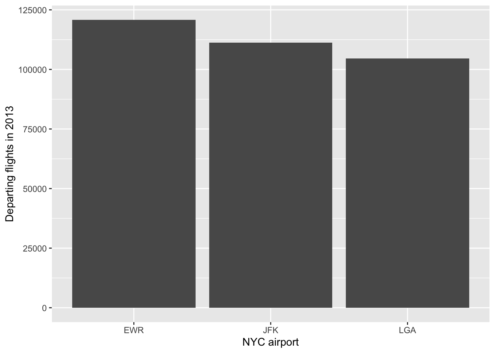
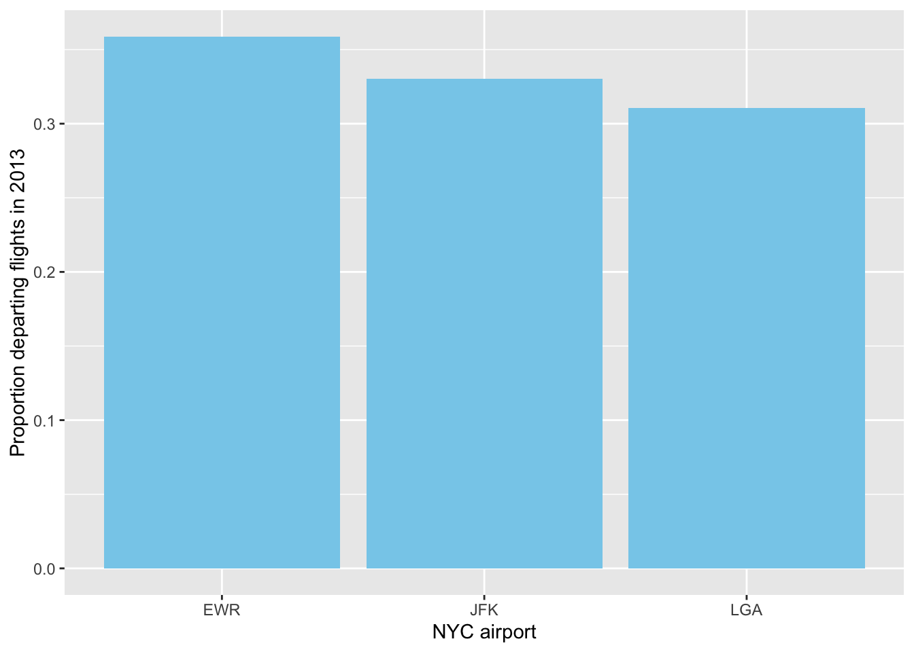
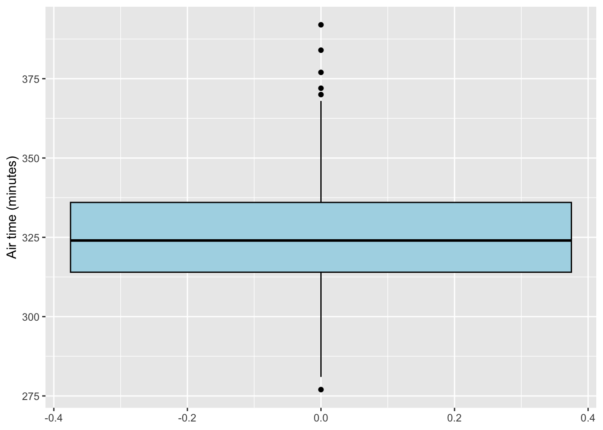
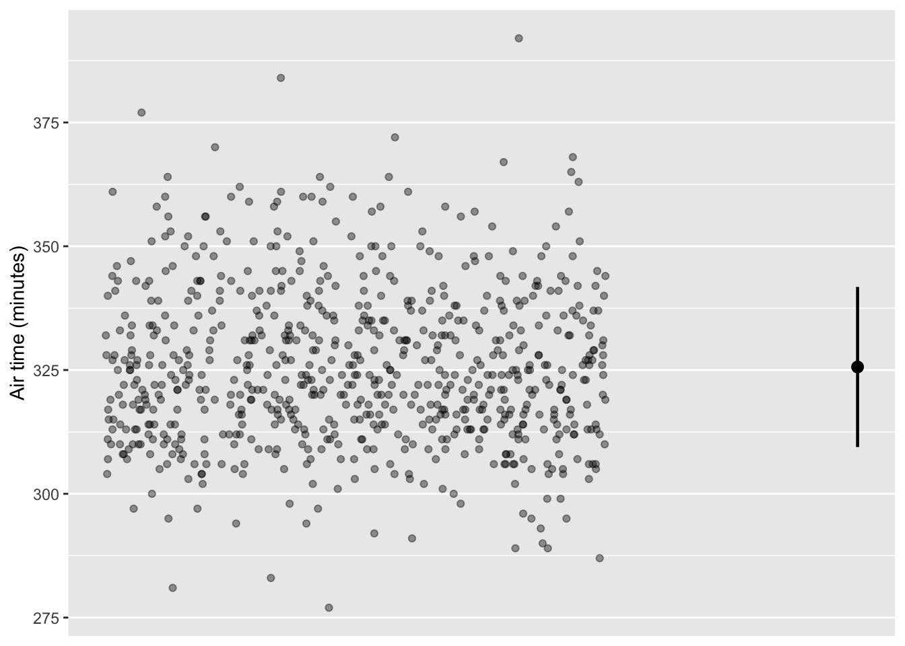
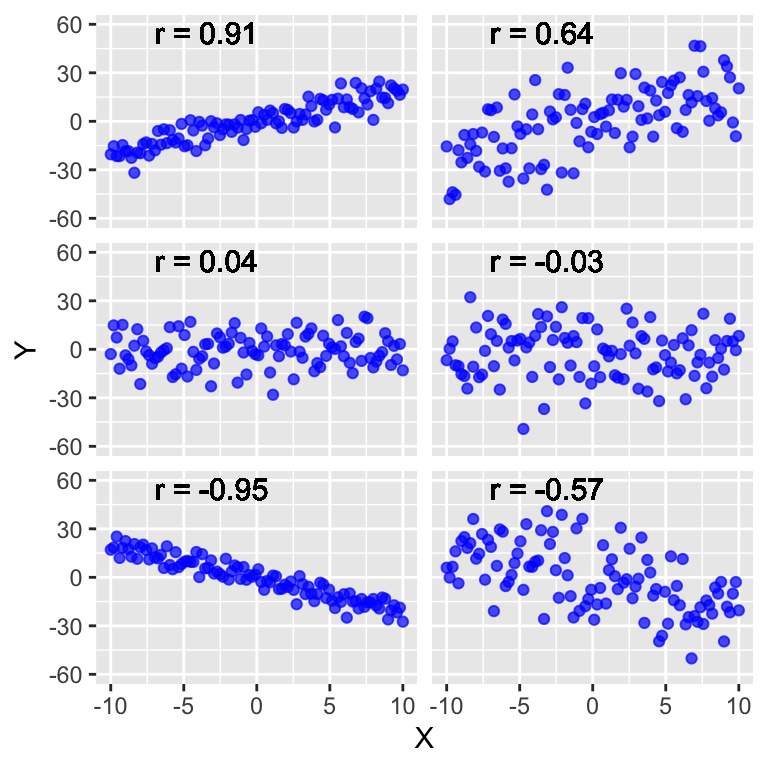
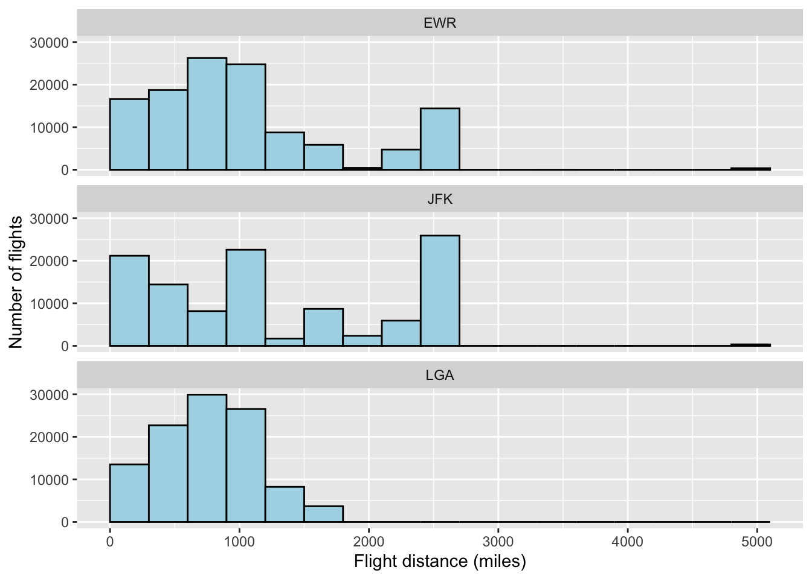

# Describing data

Now that we have a basic understanding of data, in this chapter we look at elementary approaches for describing data graphically and numerically with statistics. At a basic level, a statistic is just a numerica description of data. Description may not make for the most thrilling science, but simple descriptions are essential for decision-making. For example, politicians may use the poverty rate to inform decisions about budget priorities, including funding for food assistance, educational programming, and other services. Without simple descriptive statistics like the poverty rate, we risk decisions being made based on **anecdotes**, which are individual observations often made by a single person. A single politician who lives in a wealthy part of town may think the poverty rate is low based on his personal experience. Statistics, when based on sound study designs, provide a more accurate description than any one individual's experience.

## Defining the population

Even when the research goal is something simple like description, remember that it remains critical to define the population of interest when analyzing and interpreting the data. The population defines who the data should be collected from, and who we can draw inferences about. In this chapter we will investigate descriptive research questions where the population of interest is small enough that we can collect data from everyone in the population.

For example, consider a small municipality with 1000 residents. The population of interest is this single municipality, and it is small enough that everyone in the population can be measured when describing quantities of interest. In cases like this, the research question can be answered with near certainty. If 87 of 1000 residents meet the definition for poverty, then the poverty rate in this municipality is simply

$$
\frac{87}{1000} = 0.087
$$

Now we can’t be *completely certain* that 0.087 is the correct proportion. Perhaps the records used to determine the poverty status of residents are inaccurate. But, setting aside the issue of measurement error, we can often be confident that the degree of uncertainty about descriptive measures is limited when everyone in the population is measured. As we’ll see in the coming chapters, there is much more uncertainty when we can’t measure everyone in a population, and we will look at methods to minimize and quantify that uncertainty. For now, we will keep things simple and focus on the different ways we can describe data.

## Loading data into R

In 2013 there were 336,776 flights that departed airports in New York City (NYC) to destinations in the United States (Wickham 2022). We'll begin by describing some basic information about these departing flights, such as their departing times, departure delays, and more. Because the dataset includes all departing flights of interest in 2013, the descriptive statistics we quantify essentially represent the truth about this population.

To explore the data, the first thing we need to do is load the dataset into R. There are multiple types of files that can be loaded into R. A common file type is the **comma separated values (CSV)** file. CSV files have data organized in columns separated by commas, with separate rows for each row in a data table. CSV files can be generated with a simple text editor, or in spreadsheet software like Excel or Google Sheets.

I created a CSV of the NYC flight data called `nycflights13.csv`. To load the CSV into R, you need to tell R where the file is stored. This location is called the **working directory**, which is simply a folder on your computer. For example, suppose I stored the CSV directly on my desktop. I would begin by setting the working directory to my desktop, using the `setwd` function:


``` r
> setwd("/Users/cosentino/Desktop")   #Mac example
> setwd("C:/Users/cosentino/Desktop") #PC example
```

Once the working directory is set, I can then load the CSV with the `read.csv` function, naming the results data frame `d`:


``` r
> d <- read.csv("nycflights13.csv")
```


If you prefer not to set a generic working directory for a script, you can always load files by specifying the entire directory:


``` r
> d <- read.csv("/Users/cosentino/Desktop/nycflights.csv")   #Mac example
> d <- read.csv("C:/Users/cosentino/Desktop/nycflights.csv") #PC example
```

::: {.alert .alert-block .alert-info}
<b>Note for Posit Cloud users</b>

If you're working in RStudio on Posit Cloud, the working directory is automatically set to the root of your project when you open it. That means you usually do **not** need to use `setwd()`. As long as your data files are saved inside the project (for example in a `data/` folder), you can just use a relative path: `sq <- read.csv("data/nycflights13.csv")`
:::

Another common data format you can load into R is an **.RData** file. This type of file is specific to R and has one or more data object stored directly in the file. The ability to store multiple objects is a nice feature of RData files.For example, an RData file could include two different dataframes. This can be handy when working with multiple datasets that are related to each other as part of an analysis. I generated an RData file that has the `nycflights13` dataset stored as a data frame named `d` data frame, which you can load in the following way using the `load` function:


``` r
> load("nycflights13.RData")
```


Once you've loaded the RData file in this way, the `d` data frame should appear in your working environment.

## Inspecting the dataset

Once you've loaded a file and named a data frame for it, it's a good idea to inspect the structure of a new data frame to confirm that everything loaded properly and as you expect it:


``` r
> str(d)
tibble [336,776 × 19] (S3: tbl_df/tbl/data.frame)
 $ year          : int [1:336776] 2013 2013 2013 2013 2013 2013 2013 2013 2013 2013 ...
 $ month         : int [1:336776] 1 1 1 1 1 1 1 1 1 1 ...
 $ day           : int [1:336776] 1 1 1 1 1 1 1 1 1 1 ...
 $ dep_time      : int [1:336776] 517 533 542 544 554 554 555 557 557 558 ...
 $ sched_dep_time: int [1:336776] 515 529 540 545 600 558 600 600 600 600 ...
 $ dep_delay     : num [1:336776] 2 4 2 -1 -6 -4 -5 -3 -3 -2 ...
 $ arr_time      : int [1:336776] 830 850 923 1004 812 740 913 709 838 753 ...
 $ sched_arr_time: int [1:336776] 819 830 850 1022 837 728 854 723 846 745 ...
 $ arr_delay     : num [1:336776] 11 20 33 -18 -25 12 19 -14 -8 8 ...
 $ carrier       : chr [1:336776] "UA" "UA" "AA" "B6" ...
 $ flight        : int [1:336776] 1545 1714 1141 725 461 1696 507 5708 79 301 ...
 $ tailnum       : chr [1:336776] "N14228" "N24211" "N619AA" "N804JB" ...
 $ origin        : chr [1:336776] "EWR" "LGA" "JFK" "JFK" ...
 $ dest          : chr [1:336776] "IAH" "IAH" "MIA" "BQN" ...
 $ air_time      : num [1:336776] 227 227 160 183 116 150 158 53 140 138 ...
 $ distance      : num [1:336776] 1400 1416 1089 1576 762 ...
 $ hour          : num [1:336776] 5 5 5 5 6 5 6 6 6 6 ...
 $ minute        : num [1:336776] 15 29 40 45 0 58 0 0 0 0 ...
 $ time_hour     : POSIXct[1:336776], format: "2013-01-01 05:00:00" "2013-01-01 05:00:00" ...
```

We see there are 336,776 observations and 19 variables. Some of the variables are numeric, such as the departure delay (`dep_delay`), and others are characters, such as the destination airport (`dest`). We also see some new data classes in this file type. For example, multiple variables are defined as integer (`int`). These are simply discrete quantitative variables. The difference from a numeric variable in R is largely inconsequential; it's just R's way of differentiating between quantitative variables that do or do not have decimals. We also see the variable `time_hour` is stored as `POSIXct`, which is a format for dates and times.

## Describing single variables

### Qualitative variables

Describing single variables in isolation is really a simple exercise. What are the possible values the variable could take on, and what is the relatively likelihood of those values? In other words, describing a single variable is an exercise in characterizing its **distribution**. What values are most likely, which values are least likely, and how much variation is there among the values?

Flights from NYC depart from three major airports: Newark Liberty International Airport (EWR), LaGuardia Airport (LGA), and John F. Kennedy International Airport (JFK). The origin airport is defined by the variable `origin`, which we see is classified as a character (`chr`). How might we describe this variable? The first thing we could do is look at the different levels present in the `origin` variable. The `unique` function will show you each unique level present in a character or factor variable:


``` r
> unique(d$origin)
[1] "EWR" "LGA" "JFK"
```

Here we can see the airport codes for each of the three NYC airports. Now we might want to know how many flights are departing from each airport, or whether most departing flights from one of the airports. In R we can see the **frequency distribution** of a categorical variable with the `table` function.


``` r
> table(d$origin)

   EWR    JFK    LGA 
120835 111279 104662 
```

A frequency distribution is simply the raw count of each observation. We can see each airport had between 104,000 and 121,000 departing flights in 2013. These are staggering numbers. EWR has the most departing flights, but not be much. The distribution of departing flights appears relatively even among the three airports.

We can quantify the *relative* distribution of observations more directly with a **relative frequency distribution**. In other words, how common are departing flights from one airport relative to the other airports. Relative frequency of a qualitative variable is called a **proportion**, quantified as

$$
p = \frac{x}{n},
$$

where $p$ is the proportion, $x$ is the observed number of observations for the category of interest (often called **successes**), and $n$ is the total number of observations in the dataset. Let's quantify the proportion of flights departing from EWR. We know there were 336,776 departing flights($n$), and 120,835 were from EWR ($x$), so the proportion of flights from EWR in 2013 was

$$
p = \frac{120835}{336776} = 0.359,
$$

We see that just over one third of departing flights came from EWR. Proportions are probabilities, so one way of interpreting the outcome here is that, of all departing flights from NYC in 2013, the probability of any one flight departing from EWR was 0.359. Proportions can be converted to percentages by multiplying the proportion by 100. Of the departing flights in 2013, 35.9% were from EWR.

What about the proportion of flights departing from JFK and LGA? Rather than computing the proportions for each airport separately, we can ask R to compute the proportions using the `prop.table` function:


``` r
> prop.table(table(d$origin))

      EWR       JFK       LGA 
0.3587993 0.3304244 0.3107763 
```

Here we wrapped the `table` function of the frequency of each coat color in the `prop.table` function, and now we can see the entire relative distribution of primary fur color. Most flights originated from EWR (35.8%), followed by JFK (33.0%) and LGA (31.1%).

Patterns in data are often easier to see and communicate graphically than numerically. Rather than reporting a table of frequencies or relative proportions, we could create a bar graph. R has built-in functions that can be used to create graphs, but in most cases for this book, we will use functions from a specialized package called `ggplot2` developed specifically for creating graphs. When you want to use functions from a specialized package in R, you first have to install the package with those functions with the `install.packages` function. The main argument of the `install.packages` function is a character vector of the packages you want to install. If you only want to install a single package, just write the name of the package as a character:


``` r
install.packages("ggplot2")
```

When you execute the code, you'll see R will download the package and install it. After you've installed a package, you don't have to install it again, but to use functions from the package you do need to load the package with the `library` function:


``` r
library(ggplot2)
```

Once you execute this code to load the package, you can then use any function from `ggplot2` just as you'd use functions from base R. The main function for creating graphics in `ggplot2` is called `ggplot`. Let's walk through the basic steps of using the `ggplot` function, in this case to create a frequency distribution plots of departing flights by NYC airport in 2013.

1.  The first thing we need to do is create a dataframe organizing the data that we want to plot. In this case we're plotting the frequency of departing flights originating from NYC airports, so we'll create a data frame of these frequencies:


``` r
origin_freq <- as.data.frame(table(d$origin))
colnames(origin_freq) <- c("origin", "n")
origin_freq #display to see how the data are organized
```

```
##   origin      n
## 1    EWR 120835
## 2    JFK 111279
## 3    LGA 104662
```

2.  Next we use the `ggplot` function to code our plot. The first argument in the `ggplot` function should specify the data frame containing the data (`origin_freq`), and we usually include a second argument mapping variables to axes. After the `ggplot` function, we add a set of hierarchical layers, each specified with the `+` operator. Here's the full code needed for a basic bar graph:


``` r
ggplot(origin_freq, aes(x = origin, y = n)) +
  geom_col() +
  labs(x = "NYC airport",
       y = "Departing flights in 2013")
```



We see the code created a graph with two axes, the horizontal x-axis and the vertical y-axis. The variables are mapped to the `x` and `y` axes by the `aes` function. The `geom_col` layer is included to specify a bar chart where the actual frequencies of each category are displayed on the y-axis, and the `labs` layer lets you define the x- and y-axis labels. Note that the `aes` function can be added as a layer outside the `ggplot` function. Including `aes` as an argument within the `ggplot` function is more common because it applies the axis mapping as the default for all subsequent layers.

What if you want the y-axis to show proportions instead of frequencies? Easy. Simply quantify the proportions when creating your dataframe:


``` r
origin_prop <- as.data.frame(prop.table(table(d$origin)))
colnames(origin_prop) <- c("origin", "p")

ggplot(origin_prop, aes(x = origin, y = p)) +
  geom_col(fill="skyblue") +
  labs(x = "NYC airport",
       y = "Proportion departing flights in 2013")
```



Note that I added a `fill` argument here in `geom_col` to specify a different color for the bars. There are many more arguments you can use to customize these figures. Throughout the book I'll add various options like this to plots and point them out.

### Quantitative variables

Let's turn our attention to describing quantitative variables. For this section, we'll narrow our focus on departing flights operated by Alaska Airlines departing Newark, so first we will subset the dataset to flights where the `carrier` is `WN` and `origin` is `EWR`:


``` r
d.as <- subset(d, carrier == "AS" & origin == "EWR")
```

There 714 Alaska flights that departed Newark. If you're taking an Alaska flight out of Newark - perhaps to visit family out west - you might be interested in whether or not their flights typically depart on time. Let's take a look at the distribution of departure delays. The `dep_delay` variable is the departure delay in minutes. The value of `dep_delay` is positive when a flight was delayed, negative when the flight left early, and 0 when the flight departed on time.

Characterizing the distribution of a quantitative variable is more involved than for a qualitative variable. When we were describing flight departures by airport, we easily computed the proportion of all NYC departures by airport. That was an easy task because categories are discrete units. Quantitative variables, on the other hand, are more tricky because often the data are not discrete, and even when they are discrete, there are so many possible values that there will be few observations for each particular value. For example, there won't be many Southwest flights with a departure delay of exactly 2.45364 minutes.

One of the most common graphs used to illustrate the distribution of a single quantitative variable is a **histogram**, so let's start there:


``` r
ggplot(d.as, aes(x = dep_delay)) +
  geom_histogram(binwidth = 10,  # 10-minute bins
                 boundary = 0,
                 color = "black", fill = "lightblue") +
  labs(x = "Departure delay (minutes)",
       y = "Number of Alaska flights")
```


A histogram combines multiple observations into bins of a particular size and shows the frequency of those observations. In this histogram, I set the `binwidth` to 10 minutes. I also set the `boundary` to 0, which forces 0 to be a boundary between bins, allowing us to clearly differentiate between early- and late-departing flights. You don't need to set these values, but sometimes it helps when you want to make the bin size meaningful. Just beware that setting bin sizes too small or too large will make it impossible to see the shape of the distribution.

What can we learn from our histogram of departure delays among Alaska flights from Newark? Impressively, we see there were about 400 Alaska flights that departed 0-10 minutes early, the most common observations in the dataset (which is called the **mode**). We also see a significant number of flights (just over 1500) that departed 10-20 minutes early, or 0-10 minutes late. And then of course there are the occasional flights have long delays, sometimes an hour or more.

It's worth pointing out the shape of the histogram. The majority of observations of departure delay are clustered around zero, but there is a long *tail* of observations to the right, corresponding to longer delays. We can describe this kind of distribution as *skewed to the right*, or as one having *positive skew*. So although the vast majority of flights depart slightly early or slightly late, there's a small chance of departure delays that last for hours. In contrast, we never see flights that depart hours early, which of course makes sense given that people don't arrive many hours before a flight anticipating an early departure.

The shape of distributions of quantitative variables can vary substantially from variable to variable, or population to population. The figure below shows the most common shapes:

\-*Bell-shaped* distributions have a single peak around the most typical values, with a similar number of of observations above and below the most typical values -*Bimodal* distributions have two peaks that can be distinguished with a gap of fewer observations in between. -*Skewed* distributions have a long tail of observations extending above (skewed to the right) or below (skewed to the left) the most typical values. -*Uniform* distributions have a similar nubmer of observations in each bin.


Like qualitative data, we can summarize quantitative data using the absolute count of observations as we've done, or we can display the relative frequency (probability) of each bin. To do this we use the same code as our initial histogram, but add a y-axis computing proportions for each bin with the `after_stat` function.


``` r
ggplot(d.as, aes(x = dep_delay,
                 y = after_stat(..count.. / sum(..count..)))) +
  geom_histogram(binwidth = 10,  # 10-minute bins
                 boundary = 0,
                 color = "black", fill = "lightblue") +
  labs(x = "Departure delay (minutes)",
       y = "Probability")
```


We don't learn anything new about the shape of the distribution, but now we can see, for example, that over half of Alaska flights depart on time or early, and just over half depart late. With so many observations, it was difficult to eyeball those proportions when plotting the absolute counts.

#### Numerical descriptions of central tendency

Distributions of quantitative variables contain a lot of information, and so it can be helpful to summarize the distributions numerically. One aspect of a distribution is its **central tendency**. In other words, what are the typical values of a variable? One numeric summary of central tendency is the **mean**:

$$
\mu = \frac{\sum_{i=1}^n x_i}{n},
$$

where $\mu$ is the mean of the variable, $x_i$ is each observed value of the variable, and $n$ is the total number of observations. The Greek letter sigma is mathematical notation for summation. The formula says to quantify the mean, you need to sum the value of each observation *i* in the population, then divide by the total number of observations. The *i* is simply a subscript representing each observation of the variable, from the first ($i = 1$) to the last ($i = n$). For example, if we have a dataset of {3, 5, 7, 9, 10}, the mean is quantified as

$$
\mu = \frac{3+5+7+9+10}{5}=6.8
$$

In R, the mean can be quantified with the `mean` function:


``` r
(3+5+7+9+10)/5
```

```
## [1] 6.8
```

``` r
mean(c(3,5,7,9,10))
```

```
## [1] 6.8
```

Let's quantify the mean departure delay for Alaska flights. One thing to be aware of is that the departure delay variable has some missing observations, which are coded as `NA` in R. These are for flights that were cancelled. The `mean` function in R will not work unless you tell it how to handle the missing observations. We can simply remove those missing observations to quantify the mean by setting the `na.rm` argument to `TRUE`:


``` r
mean(d.as$dep_delay, na.rm=TRUE)
```

```
## [1] 5.804775
```

We see the mean departure delay for United flights was 5.8 minutes. Let's compare that to another common metric of central tendency: the **median**. The median is the middle value of a distribution. Consider again the made-up dataset of {3, 5, 7, 9, 10}. The value in the middle is 7, so that's the median. If there's an even number of observations in a dataset, the median can be computed mean of the two middle numbers. For example, if a dataset had observations of {3, 5, 7, 8, 9, 10}, the median is the average of 7 and 8: 7.5. Let's compute the median departure delay for United flights, again telling R to remove missing observations:


``` r
median(d.as$dep_delay, na.rm = TRUE)
```

```
## [1] -3
```

Fascinating. The median departure delay is -3 minute, or a departure time of three minutes early. How is it possible that these two different statistics paint different pictures of the typical departure delay? It turns out that the mean and median characterizd central tendency in different ways. Let's break this down. The mean is a ratio of two numbers: the sum of all observations divided by the number of observations. In our example, the mean is a ratio of the total number of minutes flights were delayed over the number of flights. Notice that the magnitude of every observation in the dataset can influence the mean. Indeed, if we change one of the values, the mean should change. Let's try that. There were 30 Alaska flights that departed exactly on time (`dep_delay` = 0). Let's quantify the mean as if one of them had left 500 minutes late.


``` r
#actual mean departure delay
mean.numerator <- sum(d.as$dep_delay, na.rm = T)
mean.denominator <- sum(!is.na(d.as$dep_delay))
mean.numerator/mean.denominator
```

```
## [1] 5.804775
```

``` r
#mean if one on-time flight left 500 minutes late
mean.numerator <- sum(d.as$dep_delay, na.rm = T) + 500
mean.denominator <- sum(!is.na(d.as$dep_delay))
mean.numerator/mean.denominator
```

```
## [1] 6.507022
```

Just by changing one departure delay value from 0 to 500, we see the mean departure delay changes from 5.8 to 6.5 minutes. The mean is sensitive to the magnitude of each observation, and thus it's particularly sensitive to extreme observations. Because the mean is sensitive to extreme observations, it's not always a useful indicator of typical values. Indeed, we can see in the histogram that it's much more likely for an Alaska flight to leave 0-10 minutes early than 0-10 minutes late.

Let's contrast with the median. The median is simply the value in the dataset where 50% of observations are greater and 50% of observations are lower. The magnitude of the values above or below the mean don't matter. Let's prove this with our example of a single departure delay changing from 0 to 500 minutes:


``` r
#actual median
median(d.as$dep_delay, na.rm=T)
```

```
## [1] -3
```

``` r
#median if one on-time flight left 500 minutes late
x <- d.as$dep_delay #create a vector x of the actual departure delays
x[which(x == 0)[1]] <- 500 #change the first on-time flight to 500 min late
median(x, na.rm=T)
```

```
## [1] -3
```

The median doesn't budge at all. We could have changed that late flight's departure delay to 1000, 5000, or an entire month late, and the median would stay the same. In this way, the median is robust to extreme observations, and so it's a handy statistic to characterize the central tendency of distributions that are strongly skewed (i.e., those with extreme observations), or those where we are interested in the most typical observations.

One last point about the mean and median. When the distribution of a quantitative variable is bell-shaped, the mean and median will be similar. For example, the distribution of air time for Alaska flights is approximately bell-shaped:


``` r
ggplot(d.as, aes(x = air_time,
                 y = after_stat(..count.. / sum(..count..)))) +
  geom_histogram(binwidth = 10,  # 10-minute bins
                 color = "black", fill = "lightblue") +
  labs(x = "Air time (minutes)",
       y = "Probability")
```


Because there are not extreme values with strong skew towards one end of the distribution, the mean and median will be similar.


``` r
mean(d.as$air_time, na.rm=T)
```

```
## [1] 325.6178
```

``` r
median(d.as$air_time, na.rm=T)
```

```
## [1] 324
```

Here the mean and median air time are only one minutes apart. Indeed, if the distribution was *perfectly* bell-shaped, the mean and median (and mode!) would all be identical. In contrast, when a variable has a skewed distribution, the mean and median diverge from each other, with the mean being drawn out in the direction of the skew.

#### Numerical descriptions of variation

Statistics of central tendency are useful for describing the most typical values of a quantitative variable, but sometimes we're interested in the variaation among observations. Two distributions can have the same central tendency, but different levels of variation. For example, datasets X = {4, 5, 5, 5, 6} and Y = {1, 2, 5, 8, 9} both have a mean and median of 5, but clearly the observations in Y are more variable than the observations in X. One way of quantifying variation among observations is the **variance**:

$$
{\sigma}^2 = \frac{\sum_{i=1}^n (x_i - \mu)^2}{n}
$$

Let's take a look at what the variance is doing. We take each observation $x$, subtract the mean from that value, and then square the term. This value is called a **squared deviation**, and the variance sums those squared deviations and then divides by the sample size. Effectively what's happening here is that the variance is quantifying the mean of the squared deviations from the mean. The more the observations are far away from the mean, the greater the squared deviations, the greater the mean. The variance with our made-up dataset, {3, 5, 7, 9, 10}:

$$
\sigma^2 = \frac{(3 - 6.8)^2 + (5 - 6.8)^2 + (7 - 6.8)^2 + (9 - 6.8)^2 + (10 - 6.8)^2}{5} = 6.56
$$

This way of quantifying the variance assumes the dataset includes all observations from the pouplation. In practice, most statistical software assumes you don't have all observations from the population, and in those cases, the variance is quantified with the denominator *n-1* instead of *n*. The quantity $n-1$ is a bias correction factor when quantifying the variance with a subset of observations from the population, and we'll explore this topic further when we introduce the concept of sampling in a later chapter.

For practical purposes, we can use the more typical calculation of variance with the denominator *n-1*, which is exactly what the `var` function applied in R. Let's go ahead and quantify the variance in air time among flights:


``` r
var(d.as$air_time, na.rm=T)
```

```
## [1] 261.3608
```

We see the variance in arrival time is 251.4. Because we're squaring the deviation of each observation from the mean, the units of variance is the square of the original unit. Thus, the variance of air time is 261.4 $min^2$. Squared units can be difficult to comprehend, but we can put this metric back on the scale of the original units by taking the square root of the variance, which is called the **standard deviation**:

$$
\sigma = \sqrt{\frac{\sum_{i=1}^n (x_i - \mu)^2}{n}}=\sqrt{\sigma^2}
$$

The standard deviation can be quantified in R with the `sd` function. Like the variance, R's `sd` function uses the bias correction factor in the denominator.


``` r
sd(d.as$air_time, na.rm=T)
```

```
## [1] 16.16666
```

We see now that the standard deviation of air time is 16.2 *min*. The standard deviation is back in the original units of the variable, which is good, but it's still not obvious how we should interpret this number. For practical purposes, you can think of the standard deviation as the average difference in an observation from the mean. In other words, if you randomly picked values from the dataset, on average how far would those value be from the mean air time of 325.6 *min*? For Alasaka airline flights, the average difference in air time from the mean is 16.2 *min*.

Because standard deviations (and variances) are quantified based on the mean, they have the same weaknesses as the mean, namely they are sensitive to extreme observations. Consider, for example, the standard deviation in departure delay for Alaska flights:


``` r
sd(d.as$dep_delay, na.rm=T)
```

```
## [1] 31.36303
```

The meaning here is that we should expect an average difference of 31.4 min from the mean departure delay of 5.8 min. That suggests quit a bit of variation. Indeed, based on the mean and standard deviation alone, we shouldn't be surprised to see departure delays around 35-40 minutes late, or 30-35 minutes early. Yet if we look again at the histogram for departure delay, we see that Alaska flights rarely leave more than 35 mintues late or 30 minutes early. Indeed, most of the variation in departure delays is clustered between -20 and 20 minutes. The standard deviation here seems too high to describe the typical variation in the dataset, and that's because the standard deviation is being increased by the rare but extreme cases of very long delays.

A more flexible way of describing variation in a quantitative variable is to use **percentiles**. A percentile is the observation in the dataset for which a specified percentage of the data falls below that value. We've actually already seen a percentile. The median is the 50th percentile because 50% of the observations fall below that value. But you can quantify a percentile for any level of percentage. In R, percentiles are quantified with the `quantile` function . Here are some percentiles for the departure delay data:


``` r
## Report just the 50th percentile (i.e., the median)
quantile(d.as$dep_delay, probs = 0.5, na.rm=TRUE)
```

```
## 50% 
##  -3
```

``` r
## Report the 0th, 25th, 50th, 75th, and 100th percentiles:
quantile(d.as$dep_delay, probs=c(0, 0.25, 0.5, 0.75, 1), na.rm=TRUE)
```

```
##   0%  25%  50%  75% 100% 
##  -21   -7   -3    3  225
```

So we can see that there are no observations below -21 *min*, 25% of the observations are below -7 *min*, 50% of the observations are below -3 *min*, and so on. Note that the 0th and 100th percentiles are the **minimum** and **maximum** observations in the data, respectively. The percentiles nicely describe variation despite the strong skew in the dataset. For example, we can see from the percentiles that the bulk of the observations - 75% in fact - are between -21 and 3. So if you have a departing flight with Alaska Airlines, you can interpret this as meaning there's a 75% chance that your flight will depart anytime from 21 minutes early to 3 minutes late. The remaining 25% of observations are between 3 and 225 minute delays.

The percentiles are sometimes used to quantify numerical indices of variation. Two common metrics are the **range** and the **interquartile range (IQR)**. The range is simply the difference between the maximum and minimum observation, whereas the IQR is the difference between the 75th and 25th percentiles. Here are some relevant R functions that you'll find of use:


``` r
## report the minimum and maximum
range(d.as$dep_delay, na.rm=TRUE)
```

```
## [1] -21 225
```

``` r
## report the range as max - min
max(d.as$dep_delay, na.rm=TRUE) - min(d.as$dep_delay, na.rm=TRUE)
```

```
## [1] 246
```

``` r
## IQR
IQR(d.as$dep_delay, na.rm=TRUE)
```

```
## [1] 10
```

``` r
## IQR calculated with the quantile function
q.75 <- quantile(d.as$dep_delay, na.rm=TRUE, probs=0.75) 
q.25 <- quantile(d.as$dep_delay, na.rm=TRUE, probs=0.25) 
as.numeric(q.75 - q.25)
```

```
## [1] 10
```

The range is commonly reported for variables to define the bounds of the observed data, but note that the range will be strongly sensitive to extreme observations. For distributions with extreme observations or strong skew, the IQR can be a useful summary statistic to describe variation. Both the range and the IQR have the same units as the original variable.

#### Summary function

The `summary` function is handy for quickly evaluating the quantiles and mean of a numeric variable. You can apply it to a single vector, or to an entire data frame to summarize all the objects in the data frame at once. If there are characters in the data frame, the `summary` function will simply indicate that the object is a character of a specific length.


``` r
## Summary for a single variable
summary(d.as$dep_delay)
```

```
##    Min. 1st Qu.  Median    Mean 3rd Qu.    Max.    NA's 
## -21.000  -7.000  -3.000   5.805   3.000 225.000       2
```

``` r
## Summary for the entire data frame
summary(d.as)
```

```
##       year          month             day           dep_time     
##  Min.   :2013   Min.   : 1.000   Min.   : 1.00   Min.   : 651.0  
##  1st Qu.:2013   1st Qu.: 3.000   1st Qu.: 8.00   1st Qu.: 717.8  
##  Median :2013   Median : 6.000   Median :16.00   Median :1805.0  
##  Mean   :2013   Mean   : 6.415   Mean   :15.79   Mean   :1294.6  
##  3rd Qu.:2013   3rd Qu.: 9.000   3rd Qu.:23.00   3rd Qu.:1825.0  
##  Max.   :2013   Max.   :12.000   Max.   :31.00   Max.   :2205.0  
##                                                  NA's   :2       
##  sched_dep_time   dep_delay          arr_time    sched_arr_time
##  Min.   : 705   Min.   :-21.000   Min.   :   3   Min.   :1015  
##  1st Qu.: 720   1st Qu.: -7.000   1st Qu.:1003   1st Qu.:1025  
##  Median :1815   Median : -3.000   Median :2043   Median :2125  
##  Mean   :1285   Mean   :  5.805   Mean   :1565   Mean   :1595  
##  3rd Qu.:1825   3rd Qu.:  3.000   3rd Qu.:2128   3rd Qu.:2145  
##  Max.   :1835   Max.   :225.000   Max.   :2355   Max.   :2158  
##                 NA's   :2         NA's   :2                    
##    arr_delay         carrier              flight         tailnum         
##  Min.   :-74.000   Length:714         Min.   :  5.00   Length:714        
##  1st Qu.:-32.000   Class :character   1st Qu.:  7.00   Class :character  
##  Median :-17.000   Mode  :character   Median :  7.00   Mode  :character  
##  Mean   : -9.931                      Mean   : 12.19                     
##  3rd Qu.:  2.000                      3rd Qu.: 15.00                     
##  Max.   :198.000                      Max.   :915.00                     
##  NA's   :5                                                               
##     origin              dest              air_time        distance   
##  Length:714         Length:714         Min.   :277.0   Min.   :2402  
##  Class :character   Class :character   1st Qu.:314.0   1st Qu.:2402  
##  Mode  :character   Mode  :character   Median :324.0   Median :2402  
##                                        Mean   :325.6   Mean   :2402  
##                                        3rd Qu.:336.0   3rd Qu.:2402  
##                                        Max.   :392.0   Max.   :2402  
##                                        NA's   :5                     
##       hour           minute        time_hour                  
##  Min.   : 7.00   Min.   : 5.00   Min.   :2013-01-01 07:00:00  
##  1st Qu.: 7.00   1st Qu.:20.00   1st Qu.:2013-03-31 09:45:00  
##  Median :18.00   Median :25.00   Median :2013-06-28 12:30:00  
##  Mean   :12.62   Mean   :22.18   Mean   :2013-06-29 05:05:27  
##  3rd Qu.:18.00   3rd Qu.:25.00   3rd Qu.:2013-09-25 15:15:00  
##  Max.   :18.00   Max.   :35.00   Max.   :2013-12-31 18:00:00  
## 
```

#### Other graphical approaches to display quantitative variables

I want to introduce two additional types of graphs that are useful for displaying the distributions of quantitative variables, specifically a **box plot** and **stripchart**. The graph below shows the distribution of air time using both plots. Box plots show the distribution of quantitative variables by displaying numerical summaries.


``` r
ggplot(d.as, aes(y = air_time)) +
  geom_boxplot(color = "black", fill = "lightblue") +
  labs(x = NULL,
       y = "Air time (minutes)")
```



-   Median: represented by the thick horizontal line as a metric of central tendency.

-   IQR: represented by the edges of the box, where the lower edge is the 25th percentile and the upper edge is the 75th percentile. The box displays the bounds of the middle 50% of the data, giving you a sense for variation.

-   Variation in the tails: Values in the tails of the distribution are displayed by the whiskers, which extend up to 1.5 times the IQR from the box. Any values outside the whiskers are defined as **outliers** and are displayed by points.

The shape of a distribution can be inferred from a box plot based on the symmetry of the box and whiskers. If the box and whiskers are largely symmetrical - as is the case for air time - then the distribution has a bell shape. If the box and whisker extends far from the median to one end of the distribution, then the distribution is skewed.

A stripchart shows each individual observation as a cluster of points along the x- or y-axis (I've chosen the y-axis in this case). It's a nice option if you want to display all the data while still getting a sense for the shape of the distribution. In this case we can see clustering of the arrival times around 325 minutes with fewer observations about equally represented above and below the mean, suggesting a bell shape. Stripcharts can be supplemented with numerical descriptions as well. In this case, the circle with error bars around it represents the mean and one standard deviation above and below the mean.


``` r
ggplot() +
  geom_jitter(
    data = d.as,
    aes(x = 0, y = air_time),
    width = 0.01, height = 0, alpha = 0.4
  ) +
  stat_summary(
    data = d.as,
    aes(x = 0.02, y = air_time),
    fun.data = function(y) {
      m <- mean(y, na.rm = TRUE)
      s <- sd(y, na.rm = TRUE)
      data.frame(y = m, ymin = m - s, ymax = m + s)
    },
    geom = "linerange",
    linewidth = 0.8
  ) +
  stat_summary(
    data = d.as,
    aes(x = 0.02
        , y = air_time),
    fun = function(y) mean(y, na.rm = TRUE),
    geom = "point",
    shape = 16,
    size = 3
  ) +
  scale_x_continuous(NULL, breaks = NULL) +
  labs(y = "Air time (minutes)")
```



## Describing relationships between variables

Whether your goal is causal explanation or prediction, much of science involves examining relationships between variables. So far we have looked at different ways of describing a single variable. But perhaps the distribution is associated with another variable. Those associations may or may not be causal, and teasing out causal vs. non-causal associations will be a major topic later in the book. At this point we simply need some basic approaches to describe associations between variables.

### Associations between quantitative variables

Does learning something about the departure delay of a fligth tell us anything about the arrival delay? The first step to examine the association between two quantitative variables is to create a **scatterplot**, where each point in the graph displays the values of the two variables for each individual in the dataset.


``` r
ggplot(d.as, aes(x = dep_delay, y = arr_delay)) +
  geom_point(alpha = 0.4) +
  labs(x = "Departure delay (minutes)",
       y = "Arrival delay (minutes)")
```

<div class="figure" style="text-align: center">

<p class="caption">(\#fig:c04c35)TODO: caption</p>
</div>

The scatterplot shows a clear and expected pattern. When a flight has a long departure delay, it tends to have a long arrival delay. In other words, we see a positive relationship between the two variables. Scatterplots can also reveal a negative relationships, where the value of one variable tends to decrease as the value of the other variable increases.

The figure below shows a range of possible patterns that one might encounter in scatterplots. Note that in addition to describing the nature of the relationship between variables, we can also describe the magnitude of the relationship. For example, the graph shows two positive relationships in the top row, but the pattern looks much stronger in the scatterplot on the left than the scatterplot on the right.

<div class="figure" style="text-align: center">

<p class="caption">(\#fig:c04c36)TODO: caption</p>
</div>

The **correlation coefficient (r)** is a numerical metric used to describe both the direction and strength of an association. It has a bit of a messy formula:

$$
r = \frac{\frac{1}{n-1} \sum_{i=1}^n (x_i - \mu_x)(y_i - \mu_y)}{\sigma_x \sigma_y}
$$

At a basic level, the correlation coefficient is based on the **covariance**, which is the numerator in the formula for the correlation coefficient. The covariance is a cross product of the deviation between each value of variables $x$ and $y$ from their mean. When $x$ and $y$ values have a common relationship to their mean, the covariance is positive. This would reflect a positive association, where high values of $x$ correspond to high values of $y$, and vice versa. When $x$ and $y$ values have opposite relationship to their mean, the covariance is negative. This would reflect a negative association, where high values of $x$ correspond to low values of $y$, and vice versa. When there's no association between $x$ and $y$, the covariance is 0. Covariance has awkward units. The correlation coefficient divides the covariance by the standard deviations of each variable, which standardizes the association to be between -1 and 1. The values $r<0$ indicate negative associations, $r>0$ indicate positive values, and $r=0$ reflects no association. The strength of the association is reflected by how close the value of $r$ is to 1 or -1. Stronger associations have values of $r$ close to 1 or -1. You can see this in the example scatterplots, where stronger associations reflect less scatter among the points. When $r$ is exactly 1 or -1, the points all fall on a perfect line.

Does it matter which variable we place on each axis when examining the association between two quantitative variables? It can. If your goal is causal explanation, the general practice is to place the explanatory variable on the x-axis and the response variable on the y-axis. The departure delay is almost certainly a cause the the arrival delay, so it makes sense that we placed departure delay on the x-axis. But don't assume that an association between two variables is causal! When we describe associations between variables, all we are doing is describing patterns. We'll need additional tools to say whether or not the patterns we find in the data reflect some kind of causal process. More on that in later chapters.

### Associations between quantitative and qualitative variables

Let's look at how to compare quantitative data between categories of a qualitative variable. The idea here is to visually inspect how the distribution of the quantitative variable differs between categories of the qualitative variable. As an example, let's compare the distance of flights departing from each of the three airports in New York.


``` r
ggplot(d, aes(x = distance)) +
  geom_histogram(binwidth = 300, boundary = 0, 
                 color = "black", fill = "lightblue") +
  facet_wrap(vars(origin), ncol=1) +
  labs(x = "Flight distance (miles)",
       y = "Number of flights")
```

<div class="figure" style="text-align: center">

<p class="caption">(\#fig:c04c37)TODO: caption</p>
</div>

What can we learn from this figure. First, we can see that the shape of the distribution of flight distance varies among airports. LGA has a largely bell-shaped distribution with no skew, whereas the EWR and JFK distributions are more bimodal (perhaps trimodal for JFK). The peak of flight distances between 2000-3000 miles for EWR and JFK suggests those airports specialize more in long-haul flights in comparison to LGA. Indeed, the most common flight distance out of JFK is about 2500 miles.

Although in this case I've plotted a stacked panel of histograms to compare flight distance among categories of airport, we could have used other types of figures. Here's the same association displayed as a set of boxplots. The box plots show the same general shape of the distributions, but they additionally show some useful quantitative summaries. For example, we can see the median distance is greater for JFK than EWR and LGA. It's also clear from this plot that variation in distance among flights is greatest for JFK and lowest for LGA.

### Associations between qualitative variables

What about associations between two categorical variables? One type of plot for this purpose is a **mosaic plot**, which shows the relative frequencies of each category for one variable by the categories of the other variable. For example, the plot below shows the percentages of each carrier with departing flights from each airport. To simplify the plot, I've combined small carriers (defined as those with \<1000 departing flights) into an "other" category.

It's quite apparent that the distribution of carriers differs quite a bit among airports. The top carrier at EWR is United Airlines (UA), but ExpressJet (EV) wasn't close behing. ExpressJet was an airline that flew contracted flights for other carriers. At JFK we see JetBlue (B6) is clearly the most common carrier. Delta is the most common carrier departing LGA, but it appears there's a much more even distribution of carriers operating at LGA compared to EWR and JFK.


``` r
#collapse small carriers (<1000 flights)
n_carrier <- table(d$carrier)
small_carriers <- names(n_carrier[n_carrier < 1000])

# collapsed carrier variable
d$carrier2 <- ifelse(d$carrier %in% small_carriers, 
                     "Other", as.character(d$carrier))

# plot
ggplot(d, aes(x = origin, fill = carrier2)) +
  geom_bar(position = "fill", color = "black") +
  scale_fill_brewer(palette = "Set3") +
  scale_y_continuous(labels = function(x) paste0(100 * x, "%")) +
  labs(x = "Origin", y = "Proportion of flights", fill = "Carrier")
```

<div class="figure" style="text-align: center">

<p class="caption">(\#fig:c04c38)TODO: caption</p>
</div>

## Next steps

In this chapter we've barely scratched the surface of ways to describe and display data. The approaches in this chapter are common, but certainly not the only options, and we will encounter new types of statistics figures in the coming chapters.
