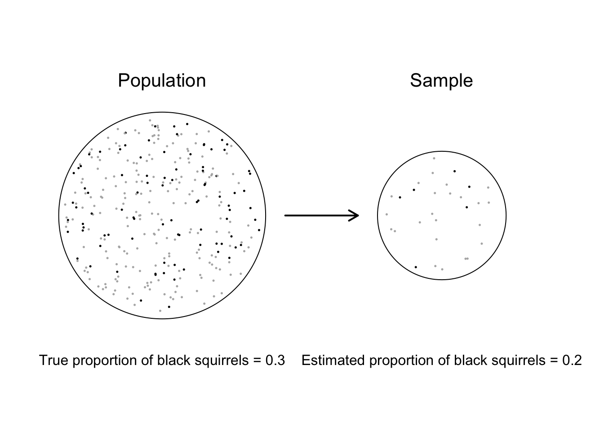
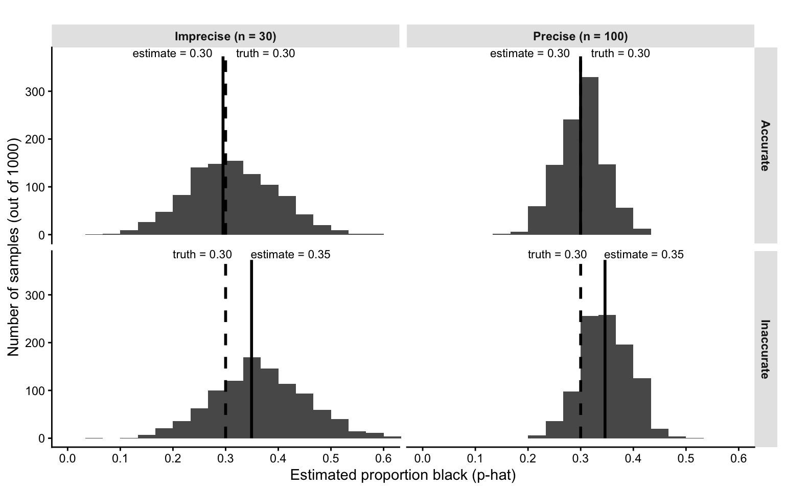

# Uncertainty from sampling

The last two chapters introduced the basic structure of datasets and approaches to describe and display data. We explored a dataset where all observations were made from the population of interest, namely all flights out of NYC airports in 2013. Using a complete dataset like this allowed us to ignore the **problem of uncertainty**. If all observations from the population of interest enter the dataset (and are measured accurately), then any summary statistic quantified (e.g., mean, standard deviation, proportion) might be considered the truth. In practice, even "complete" datasets that include all observations from a population can still have sources of uncertainty, such as measurement or processing errors, but we'll set those issues aside for now.

If only life was so simple! The truth is that in the vast majority of scientific studies, it isn't feasible to measure every individual in a population of interest. What proportion of people in the United States had Lyme Disease last year? What fraction of forests are occupied by endangered spotted owls? What is the mean cholesterol level of people diagnosed with Type 2 diabetes? What's the average radon concentration in households in Chicago? By how much does a vaccine reduce the probability of getting a viral infection? Good luck measuring all the individuals in each of the populations of interest represented by these questions.

What happens when we can't measure every individual in the population? Consider the question about radon concentration in Chicago. If I wanted to know the true mean radon concentration, I would need to measure the air in *every* household in Chicago. There are over a million households in Chicago, and it simply isn't feasible to measure them all. So what do we do? We measure radon in a *subset* of the households. Suppose we select 1000 households for measurement, and we find the mean radon level is 3.0 pCi/L. Is that the true mean radon concentration? Probably not! It's very likely that the mean radon level in our sample will differ from the truth *just by chance*. In other words, measurements from subsets of populations are *estimates*, and there is *uncertainty* about how good those estimates are relative to the truth.

Uncertainty is the fundamental reason why we need a discipline called *statistics*. If we could just quantify values of interest with certainty, then the analysis of data would ultimately be an exercise in mathematics. Measure a bunch of individuals, quantify the value of interest with a mathematical formula, and voila, you have your answer! It just isn't that easy.

If we're going to do science the right way, we have to wrestle with the problem of uncertainty. What creates uncertainty in our statistics? How do we quantify the magnitude of uncertainty? How do we design studies to limit uncertainty? How do we make decisions in light of uncertainty? Fundamentally these are the sorts of questions that are at the heart of statistical analysis. In this chapter, we will look at how uncertainty arises and how we can control it. Then the next chapter will focus on how we can quantify uncertainty with probability.

## Sampling requires estimation

I'm an evolutionary biologist interested in how environmental change causes evolution in wildlife populations. One of our projects focuses on how urbanization and climate change affect the evolution of coat color in eastern gray squirrels (*Sciurus carolinensis*). Coat color is typically gray or black, which is determined by a single allele at a gene called *Mc1R* (melanocortin-1 receptor). The *Mc1R* gene controls how pigment is deposited in tissue in vertebrates. One of the fundamental measurements we make is how frequent each color morph is in a population, and how that frequency changes over time.

We have both color morphs of gray squirrels in my own backyard in Rochester, NY, so let's start there. *What proportion of eastern gray squirrels in my backyard are black*? Notice my question is very specific about *who* I want to make conclusions about. What proportion of the gray squirrels in *my backyard* are black? The target population is very specific and small. My backyard is pretty small, and let's suppose there are only 10 squirrels that live there. I spot each of them and count six black morphs and four gray morphs. Thus, the proportion of black morphs is 0.6, the proportion of gray morphs is 0.4, and that's that! Life is simple when our target population is very specific, small, and easily measured.

But let's expand now. What if I lived on a property with 20 acres of woods (if only I were so lucky), and let's say there are 300 eastern gray squirrels in my woods. Measuring the proportion of black squirrels isn't so simple now. I can't track down all 300 squirrels, but I could measure the coat color in a subset of squirrels. The subset of individuals measured from the population of interest is called the **sample**. Again, for the sake of argument, let's assume that of the 300 squirrels in my woods, 210 are gray and 90 are black, meaning the true proportion of black squirrels is $\frac{90}{300}= 0.3$. Now I don't know this in reality, which is the entire problem we face here. I can't find all 300 squirrels, but I can *estimate* the proportion black with a sample of them. Suppose I take a sample of 30 squirrels and find 6 are black. Based on my sample, I quantify the proportion of black squirrels ss $\frac{6}{30}=0.2$.



```
## Population black count:90of300 (0.3)
```

```
## Sample black count:6of30 (0.2)
```

In this example, note that the sampling process is about individual squirrels. But sometimes sampling can be hierarchical. For example, let's rephrase the research question and ask *What proportion of squirrels in all backyards in Rochester, NY are black*? There are too many backyards in Rochester to visit them all, so I will need to select a sample of backyards. Moreover, I can't guarantee that I will observe every single squirrel in every back yard, so there's additional sampling going on within each backyard. In other words, the population is nested. Of the population of all backyards in Rochester, I can only visit a subset of them. And among the backyards I visit, I can only measure a subset of squirrels. There are two, nested layers of sampling here that can cause deviations between the true proportion of black squirrels in Rochester backyards and the estimate from my sampling.


```
## Population black count: 90 of 300
```

```
## Sample black count: 6 of 30
```

Sampling brings us face to face with the fundamental problem of statistical analysis. The estimates we make of quantities of interest from a sample will not be the same as the truth. This uncertainty can make decision-making very difficult. Suppose I'm interested in whether natural selection is causing an increase or decrease in the proportion of black squirrels in a population of interest. I measure the proportion every year for 20 years. How much of the change that I see is due to natural selection (if any), and how much is due to the fact that I'm sampling a subset of the pouplation? In other words, how much of the change from year-to-year is a signal of the process of interest (selection), and how much of it is noise (errors from sampling)? The more noise there is, the harder it is to see the signal. So if we're going to do science well, we need tools to minimize the amount of noise from sampling and to quantify the degree of uncertainty about an estimate from any given sample.

## Parameters, estimates, estimands

Like most technical disciplines, statistics is full of jargon. Sorry. Before we take a look at the causes of uncertainty and how we can control them, let's define some key terms related to sampling. Consider again my goal of estimating the proportion of black squirrels in my woods.

Quantities with unknown values are called **parameters**. In my example, the parameter is the true proportion of black squirrels in my woods. The parameter is a probability in this case, but parameters can be means, variances, rates, components of a complex statistical model, or any number of other quantities. The defining feature of parameters is that they are unknown and require estimation to answer your research question. If I collect data on 30 squirrels and find 6 are black, then my **estimate** is 0.2 for the proportion black. In practice, we can distinguish estimates from parameters by using a "hat". For example, the true proportion of black squirrels is $p = 0.3$, whereas the estimate from my sample is $\hat{p}=0.2$.

Sometimes we have to estimate multiple parameters in a statistical analysis, but not all parameters are of direct interest for our research question. The quantities of interest for our research question are called **estimands**. In my example on the proportion of black squirrels in my woods, the question and analysis is simple enough that there's only a single parameter, and it's the parameter I'm interested in. The true proportion of black squirrels is the estimand.

In a more complex statistical analyses, we will often have to estimate multiple parameters, but not every parameter is of interest. For example, when I want to measure the change in the proportion of black squirrels over time, I could fit a model that includes two parameters, specifically the proportion of black squirrels at the starting time point, and the annual change in the proportion of black squirrels. If I'm interested in whether natural selection is causing a change in the proportion fo black squirrels, the estimand is the annual change. In these cases of complex statistical analyses, it is important to identify which parameters estimands.

## Sources of uncertainty from sampling


Now that we have a basic sense for the process of sampling, let's get more specific about why estimates from samples deviate from the truth. There are two fundamental processes that cause estimates from a sample to be different from the truth:

1.  **Sampling error**: When I take a sample of 30 squirrels out of 300, by chance there can be relatively more or fewer black squirrels in my sample than in the true population. This kind of variability is a consequence of selecting a finite number of individuals into a sample. There's simply randomness in who happens to be selected. The deviation in a sample estimate from the truth due to this chance variation of who enters the sample is called sampling error.

2.  **Systematic error (bias):** How did the 30 squirrels I observed enter my sample? If each of the 300 squirrels in my woods had an equal chance of entering the sample, then we have no problem. But let's say the sampling process was not random. What if black squirrels are easier to spot than gray ones, such that each black morph has a greater chance of entering my sample than the gray ones? My estimate of the proportion black would be greater than the truth. The tendency for the sampling procedure to produce estimates that are too high or too low on average is called systematic error, or bias.

Sampling error and bias are the two basic causes of uncertainty when estimating quantities from samples, but it's important to note that they are not the only sources of uncertainty in practice. For example, **measurement error** is a source of uncertainty that can be present whether we use a sample or exhaustively measure every individual in a population. **Measurement error** is a deviation in the observed value for a particular individual in the sample compared to the truth. Those deviations may be random. For example, a scale used to measure mass could produce measurements that are a few milligrams too high or low. If the deviations are equally likely to be high or low (zero on average), then, then the measurement error will add variability to the estimate, but not bias it. On the other hand, if the scale consistently overestimates or underestimates mass, then measurement error will introduce bias. 

The takehome point here is that when we rely on samples, we can expect uncertainty in our estimates from random sampling error and biases with respect to how individuals enter the sample. Additional uncertainty can come from measurement error, data entry errors, misclassification, and more. These latter sources of error are important but often more specific to the data collection methods of particular disciplines, so I acknowledge them here but will keep the focus of this chapter on sampling error and bias associated with samples.  

## Accuracy and precision

When we estimate quantities from a sample, there's uncertainty about the value of that estimate. We will explore two different ways of characterizing the quality of an estimate: how close our estimate should be to the truth based on our sampling design, and the variation in the possible values of the estimate we might obtain based on our sampling design. These two concepts are referred to as **accuracy** and **precision**, and estimates are of highest quality when they are both accurate and precise. Let's break these terms down.

### Accuracy

On average, how close is an estimate from the truth? Let's reconsider our squirrel sampling process. There are 300 squirrels in my woods, and 90 are black, so the true proportion of black squirrels is 0.3 The sampling process consists of observing a subset of 30 squirrels and recording whether or not each is black. In this case, the parameter (and estimand) is the true proportion of black squirrels, and the estimate is the proportion of black squirrels in the sample. If we record 6 black squirrels out of 30 our estimate for the prportion black is 0.2. On its face, that particular estimate doesn't appear to be very accurate. The estimate is obviously too low. So imagine we resample the population, again drawing a sample of 30 and this time finding that 11 are black. In this second sample, the proportion black is $\frac{11}{30}=0.37$. Now the estimate is too high! So again we resample the population, drawing another 30 squirrels, eight being black, so the proportion black is too low: $\frac{8}{30}=0.27$.

Are these estimates accurate? In the strict sense that the estimates are not identical to the truth, you might be tempted to say they are not accurate. But that's not how we define accuracy in a statistical sense. To describe whether a sample estimate is accurate, we have to consider the entire distribution of possible estimates from a sample of 30 squirrels. In other words, imagine that I repeated this process of sampling 30 squirrels 1000 times, each time estimating the proportion black. The figure below shows a histogram of the estimates: (\@ref(fig:c05c03).

<div class="figure" style="text-align: center">

<p class="caption">(\#fig:c05c03)Distribution of estimates of the proportion of black squirrels from 1000 unique samples each with 30 squirrels.</p>
</div>

Notice that this distribution is centered right on 0.3 (dotted vertical line), which is exactly what the truth is. In other words, when considering our sampling process, repeatedly conducted many times, we get a sense for the entire distribution of possible estimates, and we see that our estimate is - **on average** - accurate. Any particular estimate can be low or high. The point here is that there is no *systematic* difference between the estimate and the truth, and in that sense, we would conclude the sampling process is accurate. This distribution of possible outcomes of an estimate based on our sampling process is called a **sampling distribution**. If the sampling distribution is centered on the true value of a parameter, then the estimates are by definition accurate.

Of course estimates from samples are not always accurate. Remember that black squirrels are easier to spot in the woods than the gray morph, which increases the probability of black squirrels entering the sample. Figure \@ref(fig:c05c04) shows one example of what a sampling distribution might look like when black squirrels are more likely to be detected than the gray morph.


``` r
set.seed(4)

p_true <- 0.30
n <- 30
reps <- 1000
w_black <- 1.25  # 25% higher detection for black vs gray (gray weight = 1)

# Effective probability a *detected* squirrel is black
p_det <- (w_black * p_true) / (w_black * p_true + 1 * (1 - p_true))

# Sampling distribution of p-hat based on detected squirrels (n fixed at 30)
phat <- rbinom(reps, size = n, prob = p_det) / n
d <- data.frame(phat = phat)
mean_phat <- mean(phat)

ggplot(d, aes(x = phat)) +
  geom_histogram(binwidth = 1/n, boundary = 0, closed = "left") +
  geom_vline(xintercept = p_true, linetype = "dashed", linewidth = 1) +
  geom_vline(xintercept = p_det, linetype = "solid",  linewidth = 1) +
  annotate(
    "text",
    x = p_true, y = Inf,
    label = paste0("Truth = ", sprintf("%.2f", p_true)),
    vjust = 1.2, hjust = 1.2
  ) +
  annotate(
    "text",
    x = mean_phat, y = Inf,
    label = paste0("Mean estimate = ", sprintf("%.2f", mean_phat)),
    vjust = 1.2, hjust = -0.2
  ) +
  labs(
    x = "Estimated proportion black",
    y = "Number of samples (out of 1000)"
  ) +
  theme_classic()
```

<div class="figure" style="text-align: center">

<p class="caption">(\#fig:c05c04)Example of a sampling distribution showing biased estimates.</p>
</div>

Here we can see there's a clear problem in our sampling process. There's variation in the possible estimates just like the first case, but notice that the estimates are more consistently overestimates than underestimates. On average, our estimates are too high. If the estimates tend to systematically differ from the truth, then the estimates are ***biased***. Bias is a consistent discrepancy between the estimates and the true value of the parameter. Estimates may be biased high or biased low. When we design a study and sampling process, it is important to use strategies to maximize accuracy (minimize bias). More on that in a bit.

### Precision


When we examine the range of possible estimates based on a sampling design, we can examine how much variation we expect to see in the estimates from sample to sample. When we repeatedly sample 30 squirrels, we know our estimates of the proportion black will vary because the squirrels that enter our sample have an element of chance to it. Sometimes you end up with 8 black morphs, other times you sample 11 black morphs, even though the expectation is 9 black squirrels based on a true proportion of 30%. We defined this kind of chance variation in which individuals enter a sample **sampling error**, and it leads to deviations of the sample estimate from the parameter value. The variation in sample estimates from sample to sample is called **precision**. Precision is a measure of how consistent estimates should be when we repeatedly sample from a population, using the same sampling methodology each time. If the estimates are consistently around the same value, then the estimates are precise. If the estimates vary wildly, then the estimates are imprecise.

From a coarse perspective, we can gauge the precision of an estimate by examining the width of a sampling distribution. To illustrate this, consider two sampling processes for estimating the proportion of black squirrels, one where we sample 30 squirrels each time, and another where we sample 60 squirrels each time. I've simulated each sampling process 1000 times and show the results in (Figure \@ref(fig:c05c05). What do you notice that's different between these sampling distributions?

<div class="figure" style="text-align: center">

<p class="caption">(\#fig:c05c05)Sampling distributions for estimates of the proportion of black squirrels based on samples of size 30 (left) vs. 60 (right).</p>
</div>

These sampling distributions differ in a couple important ways. First, notice that the sampling distribution for N = 30 squirrels is wider than the sampling distribution for N = 60 squirrels. There is a clear difference in precision between the two sampling approaches. Sampling with N = 30 squirrels leads to less precise estimates of the proportion black than sampling with N = 60 squirrels. With fewer squirrels, you should expect to see much more variation in the potential estimates. If you're having trouble understanding why, consider a more extreme example. What if I had only sampled N = 2 squirrels? The only possible estimates of the proportion black would be 0, 0.5, and 1. Conversely, suppose I sample all N = 300 squirrels? In that case, I would get 0.3 every time. Increasing sample size increases precision.

Second, notice that regardless of whether the sample size is N = 30 or 60 squirrels, the most likely value of the estimate is 0.3, which is the truth. In other words, although sample size increases precision, it doesn't affect accuracy. The estimates are accurate whether the sample size is N = 30 or N = 60.

### Considering accuracy and precision together

When designing a study to sample individuals from a population of interest, your goal should be to design sampling schemes that maximize accuracy and precision of estimates. Both matter, and one doesn't guarantee the other. In other words, you can have samples that are accurate and precise accurate and imprecise, inaccurate and precise, or inaccurate and imprecise. The figure below shows each of these four outcomes for our example of estimating the proportion of black squirrels. The ideal situation is obtaining an estimate that is accurate and precise, in other words consistently getting the right answer. The worst outcome is inconsistently getting the wrong answer (inaccurate and imprecise).

<div class="figure" style="text-align: center">

<p class="caption">(\#fig:c05c06)Four combinations of accuracy and precision. Precision increases with sample size (n = 100 vs n = 30). Inaccuracy is illustrated by a 25% detection bias favoring black squirrels.</p>
</div>

## Maximizing accuracy and precision of estimates

High quality estimates are both accurate and precise. When designing a scientific study, it is critical to design the data collection scheme in a way that will maximize accuracy and precision. At this point I'd like to intorduce two elements of study design that affect accuracy and precision.

### Random sampling

The most effective strategy to minimize bias is to take a ***random sample*** of individuals from the population of interest. A random sample means that every individual in the population has an equal chance of being included in the sample. For our study estimating the proportion of black squirrels, that means black and gray morphs must have an equal probability of entering the sample. Often this is easier said than done and often requires some domain knowledge. For example, I know that black squirrels are more visible than gray ones, but I also know from experience that the black morph tends to be less active than the gray morph. I either need to design my sampling to mitigate those potential biases, or I need to explicitly account for them when I estimate the proportion of black squirrels.

In other words, it's much better to be aware of potentially biases in a sample than to ignore them. Consider an epidemiologist interested in estimating the proportion of people in a city with influenza. One might be tempted to use medical records from people who visit a doctor to estimate flu prevalence, but it's important to consider that records of individuals who visit the doctor are not representative of the broader population. People who went to the doctor likely had significant - potentially even severe - symptoms. People who get the flu but who have mild symptoms are likely underrepesented in medical records, and so relying on those records would lead to an overestimate of flu prevalence. Data from sources like medical records are often called a **sample of convenience** because the data are easy to access, but rarely are the data representative of the population of interest.

Bias in estimates is similarly caused by **volunteer samples**. The classic case is survey design. Suppose residents in a small town are debating whether to purchase land to build a park for recreation. The park will include a playground, a splash pad, fields for soccer, baseball, and football, and some tennis courts. The tennis courts and fields will all have lights, allowing people to play in the evenings. The town board wants to see if residents support the idea of building the new park, so they create a survey and mail it to residents. Who's most likely to respond? In this case, volunteer bias would occur if the people most likely to respond are ones who have very strong opinions. For example, residents who are really passionate about having recreation fields may be most likely to respond, causing an overestimate in the proportion of residents who favor creating the park. Conversely, imagine there's a large neighborhood next to the land being considered for purchase, and those residents don't want bright lights on at night in their backyard. Support for the park may be underestimated if the residents in that neighborhood are more inclined to respond to the survey.

### Replication

The clearest way to maximize precision (i.e., minimize sampling error) is to maximize replication, the number of independent sampling units in a study. The number of independent sampling units is also referred to as the **sample size**. Remember that sampling error is the chance variation in estimates due to sampling only a subset of individuals from a population. If you could include all individuals from the population in your study, there would be no sampling error. Sampling error decreases as you increase the sample size, which is exactly what we showed earlier in the chapter with the squirrelcolor example. There was much more variation in estimates of the proportion of black squirrels when sampling 30 squirrels than when sampling 60 squirrels. Precision increases with sample size.

Note that I defined replication as the number of **independent** sampling units. Independence is really important, because it affects how you count sampling units and ultimately determine the sample size in a study. Replicates are independent if the measurements from one replicate have no influence on the measurements from other replicates. Sometimes individuals in a study are not independent. For example, what if gray and black squirrels are not randomly distributed in space? Perhaps they prefer different types of habitats. In that case, if I see one black squirrel, that increases the chance of seeing another black squirrel. In a situation like this, we would need to consider the way in which squirrels are clustered in larger sampling areas, like backyards or parks.

As another example, consider again the survey about building a park. Should the researcher include multiple people from the same household in the survey? They certainly could, but the responses of individuals from the same household are likely correlated. In other words, individuals from the same household may have similar preferences about the park. If you included these individuals in your study and counted them as independent replicates, your estimates will be less precise than you think. Counting individuals as unique replicates when they are not independent is referred to as ***pseudoreplication*** and can lead to incorrect inferences. When in doubt about independence, a useful rule of thumb is to ask yourself **What is the unit that was selected for inclusion in the sample?**. That can be a useful place to start for thinking about sample size. In our backyard squirrel example, we're first and foremost selecting backyards. The individual squirrels are nested within those yards.

**Important note**: Sample size affects precision, but it does not affect accuracy of estimates. Remember that accuracy is how close, **on average**, your sample estimates are to the true value of the parameter. There's no inherent effect of sample size on accuracy. In other words, low sample size does not cause bias.

### Take-home points

-   Most scientific studies rely on samples, not full populations, so the empirical values we quantify are estimates, not the truth.

-   Sampling distributions describe how estimates vary across repeated samples.

-   Accuracy is about whether estimates are correct (consistent with the truth) on average. Estimates that are consistently wrong are biased. Random sampling is a key study design strategy to reduce bias.

-   Precision is about how much estimates vary from sample to sample due to sampling error. Increasing sample size is a key study design strategy to increase precision.
