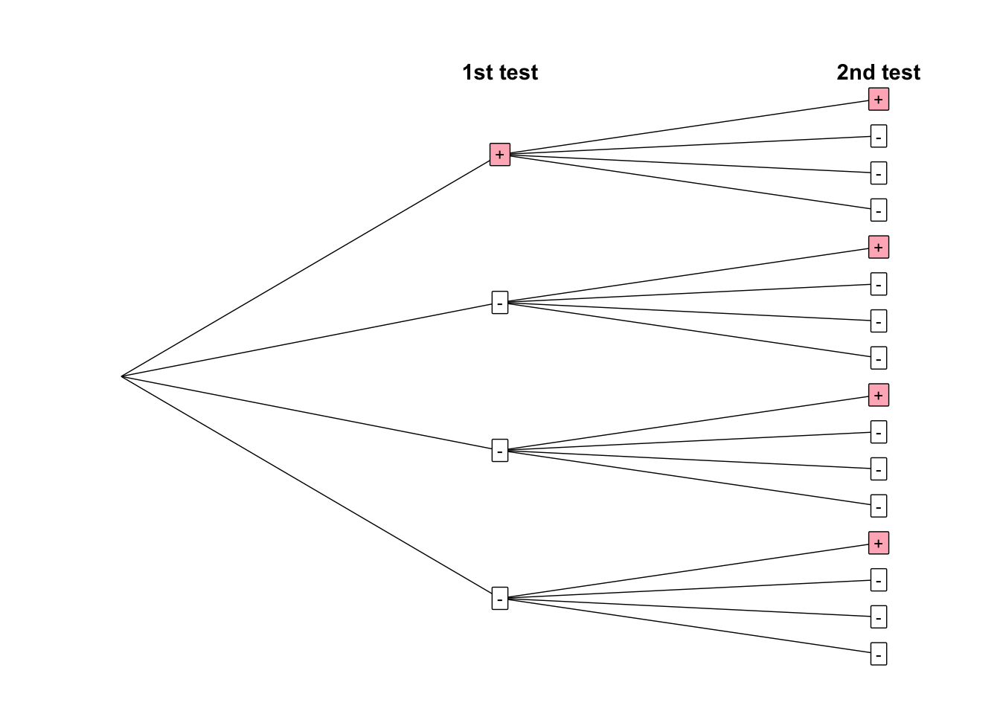
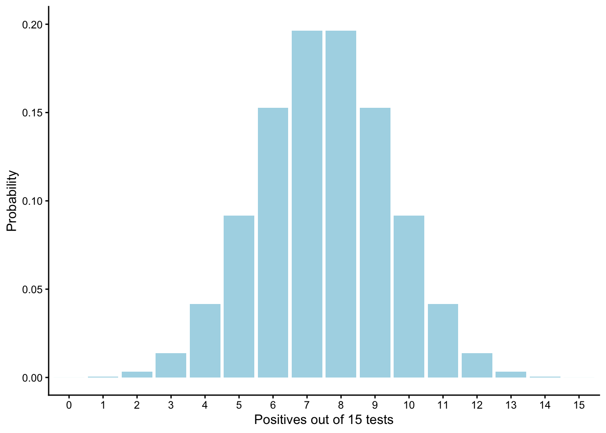
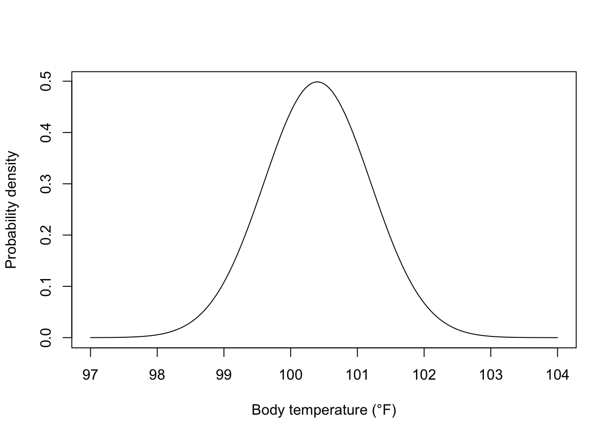
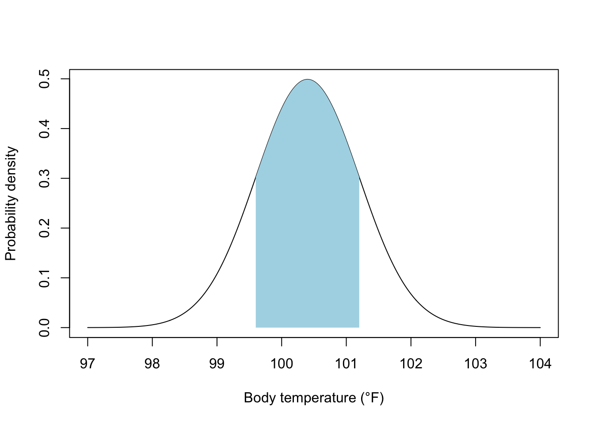
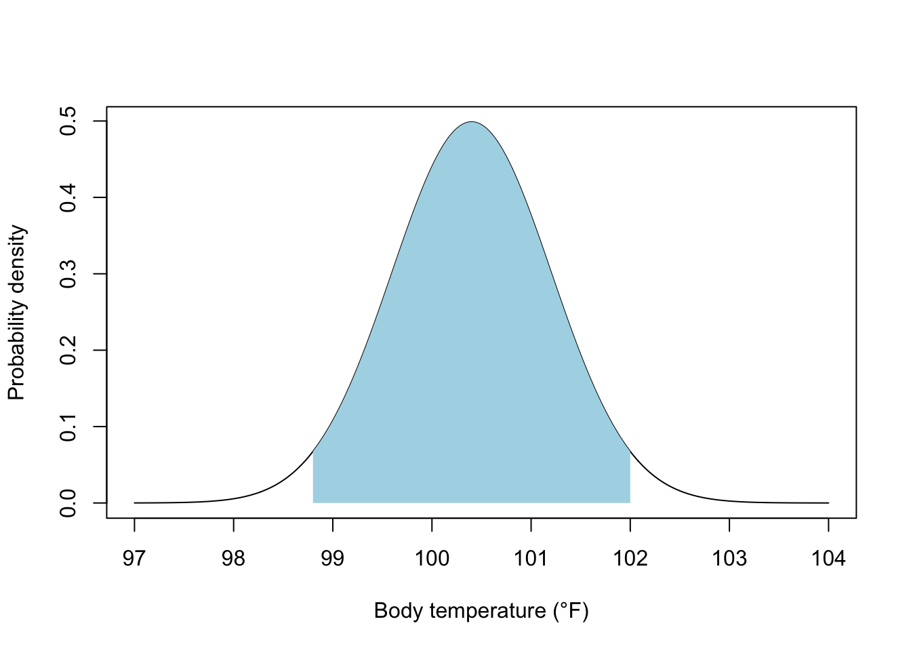
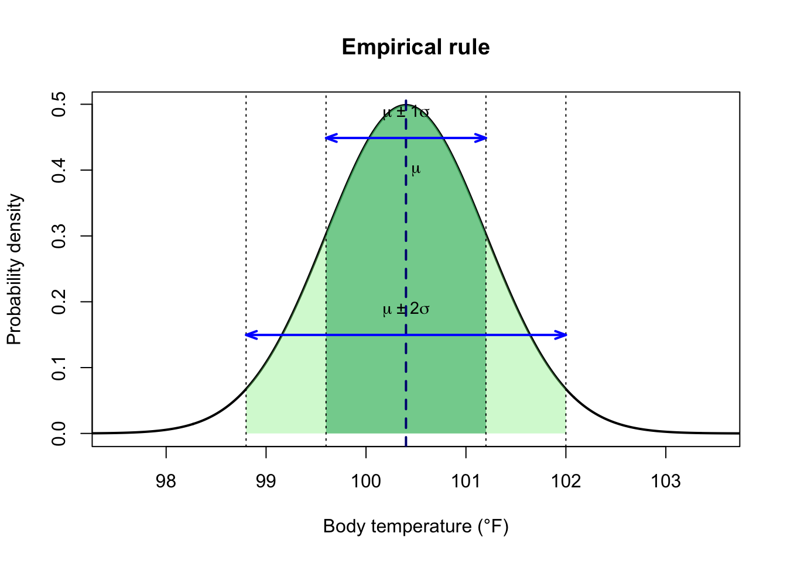

# Probability as the Language of Uncertainty


One of the central goals of epidemiology is to monitor the prevalence of disease. Basic information on the prevalence of disease is used by public health officials to guide decision-making on interventions. Perhaps there's no better example of this than the Covid-19 pandemic that started in late 2019 and led to dramatic measures intended to reduce the spread of the virus, such as social distancing, mask wearing, travel restrictions, school shutdowns, and quarantine. These interventions place significant limitations on the freedoms we tend to take for granted, and so the benefits of these measures to the public should outweigh the costs.

Consider this scenario. Imagine you are the lead epidemiologist in a community of 10,000 people, working with public health officials to make decisions about interventions to minimize the spread of a new viral disease. Based on a cost-benefit analysis, public officials determined that interventions will be enforced if the prevalence of the disease reaches 10%. As the lead epidemiologist, your goal is to monitor the prevalence of the disease. Fortunately a test for the infection is available, and it's completely fool proof. When someone has the virus, the test is always positive, and when someone doesn't have the virus, the test is always negative. Diagnostic tests are of course rarely perfect in this way, but we'll make this simplifying assumption for now.

Knowing you can't possibly test everyone in your population of 10,000, you decide on a strategy to sample individuals from the population for testing. Having studied statistics, you are well aware that the fundamental problem of statistics is the inevitable uncertainty about estimates made from samples. If you test only a sample of the individuals in the population, the proportion infected in the sample will differ from the true proportion infected due to sampling error or systematic biases. To minimize bias, you decide on a random sampling approach. In truth, random sampling in public health is hard to do, but it's a useful starting point.

Eager to get your first estimate, you test a random sample of individuals and find that 6.7% are infected. You share the finding with your public health colleagues, who are generally happy to see the number is under 10%. But one astute colleague looks at the estimate and asks you "How good is the estimate?"

How good is your estimate? The question implies that your estimated proportion infected differ from the truth. Even though only 6.7% in the *sample* were infected, it's still possible that more than 10% in the *population* are infected. Even with random sampling, we expect a difference between teh sample estimate and the truth because of sampling error. In this chapter, we directly confront this problem by examining how we can quantify uncertainty about our estimates in the language of **probability**.

## Defining probability

Let's start with some terms. When we test an individual for infection, the test is called a *trial*. A trial is simply any process that produces a probabilistic *outcome*. There are only two possible outcomes of the test: positive or negative. These outcomes are **mutually exclusive**, meaning that an individual cannot test positive *and* negative for the infection at the same time. The set of all possible mutually exclusive outcomes is called the *sample space*. The sample space is often denoted $\Omega$ and defined in brackets. For example, the sample space for infection status is $\Omega$ = {positive, negative}.

When examining a probability, we are interested in the probability of a particular *event* that we a define. The event could be as simple as the occurrence of a single outcome, such as an individual testing positive. But events can also be defined as sets of outcomes. For example, consider tossing a six-sided die, where the sample space is $\Omega$ = {1,2,3,4,5,6}. Here we could define the event as rolling an even number, which includes three of the possible outcomes.

Numerically, the values of probability are bounded between 0 and 1. A probability of 1 means that the event of interest is certain, whereas a probability of 0 means the event of interest is impossible. Mathematically probability is abbreviated as *P*, so we can say a certain event has $P = 1$ and an impossible event has $P = 0$. The events of interest are usually appended parenthetically. For example, when you toss a coin with two sides, *head* and *tails*, you can be (reasonably) certain the probability of heads or tails is one:

$$P(\text{heads or tails}) = 1$$

Conversely, you can be (reasonably) certain that you won't see something other than heads or tails, which can be written as

$$P(\text{not heads or tails}) = 0$$

Events can be any statement of interest. For our epidemiology example, we're interested in the probability that an individual is infected: $P(\text{infected})$. For this event, we probably won't be as confident as we were for our coin tossing example, but we can express our confidence numerically as a probability. Because $P=1$ implies certainty and $P=0$ implies impossibility, all values of probability are bounded between 0 and 1. The higher the value of probability, the more likely it is that the event is true. The lower the value of probability, the more likely it is that the event is false. For example, the value $P(\text{infected}) = 0.7$ implies it is more likely than not that an individual is infected. The value $P(\text{infected}) = 0.1$ implies only a small chance of an individual being infected. What really matters here is that values other than $P=1$ and $P=0$ imply a *lack of knowledge* about an event, or in other words, uncertainty! $P=1$ and $P=0$ mean we are certain an event is true or false, and all other values mean we are uncertain, with the degree of certainty of the event being true scaling numerically with the value of probability.

Although these simple rules of probability may appear straightforward, philosophically there has been much discussion about the meaning of probability. My goal here is not to provide an exhaustive overview of the various interpretations, but I do want to introduce two common interpretations that will be themes throughout the remainder of the book.

### Frequentist definition

The **frequentist** interpretation of probability is one that I suspect you might be familiar with: probability is the proportion of trials *n* where we observe the event of interest, $X$:

$$
P(X) = \frac{X}{n}
$$

Let's just assume for now that of the 10,000 people in the community, 500 are infected with the virus. Based on the frequentist definition, the probability of the infection ($I$) is

$$
P(I) = \frac{I}{n} = \frac{500}{10000}=0.05
$$

The frequentist definition simply looks at the frequency of the event of interest relative to the total number of trials. A probability is a proportion, following the rules we've already established where values must be between 0 and 1. Probabilities can also be expressed as percentages. To do this, simply multiply the proportion by 100. Saying the probability of infection is 0.05 is the same as saying 5% of the population is infected.

Now in practice, how do we know the frequentist probability? As the formula implies, we could go track down all $n$ individuals in the population and give them our fool proof test for the viral infection. But you know that tracking down every individual in the population is usually not feasible, so we usually need to estimate the probability of interest with a sample of data. For example, imagine you randomly sample $n = 15$ individuals and find one of the 15 tests are positive. In this case, the estimated probability of infection ($\hat{p}$) is

$$
\hat{p}_{infected} = \frac{I}{n} = \frac{1}{15}=0.067
$$

Here the carrot symbol simply indicates that our quantity is an estimate based on a sample.

There is a way of logically deriving frequentist probabilities, but this approach is restricted to only the most simple of examples, such as tossing a coin or rolling a die, where you can count the number of times the event of interest occurs out of the sample space. When we flip a coin, there are two sides, heads and tails. Assuming we have a fair coin and flip, the probability of heads must be 0.5, because heads represents half of the sample space. Similarly, if we roll a six-sided die with the numbers 1, 2, 3, 4, 5, and 6, the probability of seeing a "four" must be $\frac{1}{6}$, because four represents one out of six possible outcomes. This approach to quantifying probabilities is called the **principle of indifference**, in which there is no reason to believe one possible outcome is any more or less likely than the other possible outcomes. Based on the principle of indifference, the probability of each outcome is equal, and so numerically the probability of each outcome is just one divided by the total number of possible outcomes.

But as I already mentioned, this logic of deriving probability is not widely applicable. Consider our test of whether an individual is infected with a virus. Here each individual is infected or not infected. In this limited sample space, infected represents one of two possible outcomes, so isn't the probability of infection 0.5? No! When we apply the prinicple of indifference to coin tossing or die rolling, we make important assumptions, namely that we have fair coins and dice and that the coin flips and dice rolls are conducted in a random way. In other words, deriving probabilities mathematically from the sample space requires assumptions about the external forces that can affect the probability of heads, or the probability of rolling a four. If I do not give the coin a fair toss, for example by just dropping the coin flat with the heads face up, then the probability of heads will very likely *not* be 0.5. There are a multitude of external forces that affect the likelihood of an individual being infected with a virus, such as exposure, immune function, public health measures, and even the prevalence of the infection itself. In other words, the principle of indifference is a poor model of how infection works.

### Bayesian definition

The **Bayesian** way of thinking about probability is as a strength of belief. What do you believe is the probability of infection? We make these kind of subjective probability assessments all the time. If you look outside and see storm clouds on the horizon, you might be inclined to believe it's more likely than not that it will rain today. When you are deciding which route to take to work, you might notice it's the middle of rush hour and conclude there's a 90% chance that you'll end up in stop-and-go traffic on the interstate. When watching your favorite college basketball team take on the #1 ranked team, you might conclude your team has only a 10% chance of winning.

These subjective beliefs aren't empirically computed by frequencies across multiple trials or from opportunity from the sample space. Rather, they are subjectively computed in your mind based on your knowledge, experience, and intuitions. If you've never heard of anyone being infected with the viral infection being investigated, you might be inclined to conclude it's more likely than not that the prevalence of the virus is below 10%. In this case you're assigning a subjective probability statement (\>50% strength of belief) about the frequentist value of a probability (the proportion of individuals infected being below 10%).

In [*Doing Bayesian Data Analysis*](https://sites.google.com/site/doingbayesiandataanalysis/), the author John Kruschke talks about how subjective beliefs about probability can be calibrated by comparing those beliefs with events that have known probabilities. For example, suppose I offer you two choices. You can win \$20 if you flip a coin and the result is heads, or you can win \$20 if your favorite college basketball team beats the #1 ranked team. If you choose the coin flip, you are implicitly concluding that the probability of your team winning is less than 50%.

Now, Bayesian probabilities aren't always completely subjective. Indeed, as we will soon find out, there methods for updating our subjective beliefs about a probability (which we will call a *prior probability*) with frequentist probabilities informed by data that we collect. More on that soon.

## Probability rules

One can take an entire course on the mathematics and theory of probability, but here our goal is to apply some basic knowledge of probability to science and data analysis. That said, familiarity with some basic rules of probability is necessary to do applied statistics. We already know that probability is bounded between 0 and 1, but there are some additional rules we need to be familiar with in order to use probability for quantifying our uncertainty in data analysis. Importantly, these rules apply whether you interpret probability from a frequentist or Bayesian perspective. Let's take a look at those rules [\^ch07-1].

### Individual events

We first look at two rules that apply when one is interested in the probability of a single event of interest in isolation. For example, suppose you're driving into work and will go through one traffic light. Traffic lights in the United States can be red, yellow, or green. For the two rules that follow, we consider the probability of one of those outcomes in isolation, such as $P(\text{red})$.

::: {.alert .alert-block .alert-info}
<b>Addition rule</b>

$$
P(A\ \text{or}\ B) = P(A) + P(B)
$$ If outcomes A and B are **mutually exclusive**, then the probability of either A or B occurring is the sum of their individual probabilities.
:::

Let's apply the addition rule to an example. Consider the traffic light example, and let's assume the probability of red is 0.48, the probability of yellow is 0.04, and the probability of green is 0.48. Each outcome is mutually exclusive, because the traffic light cannot - for example - be red and green at the same time (barring a malfunction). When events are mutually exclusive in this way, we can apply the addition rule to quantify the probability of one event or another. For example, the probability of the light being green or yellow when driving through it is:

$$
P(\text{green or yellow})= P(\text{green}) + P(\text{yellow}) = 0.48 + 0.04 = 0.52
$$

We can extend this rule beyond two events. For example, the probability of green, yellow, or red is

$$
P(\text{green or yellow or red})= P(\text{green}) + P(\text{yellow}) + P(\text{red}) = 0.48 + 0.04 + 0.48= 1
$$ Here we see that the probabilities of each possible mutually exclusive outcome must sum to 1.

::: {.alert .alert-block .alert-info}
<b>Not rule</b>

$$
P(\text{not}\ A) = 1 - P(A)
$$ The probability of an event not occurring is one minus the probability that it occurs.
:::

The not rule simply states that once you know the probability of an event being true, you also know the probability that the event is false, computed as one minus the probability of the event being true. If the probability of the light being green or yellow is is 0.52, then the probability of it not being green or yellow is

$$
P(\text{not green or yellow}) = 1 - P(\text{green or yellow}) = 1 - 0.52 = 0.48
$$

### Joint events

The first two rules apply to mutually exclusive events in isolation, but often we are interested in the joint probability of multiple events occurring at the same time. For this situation, let's return to the goal of estimating prevalence of a viral infection. The epidemiologist does not know the true prevalence, but let's assume it is 5%. Let's also assume that 10% of individuals in the population are left-handed. What is the probability of selecting an individual who tests positive and is left-handed? Here we are interested in a **joint probability**, namely the events "infected" and "being left-handed" at the same time.

#### Independent events

In cases where the joint events are **independent**, we can apply the following rule to quantify the joint probability:

::: {.alert .alert-block .alert-info}
<b>Multiplication rule</b>

$$
P(A\ \text{and}\ B) = P(A)P(B)
$$

When events A and B are independent, the probability of A and B is the multiplication of the probabilities of A and B individually.
:::

For events to be independent, one event must have no impact at all on the probability of another event. In the context of testing and handedness, this would mean that the handedness of a person must have no impact on infection status, and vice versa. If that's the case, then we can quantify the probability of individual being infected and left-handed as

$$
P(\text{infected and left-handed}) = 0.05*0.10=0.005
$$

When the prevalence of the infection is 5%, the probability that an individual is infected and left-handed is only 0.5%. A rare event indeed!

#### Dependent events (conditional probability)

In the last example, we assumed handedness gave us no information about the probability of infection (i.e., they are independent). Now let's consider a different case: infection status and vaccine status. Unlike handedness, vaccine status plausibly gives us information about a person's infection status. Indeed, vaccines are designed to reduce the likelihood of being infected, so we shouldn't expect infection status and vaccine status are independent events. In other words, the probability of infection likely depends on vaccine status. This is getting interesting! Indeed, non-independence is at the heart of many research questions, particular those about causal explanation. Does vaccine status affect infection status? Such a question can be addressed quantitatively by examining joint probabilities under assumptions of independence vs. dependency between the events.

To analyze joint probabilities of multiple events when those events are not independent, we need to define **conditional probability**. A conditional probability can be defined as the probability of event A given that know event B is true. Let's formalize another rule:

::: {.alert .alert-block .alert-info}
<b>Conditional probability</b>

$$
P(A|B) = \frac{P(A\ \text{and}\ B)}{P(B)}
$$
:::

The vertical bar (\|) means "given", so $P(A|B)$ reads "the probability of A given B". For example, the probability of infection status among vaccinated people can be written as $P(\text{infected | vaccinated})$.

<table class="table table-striped table-hover table-condensed" style="width: auto !important; margin-left: auto; margin-right: auto;">
<caption>(\#tab:c06_t1)<span style="color:black; font-weight:bold;">Counts of Infection Status vs. Vaccination (N = 10,000)</span>
</caption>
 <thead>
  <tr>
   <th style="text-align:left;"> Status </th>
   <th style="text-align:right;"> Vaccinated Count </th>
   <th style="text-align:right;"> Unvaccinated Count </th>
   <th style="text-align:right;"> Total Count </th>
  </tr>
 </thead>
<tbody>
  <tr>
   <td style="text-align:left;"> Infected </td>
   <td style="text-align:right;"> 210 </td>
   <td style="text-align:right;"> 290 </td>
   <td style="text-align:right;"> 500 </td>
  </tr>
  <tr>
   <td style="text-align:left;"> Not Infected </td>
   <td style="text-align:right;"> 6790 </td>
   <td style="text-align:right;"> 2710 </td>
   <td style="text-align:right;"> 9500 </td>
  </tr>
  <tr>
   <td style="text-align:left;"> Total </td>
   <td style="text-align:right;"> 7000 </td>
   <td style="text-align:right;"> 3000 </td>
   <td style="text-align:right;"> 10000 </td>
  </tr>
</tbody>
</table>

Consider Table \@ref(tab:c06_t1), which shows our population of 10,000 people broken down by infection status and vaccine status. First, notice that the overall probability of infection is 5% as assumed (500 infected out of 10,000), and the overall probability of vaccination is 70% (7,000 vaccinated out of 10,000). These are **marginal probabilities** because they are computed by aggregating across the levels of the other variable. In other words, to compute the marginal probability of infection, we have to consider the number of people infected among those who are vaccinated (210) and not vaccinated (290). Together there are 500 people infected, which is 5% of the total population.

Second, from these data we can compute the joint probabilities of each combination of events:

$$
\begin{array}{l c c c c}
P(\text{infected and vaccinated})       & = & \dfrac{210}{10000}  & = & 0.021 \\
P(\text{not infected and vaccinated})   & = & \dfrac{6790}{10000} & = & 0.679 \\
P(\text{infected and unvaccinated})     & = & \dfrac{290}{10000}  & = & 0.029 \\
P(\text{not infected and unvaccinated}) & = & \dfrac{2710}{10000} & = & 0.271
\end{array}
$$
These joint probabilities make up the entire sample space for the joint event "infection status and vaccination status", so following our addition rule, they should sum to one.

Now let's examine the question of conditional probability. Are the events infection status and tattoo vaccination status independent or dependent events? If they are independent events, then the probability of infection should be the same for people are vaccinated and unvaccinated. Conversely, if they are dependent events, the probability of infection will differ between people who are vaccinated and unvaccinated. Let's compute the conditional probabilities following our rule:

$$
P(\text{infected | vaccinated}) = \frac{P(\text{infected and vaccinated)}}{P(\text{vaccinated})}=\frac{210}{210+6790}=0.03
$$

$$
P(\text{infected | unvaccinated}) = \frac{P(\text{infected and unvaccinated)}}{P(\text{unvaccinated})}=\frac{290}{290+2710}=0.0967
$$ Here we clearly see that the probability of infection differs by vaccine status. The probability of infection is over three times as likely for unvaccinated than vaccinated people. In other words, infection status is *not* independent of vaccine status.

How do we compute joint probabilities when events are not independent? There's a rule for that!

::: {.alert .alert-block .alert-info}
<b>General multiplication rule</b>

$$
P(A\ \text{and}\ B) = P(A|B)P(B)
$$
:::

This general multiplication rule is derived from the rule on conditional probability by simply isolating $P(A\ and\ B)$. As an example, if you knew that 3% of vaccinated people were infected and 70% of all people were infected, then you can quantify the joint probability of those who are vaccinated and infected as

$$
P(\text{infected and vaccinated)} = P(\text{infected | vaccinated)}*P(\text{vaccinated})=0.03*0.7=0.021
$$

Note that we can show infection status and infection status are not independent by testing the simple multiplication rule. The simple multiplication rule says the joint probability of independent events is the multiplication of their individual probabilities. Thus, if infection status and vaccine status are independent, the proportion of people who are infected and vaccinated should be $0.05*0.70=0.035$. But we ust showed that's not the case! The simple multiplication rule doesn't work here because it assumes independence, when in reality infection status is conditional on vaccine status.

### General addition rule

Let's revisit the situation when we want to know the probability of an one event *or* another event. When the events are mutually exclusive, the addition rule tells us to simply add the probabilities of each event. What if the events are not mutually exclusive? For example, what if we want to quantify the probability that a person is infected or vaccinated. These events are not mutually exclusive because some infected individuals are vaccinated. If we simply the probability of $P(\text{infected})$ $P(\text{vaccinated})$, we will doulbe count the people who are both infected and vaccinated. To quantify the probability of event A or B when A and B are not mutually exclusive, we need to apply the **general addition rule**:

::: {.alert .alert-block .alert-info}
<b>General addition rule</b>

$$
P(A\ \text{or}\ B) = P(A) + P(B) - P(A\ \text{and}\ B)
$$
:::

Let's apply this to the infection and tattoo example. Here I've abbreviated the events "infected" as "I" and "vaccinated" as "V":

$$
P(\text{I or V}) = P(\text{I}) + P(\text{V}) -P(\text{I and V})=0.05+0.70-0.021=0.729
$$

### Quantifying marginal probabilities

When working with joint events, sometimes we want to work backwards from disaggregated probabilities to aggregated, or marginal probabilities. For example, suppose you knew the infection probability separately for vaccinated and unvaccinated individuals. What is the overall prevalence of infection? You might be tempted to compute the simple average of the two conditional probabilities $P(\text{infected | vaccinated)} = 0.03$ and $P(\text{infected | vaccinated)} = 0.0967$, but the mean (0.063) is not correct. Why not? The mean does not weight the conditions of vaccination status correctly. We know 70% of the population is vaccinated, whereas 30% of the population is unvaccinated. We need to account for the fact that more of the population is vaccinated. To quantify the marginal probability of infection (i.e., marginalizing the probability of infection over the levels of tattoo status), we basically quantify a weighted mean. This is the *law of total probability*:

::: {.alert .alert-block .alert-info}
<b>Law of total probability</b>

$$
P(A) = \sum_{i=1}^n P(A|B_i)P(B_i),
$$

where $A$ is event A and $B_i$ is condition *i* of event $B$.
:::

Here we see the total (marginal) probability of event A is the weighted average of the probability of A across conditions of event B. Now let's apply this rule to quantify the probability of infection across conditions of vaccination (abbreviated each of the events):

$$
P(\text{I}) = P(\text{I | V)}*P(\text{V}) + P(\text{I | UV)}*P(\text{UV})=0.03*0.7+0.0967*0.3=0.05
$$

## Sampling from probability distributions

Now that we have a basic handle on probability rules, let's turn our attention to the topic that motivated this chapter. How can we use probability to describe uncertainty about estimates when we sample from populations? Recall that you're the lead epidemiologist trying to estimate the prevalence of an infection in a community of 10000 people. You have a fool proof test, when you tested 15 people at random, you found one was positive, leading to an estimated prevalence of 6.7%. How good is that estimate? Are you confident the prevalence is truly under 10%, the threshold that would trigger public health interventions?  How confident? 

Science is ultimately a process of making inferences about the world with data. Because the data we collect are almost always incomplete, being samples of the population of interest, those inferences must be made with uncertainty. In this section, I will outline how probability can be used to describe the uncertainty about the estimates we make with data. 

### Sampling from populations is probabalistic

Let's take a close look at how data are generated in the process of sampling a population for testing. We begin with a much simpler example than sampling a population of 10,000 people. In this example, assume we have a population of just four individuals, and we randomly select two individuals for testing. Each test returns a positive or negative result. To make matters more simple from a probability perspective, we assume individuals are selected from the population **with replacement**. This means each person is available to be selected for each of the two tests. This is analogous to randomly selecting multiple playing cards from a deck, but each time replacing the card you chose before you select a new one.

Suppose you go ahead and randomly select two individuals and find that one of the two tests was positive, and one of the two tests was negative. In probability terms, we know there was $X = 1$ positive test out of $n = 2$ trials. Those are the observed data. What insight do these data provide into proportion of individuals infected in the broader population of four people? Do we simply conclude the prevalence of the disease is 50% because one out of two tests were positive, or is there more to the story?

Let's examine the issue by assuming the true prevalence of the infection is 25% ($p_{infected} = 0.25$), meaning that just one of the four people in the population is infected. If only one of the four people are infected, how likely were we to see one positive out of two tests? To answer that question, let's look at all the possible outcomes when we conduct two tests, given that only one individual is infected. Figure \@ref(fig:c06_f1) shows these possibilities in the format of a branching tree.

<div class="figure" style="text-align: center">

<p class="caption">(\#fig:c06_f1)Probability tree showing the possible outcomes of testing when one of four people in the household are infected. Pink boxes with + indicate a positive test, and white boxes with - indicate a negative test.</p>
</div>

The boxes in each branch of the tree represents the four individuals in the population. Only one of the four members is truly infected in this scenario, so for the 1st test, we see there's three more ways to see a negative test than a positive test. In other words, when we randomly select an individual for the first test, there's a 25% chance of a positive test and a 75% chance of a negative test when one of four individuals is infected. We then repeat that process for the 2nd test. Because we're sampling with replacement, the possibilities on the 2nd test are the same as the 1st test.

We see that when only one of the four people is truly infected, there are 16 possible outcomes when we conduct two tests: one outcome where both tests are positive, six outcomes where one test is positive and one test is negative, and nine outcomes when both tests are negative. Of these 16 possible outcomes, six outcomes are consistent with the data we observed, one positive test and one negative test. In other words, there was a 6 in 16 chance (37.5%) of getting the data we observed. Those outcomes are highlighted with bold lines in Figure \@ref(fig:c06_f2).

<div class="figure" style="text-align: center">

<p class="caption">(\#fig:c06_f2)Probability tree showing the possible outcomes of testing when one of four people in the household are infected, highlighting outcomes consistent with the observed data.</p>
</div>


Probability trees like this are really handy for looking at all the possible outcomes of joint events, but we can also apply our probability rules to compute the probability of one positive out of two tests when the probability of infection is 0.25. You might be tempted to apply the multiplication rule, because we want to know the probability of a positive test *and* a negative test. Applying that rule, we find $P(+\ \text{and}\ -) = P(+)P(-) = 0.25*0.75=0.1875$. Why isn't this correct? The problem is not independence. We can reasonably assume the test results are independent if we are randomly picking people for each test. The problem is that there are multiple ways of observing exactly one positive test and one negative test! You can see this in the probability tree. It could be that the first test is positive and the second test is negative ("+-"), which can happen in three ways, or it could be that the first test is negative and the second test is positive ("-+"), which can also happen in three ways. We can separately quantify $P(+\ \text{and}\ -)$ and $P(-\ \text{and}\ +)$, and then apply our addition rule because these outcomes are mutually exclusive.

$$
P(\text{One +}\ \text{and}\ \text{One}\ - ) = P(+)*P(-) + P(-)*P(+)\\
P(\text{One +}\ \text{and}\ \text{One}\ - ) = 0.25*0.75 + 0.75*0.25=0.375
$$\

### Discrete random variables

At this point I want to formalize some important concepts from the example of conducting two tests in a population of four. What we've shown is that **the process of sampling from a population is probabilistic**. When one of four people is infected and we take a sample of $n = 2$ tests, the outcome that we observe has an element of chance. The outcome $X$ positive tests is called a **random variable**, where the term *random* implies the element of chance in terms of how we observe the variable. When we conduct $n=2$ tests, we can observe one of three mutually exclusive outcomes: X = 0 positives, X = 1 positive, or X = 2 positives. Some of these outcomes are more likely than others, just like getting 5 heads when you flip a coin 10 times is more likely than getting one heads. But there's an element of chance, which is ultimately what creates much of the uncertainty we face when we estimate a quantity.

Random variable can be characterized by a **probability distribution**, which is the distribution of probabilities for each mutually exclusive outcome. Mathematically, we can define the probability that a random variable $X$ takes on each possible value $x$ as ($P(X = x)$). For the random variable $X$ = *number of positives out of two tests*, the probability distribution consists of $P(X = 0)$, $P(X = 1)$, $P(X = 2)$. First, we can quantify these probabilities by enumerating all of the possibilities in the sample space and count up the outcomes:


``` r
#P(X = 0 positives): 9 ways
9/16
```

```
## [1] 0.5625
```

``` r
#P(X = 1 positives): 6 ways
6/16
```

```
## [1] 0.375
```

``` r
#P(X = 2 positives): 1 way
1/16
```

```
## [1] 0.0625
```

Second, we could apply our probability rules:


``` r
#P(X = 0 positives) = P(negative and negative)
(0.75*0.75)
```

```
## [1] 0.5625
```

``` r
#P(X = 1 positives) = P(positive and negative)
(0.75*0.25) + (0.25*0.75) #2 ways this can happen
```

```
## [1] 0.375
```

``` r
#P(X = 2 positives) = P(positive and positive)
(0.25*0.25) 
```

```
## [1] 0.0625
```

The probabilities for each possible of outcome, no matter how we quantify them, form a probability distribution. This particular example is a **discrete probability distribution** because the sample space is composed of discrete, mutually exclusive outcomes where we can quantify the probability of each as we have done. Figure \@ref(fig:c06_f3) shows the probability distribution.

<div class="figure" style="text-align: center">

<p class="caption">(\#fig:c06_f3)Discrete probability distribution of the number of positive tests out of two trials.</p>
</div>

The probability of discrete outcomes is referred to as **probability mass**, but as Figure \@ref(fig:c06_f3) shows, the y-axis of discrete probability distributions will often just be labeled "probability".

#### Binomial distribution

It was straightforward to quantify the probability distribution for the number of positives out of only two tests. The sample space is so small that we could easily quantify those probabilities by applying our probability rules. But now let's consider the larger sample of 15 tests from a community of 10,000. Manually enumerating the probability distribution for each possible number of positives would take considerable time! Fortunately we don't have to do that.

The random variable that we defined - the number of positives *X* out of *n* trials - is actually an example of a variable that follows a known mathematical function called the **binomial distribution**. A binomial distribution is a probability distribution for a binary variable where the outcome of that binary variable is examined across *n* trials, where each individual trial is called a *Bernoulli trial*. The sample space of each trial must be binary, for example heads and tails when flipping a coin, even or odd when rolling a die, and positive or negative when testing for a viral infection. The outcome being recorded is often generically referred to as a **success**. The *n* trials must be independent and have the same probability of success, *p*, which is the only parameter for the binomial distribution (e.g., probability of positive test). If those assumptions are met, the probability of *x* successes out of *n* trials can be computed with the binomial formula:

$$
P(X = x) = \binom{n}{x} p^x (1 - p)^{n - x}
$$ 
The $binom{n}{x}$ part of the formula reads "n choose x" and represents the number of ways *x* successes can occur out of *n* trials without regard to order (i.e., **combinations**). For example, we've already seen that 1 positive test can occur in two ways based on 2 trials. The number of combinations can be quantified as

$$
\binom{n}{x} = \frac{n!}{x!(n-x)!}
$$ 

Let's now consider the random sample of 15 people from our community of 10,000 where the prevalence of infection is 0.05. What's the probability of observing exactly one infection out of 15? Just apply the binomial formula:

$$
P(X = 2) = \binom{15}{1} 0.05^1 (1 - 0.05)^{15 - 1}=0.366
$$ 
I'm not going to go into details here, but if you work through this formula, you'll see that all it's doing is applying the multiplication rule for independent events and the addition rule for mutually exclusive outcomes. And fortunately for us, we don't have to do these calculations by hand because R has a built-in function to compute the binomial probability: `dbinom`. For example, we can use the function to quantify the probability of 1 infections out of 15 trials:


``` r
dbinom(x = 1, size = 15, prob = 0.05)
```

```
## [1] 0.3657562
```

We can apply the `dbinom` formula to efficiently compute the binomial probability of all possible values of X positive tests out of 15 trials, when the probability of infection is 0.05, and then display the probability distribution in a graph (Figure \@ref(fig:c06_f4)):

<div class="figure" style="text-align: center">

<p class="caption">(\#fig:c06_f4)Discrete probability distribution of the number of positive tests out of 15 trials when 5% of the population is infected.</p>
</div>

The probability distribution shows that the most likely outcome is no positives out of 15 when the prevalence is 0.05, and the probability of each outcome decreases as the number of positives increases. In fact, there's virtually no chance of observing six or more positives out of 15 tests when the true prevalence is only 5%. The probability distribution would look much different if 50% of the population was infected (Figure \@ref(fig:c06_f5)).

<div class="figure" style="text-align: center">

<p class="caption">(\#fig:c06_f5)Discrete probability distribution of the number of positive tests out of 15 trials when 50% of the population is infected.</p>
</div>

When 50% of the population is infected, the most likely outcomes are 7 or 8 tests out of 15, but note that many other values are plausible. In fact, it's more likely that we'll see a value other than 7 or 8 positives out of a sample of 15, even though X = 7 and X = 8 are the most likely outcomes:


``` r
1 - (dbinom(7, 15, prob=0.5) + dbinom(8, 15, prob=0.5))
```

```
## [1] 0.6072388
```

Here we see there's a 61% chance of observing a value other than 7 or 8 positive tests out of 15 when the prevalence of the disease is 50%. This is an excellent illustration of the problem of sampling error.

##### Mean for a binomial random variable

As we saw in Chapter 4, we can characterize the shape of distributions by their central tendency and variation. When examining probability distributions of random variables, central tendency is usually characterized by the mean, also known as the **expected value**. The expected value of each possible outcome *X* is

$$
E[X] = \sum_{X}P(X)X
$$

Expected value is simply weighing each possible outcome of the random variable *X* by its probability of occurring. Let's quantify the expected value of the number of positives out of 15 tests when the prevalence is 50%:


``` r
#create a vector of outcomes
x <- c(0:15)

#sum the products of each outcome and its probability
sum(dbinom(x=x, size=15, prob=0.5)*x)
```

```
## [1] 7.5
```

We see exactly what we expect. When the prevalence is 50% and we conduct 15 tests, we expect 7.5 positives on average. What if the prevalence was 5%?


``` r
sum(dbinom(x=x, size=15, prob=0.05)*x)
```

```
## [1] 0.75
```

When the prevalence is 5%, we expect 0.75 positives on average. Obviously you can't observe 7.5 or 0.75 positives for a discrete random variable, so you need to think about the expected value of discrete random variables as the long run outcome. That is, if you could take thousands of samples of 15 and compute the mean of the number of positives across samples, you'd expect the mean to be 7.5 positives if the prevalence was 50% and 0.75 positives if the prevalence was 5%. 
For binomial random variables, the mean of the probability distribution is equal to the true probability of success, so the expected value of a binomial random variable can be quantified simply as $E(X) = np$, where $n$ is the number of trials and $p$ is the probability of success. For example, when we take $n = 15$ tests from a population with $p_{infection} = 0.05$, the expected value can be computed as $E(X) = np=15*0.05=0.75$.

##### Variance for a binomial random variable

Recall that variance is a measure of variation in an outcome relative to the mean. The variance will be large when outcomes of the random variable can range widely around the mean, and it will be small when the outcomes show little variation around the mean. For a discrete random variable, the variance is quantified as

$$
V[X]=\sum_{X}P(X)(X-E[X])^2
$$ 

What does this mean? Just like we saw in the variance formula before, we're looking at how far each value of X is away from the mean, quantified as the squared difference between $X$ and $E[X]$. We weigh each of those squared deviations by the probability of X, $P(X)$, and then we sum them up. Intuitively, you should see that the variance will increase as there are highly probable values of $X$ far from the mean.

The variance formula for a binomial random variable can be simplified to the following:

$$
V[X]=np(1-p)
$$ 

From this formula we can see that the variance of a binomial random variable will be greatest when the probability of success is closer to 0.5. When $p=0.5$ and $n$ = 15, the variance is $V[X]=15*0.5*(1-0.5)=3.75$. Any deviation from $p = 0.5$ leads to lower variance. For example, when $p=0.05$ (e.g., 5% prevalence of infection), the variance is $V[X]=15*0.05*(1-0.05)=0.7125$. At the extremes, when $p = 0$ or $p = 1$, the variance by definition must be 0. What this means is that probability distribution for binomial random variables will be somewhat bell-shaped with long tails when the probability of success is close to 0.5, and it will become skewed as the probability distribution deviates from 0.5.

### Continuous random variables

Discrete probability distributions are straightforward because we can quantify the probability mass for each discrete outcome in the sample space. When we test an individual for a viral infection, the outcome is either positive or negative with probabilities $p_{positive}$ and $p_negative$. But not all random variables are so simple. Many variables form **continuous** probability distributions, such as height, weight, air temperature, and many more. The challenge of characterizing probability distributions for continuous variables is that there's an *infinite* number of potential outcomes in the sample space.

Consider the incubation period for a viral illness, which is the time between exposure to the pathogen and onset of symptoms. Incubation period is a continuous random variable because there's an infinite number of possibilities in the sample space. The incubation might be 2, 2.1, 2.15, 2.154, 2.1547 days, and so on. The probability of the incubation period being a particular value (e.g., 2.154794667 days) is 0 because there's an infinite number of possible values. If there's an infinite number of possible values in the sample space and each possibility had a non-zero probability, then the sum of the probability of all the mutually exclusive outcomes would be infinity, violating our rules of probability.

#### Probability density function

To characterize probability distributions for continuous variables, we use the concept of **probability density**. A **probability density function (pdf)** describes how probability is distributed across the possible values of a continuous random variable. Instead of assigning probabilities to individual points, the *pdf* reflects how "dense" the probability is at different values of the random variable.

To visualize this concept, we can approximate a continuous variable by discretizing the sample space into intervals. Figure \@ref(fig:c06_f6) shows a simulated distribution of incubation times for 10,000 individuals, grouped into bins of 0.1 days. You can see this distribution has a slight positive skew, which makes sense given that time must be positive. The highlighted bin for 1.4-1.5 days contains 1,375 observations, meaning the probability *mass* for this interval is:

$$
\frac{1234}{10000}=0.1234
$$ 

The probability density is defined as the ratio of the probability mass to the bin width, in this case:

$$
\frac{0.1234}{0.1}=1.234
$$

Here we see that probability densities can be greater than 1. That's because probability density is a measure of how concentrated the probability is within a particular interval (a density!) rather than a probability of a particular observation. In this way probability density is similar to measuring human population density in a city. A city can have densities well over one person per square kilometer, even though the probability of finding one person in a randomly selected square kilometer is very low.

<div class="figure" style="text-align: center">

<p class="caption">(\#fig:c06_f6)Probability distribution of incubation period with intervals of 0.1 days.</p>
</div>

If we can quantify probability mass for a discrete interval, why do we use probability density? We use probability density because we want to describe the distribution continuously, without being constrained by arbitrary interval sizes. Narrower intervals result in smaller probability masses, approaching zero as the interval size approaches zero. The pdf allows us to describe the relative likelihood of observations without relying on a fixed bin size. Given a pdf, we can quantify the probability mass of *any* interval by applying integrals from calculus, which represents the area under the curve of the pdf over the interval of interest. The total probability over the entire sample space remains one, satisfying the basic rules of probability.

#### Normal distribution

Perhaps the most well-known probability density function for a continuous random variable is the **normal distribution**, also known as a **Gaussian distribution**. The normal distribution is bell-shaped and symmetric, such that it has no skew. It is widely used in science because many variables are well described by a normal distribution can be used to describe continuous variables with positive or negative values. Variables tend to have a normal distribution when the outcome is shaped by many factors each with small effect, and that characterizes a lot of variables!

As an example, consider body temperature among people with an active viral temperature. Body temperature reflects many small influences (e.g., hydration, time of day, ambient temperature), so the distribution of body temperature is often approximately normal. 

For a normal random variable, the probability density of any value X is quantified as

$$
f(X) = \frac{1}{\sqrt{2\pi\sigma^2}} e^{-\frac{(x - \mu)^2}{2\sigma^2}}
$$ 

where $f(X)$ is the probabilty density of value $X$, $\mu$ is the mean, and $\sigma^2$ is the variance ($\sigma$ is the standard deviation) of the random variable. This is an ugly equation, but don't fret. The main takeaway here is that a normal distribution has two parameters. The mean ($\mu$) controls the central tendency of the distribution, and the standard deviation ($\sigma$) controls the spread.

In R we can use the `dnorm` function to compute the probability density of $X$ given values for $\mu$ and $\sigma$. For example, suppose body temperature of people with a viral infection follows a normal distribution with $\mu$ = 100.4°F and $\sigma$ = 0.8°F.

<div class="figure" style="text-align: center">

<p class="caption">(\#fig:c06_f7)Probability density function assuming a normal distribution of incubation period mean = 100.4 and SD = 0.8 days.</p>
</div>

Figure \@ref(fig:c06_f7) shows the resulting probability density function, which we can use to highlight important characteristics of the normal distribution:

1. Symmetry around the mean. The normal distribution is bell-shaped and symmetric around the mean. In other words, the probability that body temperature is below 100.4°F is the same as the probability of body temperature being above 100.4°F (both 0.5). We can verify this with the `pnorm` function


``` r
pnorm(100.4, mean = 100.4, sd = 0.8, lower.tail=TRUE) # P(X < 100.4)
```

```
## [1] 0.5
```

``` r
pnorm(100.4, mean = 100.4, sd = 0.8, lower.tail=FALSE) # P(X > 100.4)
```

```
## [1] 0.5
```

The `pnorm` function computes probability mass for an interval as the area under the curve for that interval. We can quantify probability mass for any interval in this way. For example, what is the probability that body temperature is less than 99°F?


``` r
pnorm(99, mean = 100.4, sd = 0.8, lower.tail=TRUE) # P(X < 99)
```

```
## [1] 0.04005916
```

2.  The mean controls location. The mean is the expected value of the normal distribution and specifies the central tendency of the distribution. Figure \@ref(fig:c06_f8) shows three normal distributions each with different means. Notice the changing $\mu$ shifts the center of the distribution but leaves its width unchanged.

<div class="figure" style="text-align: center">

<p class="caption">(\#fig:c06_f8)Probability density functions with varying means but identical standard deviations.</p>
</div>

3. The standard deviation controls spread. The standard deviation $\sigma$ affects how variable the observations are around the mean. Figure \@ref(fig:c06_f9) shows three normal distributions each with identical means but different standard deviations. Notice how the width of the normal distribution grows as the standard deviation increases.

<div class="figure" style="text-align: center">

<p class="caption">(\#fig:c06_f9)Probability density functions with identical means but varying standard deviations.</p>
</div>

##### Probability mass and the empirical rule

Recall that we can quantify probability mass as area under the probability density function for any interval of interest. Consider again the normal distribution with $\mu = 100.4°F$ and $\sigma = 0.8°F$. What's the probability that body tempearture is between 99.6°F and 101.2°F? The interval of interest is shaded in the probability density function in Figure \@ref(fig:c06_f10).

<div class="figure" style="text-align: center">

<p class="caption">(\#fig:c06_f10)Probability density function highlighting the interval 99.6°F to 101.2°F</p>
</div>

We can compute the probability mass with `pnorm`:


``` r
pnorm(101.2, 100.4, 0.8, lower.tail=TRUE) - pnorm(99.6, 100.4, 0.8, lower.tail=TRUE)
```

```
## [1] 0.6826895
```

This interval encompasses exactly one standard deviation above and below the mean and includes 68.3% of the observations. Let's expand the interval to include values between 98.8°F and 102°F (Figure \@ref(fig:c06_f11)))?

<div class="figure" style="text-align: center">

<p class="caption">(\#fig:c06_f11)Probability density function highlighting the interval 98.8°F to 102°F</p>
</div>


``` r
pnorm(102.0, 100.4, 0.8, lower.tail=TRUE) - pnorm(98.8, 100.4, 0.8, lower.tail=TRUE)
```

```
## [1] 0.9544997
```

This interval encompasses exactly two standard deviations above and below the mean and includes 95.4% of the observations. 

This illustrates what's nown as the **emprical rule**. For a normal distribution, about 68% of the observations are within 1 standard deviation of the mean (i.e., $\mu \pm 1\sigma$), whereas about 95% of the observations are within 2 standard deviations of the mean (i.e., $\mu \pm 2\sigma$). Figure \@ref(fig:c06_f12) shows the empirical rule graphically for our example normal distribution of body temperature.

<div class="figure" style="text-align: center">

<p class="caption">(\#fig:c06_f12)Normal probability density function showing the empirical rule, namely that about 68% of observations are within one standard deviation of the mean, and about 95% of observations are within two standard deviations of the mean. In this example, the mean body temperature is 100.4°F and the standard deviation is 0.8°F.</p>
</div>

##### Standard normal distribution

Any combination of $\mu$ and $\sigma$ produces a unique normal distribution, so there's an infinite variety of possible normal distributions. However, any normal distribution can be converted to a **standard normal distribution**, which is a normal distribution with $\mu = 0$ and $\sigma = 1$ (Figure \@ref(fig:c06_f13)). Because the standard deviation is one, the values of the standard normal distribution are in units of standard deviations. The values of a standard normal distribution are denoted $Z$, or $Z-scores$.

<div class="figure" style="text-align: center">

<p class="caption">(\#fig:c06_f13)Standard normal distribution with mean = 0 and standard deviation = 1. The values Z of a standard normal distribution are in units of standard deviations away from the mean.</p>
</div>

We can convert any observation $X$ drawn from a normal distribution to a Z-score using the following formula:

$$
Z = \frac{X-\mu}{\sigma}
$$ 

Consider the normal distribution of body temperature with $\mu = 100.4°F$ and $\sigma=0.8°F$. Let's say we have an observation $X$ of 101.2°F. The corresponding Z-score is thus

$$
Z = \frac{X-\mu}{\sigma} =\frac{101.2-100.4}{0.8}=1 
$$ 

In other words, the value 101.2°F is one standard deviation above the mean. If another person has a temperature of 99.2°F, then 

$$
Z = \frac{X-\mu}{\sigma} =\frac{99.2-100.4}{0.8}=-1.5
$$ 
The negative value of $Z$ indicates the observation $X$ is below the mean, so can say the observation of 99.2°F is 1.5 standard deviations below the mean. The standard normal distribution is perfectly symmetric around 0, so half the observations are positive and half are negative.

The standard normal distribution is useful as a common language to talk about any normal distribution, but there's also practical value that we'll encounter in statistics of converting variables to Z-scores. The process of transforming a variable to Z-scores is called **standardization**, and in R we can use the `scale` function to make the conversion. For example, here I generate a dataset of 10 values, which I then convert to z-scores:


``` r
x <- c(0, 1, 3, 5, 6, 6, 7, 7, 9, 10)
z <- scale(x)
z
```

```
##             [,1]
##  [1,] -1.6673586
##  [2,] -1.3585885
##  [3,] -0.7410483
##  [4,] -0.1235080
##  [5,]  0.1852621
##  [6,]  0.1852621
##  [7,]  0.4940322
##  [8,]  0.4940322
##  [9,]  1.1115724
## [10,]  1.4203425
## attr(,"scaled:center")
## [1] 5.4
## attr(,"scaled:scale")
## [1] 3.238655
```

The scale function returns each value $X$ as a Z-score, and it also computes the mean (`scaled:center`) and standard deviation (`scaled:scale`). Note that if we standardize the value directly, we'd get the same Z-scores:


``` r
z <- (x-mean(x))/sd(x)
z
```

```
##  [1] -1.6673586 -1.3585885 -0.7410483 -0.1235080  0.1852621  0.1852621
##  [7]  0.4940322  0.4940322  1.1115724  1.4203425
```

### Sampling from probability distributions

Why does any of this matter?! Well, keep in mind that when we collect data to test scientific hypotheses, we're almost always sampling from a broader population. Imagine if I'm conducting a study to estimate the mean incubation period for a viral illness. I'd love to track down every single person who has the viral illness and record the incubation, but I can't do that. Instead, we rely on sampling. We know that sampling is a stochastic, or random process. In other words, the variables that we observe should be considered *random* variables, and if we sample in an unbiased way, the values of the variable we observe through sampling are drawn from a probability distribution.

What probability distribution are observations of random variables drawn from? Often we don't know with certainty! We usually have to make some assumptions, ideally informed by knowledge of your particular discipline. I've introduced two broad types of probability distributions - discrete and random - and particular probability distribution of each type, the binomial (discrete) and normal (continuous) distributions. In reality, there are many more probability distributions one can choose from, and we'll encounter some others throughout the book, but the binomial and normal distributions provide a useful starting point. They may not be a perfect fit for a particular random variable (for example, a normal distribution allows for negative values, but incubation period can't be negative), but often these distributions can be useful approximations.
