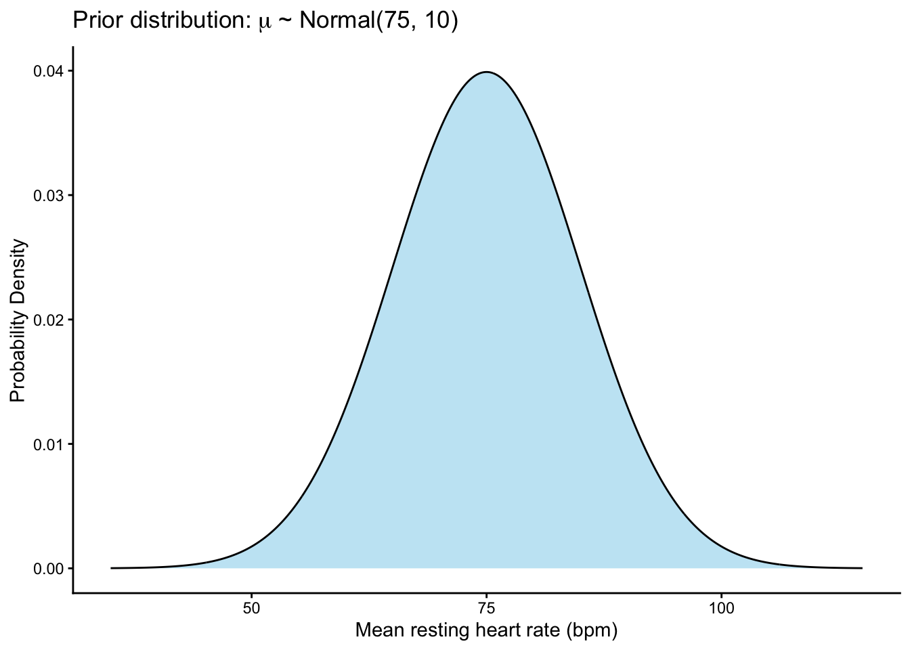
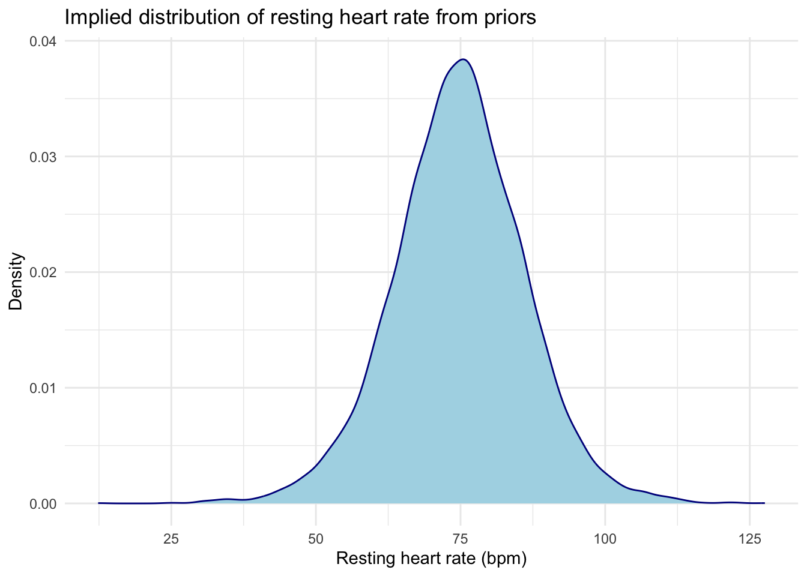
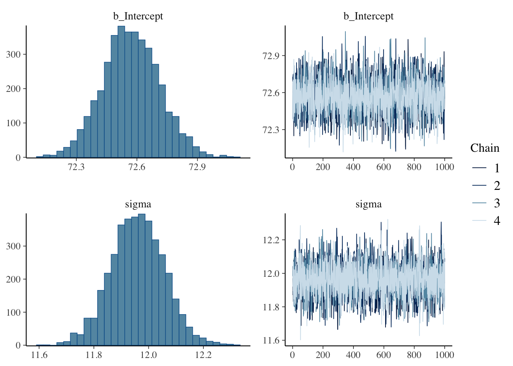
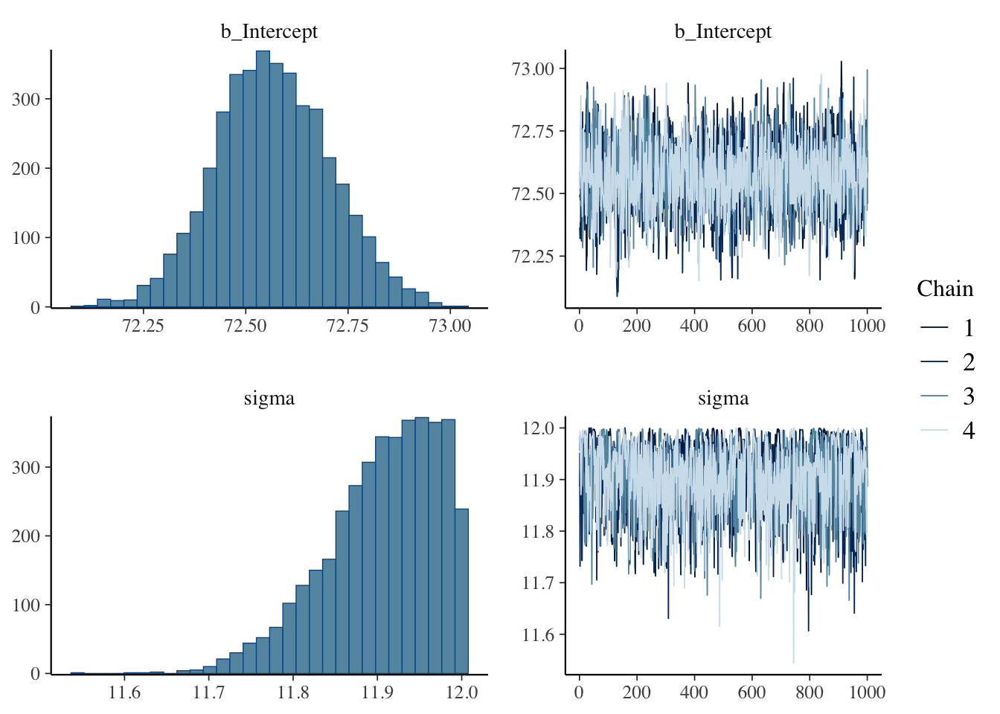
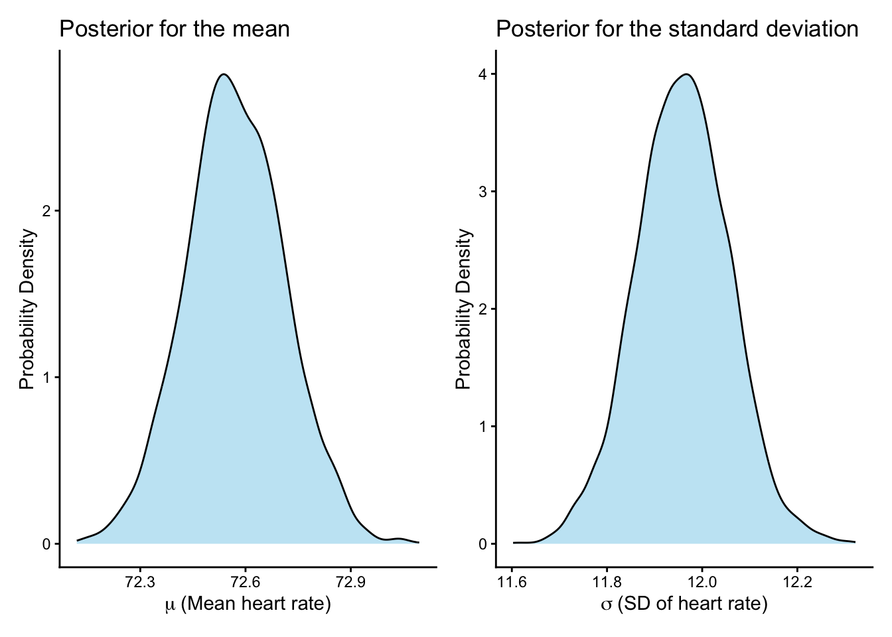
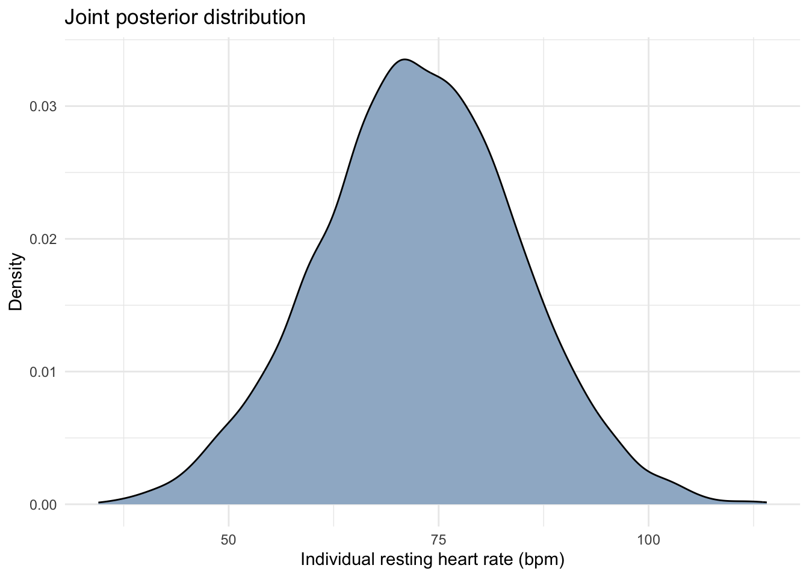
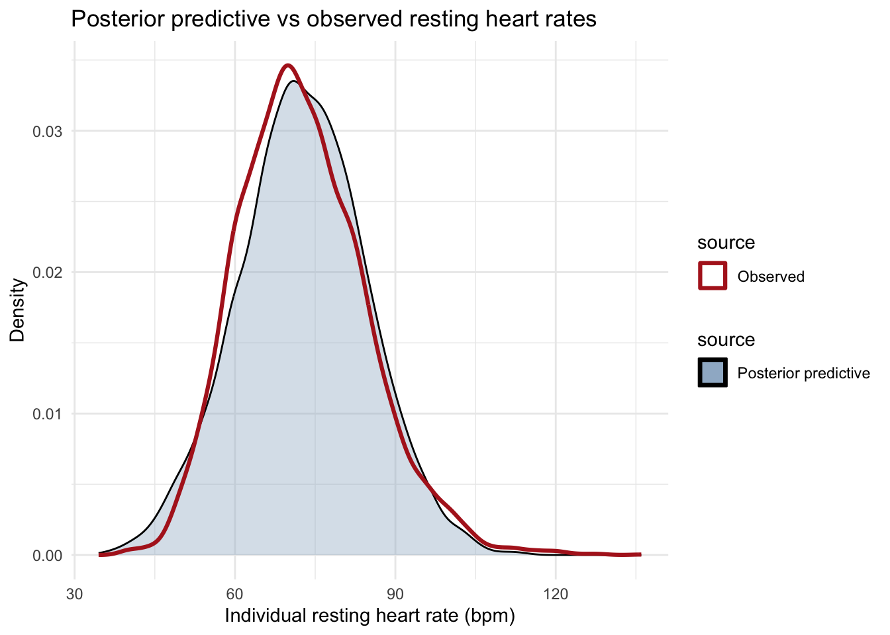

# Bayesian Workflow

In this chapter we extend the process Bayesian estimation in two ways. First, we will look at estimation of a model with parameters for a continuous random variable. Second, we will begin practicing a consistent approach to estimating parameters that includes explicit steps of picking an appropriate statistical model, checking the performance of the model with chosen prior distributions, fitting the model, and checking the performance of the fitted model. This kind of systematic approach to model selection and checking is called **Bayesian workflow**. To explore the components of Bayesian workflow in this chapter, we will consider the following question: What is the average resting heart rate for adults in the United States?

The data we'll this chapter use are included in an R packages called *NHANES*, which stands for the U.S. National Health and Nutrition Examination study. NHANES is a survey of a variety of health parameters for people in the U.S. Let's start by loading the data:


``` r
#install.packages("NHANES") #install the package if necessary
library(NHANES) #load the package
data(NHANES) #load the dataframe NHANES
d <- NHANES #simplify the name of the data frame
```

Running the code above produces a data frame called `d`. I encourage you to look at the structure of the full dataframe (`str(d)`), which includes dozens of variables, but for now let's turn our attention to a summary of two variabiles of interest: `Age` (years) and `Pulse` (resting heart rate in beats per minute, bpm).


``` r
summary(d[, c("Age","Pulse")])
```

```
##       Age            Pulse       
##  Min.   : 0.00   Min.   : 40.00  
##  1st Qu.:17.00   1st Qu.: 64.00  
##  Median :36.00   Median : 72.00  
##  Mean   :36.74   Mean   : 73.56  
##  3rd Qu.:54.00   3rd Qu.: 82.00  
##  Max.   :80.00   Max.   :136.00  
##                  NA's   :1437
```

You can see based on the summary distribution of each variable that the
sample includes individuals of any age. For our research question, we
will focus on estimating the average resting heart rate of *adults* in
the U.S. We can subset the data to remove individuals under 18 years
old, leaving observations for 7216 adults (excluding missing observations):


``` r
d <- d[d$Age >=18, ]
sum(!is.na(d$Pulse)) #sample size
```

```
## [1] 7216
```

## Step 1: Choose an appropriate model for the likelihood

How are the observed data of resting heart rates *generated*? That's the question we have to address first. We need a model that characterizes how our sample data are created. In the broader context of scientific workflow introduced in Chapter 2, this process represents the arrow from the generative model to the statistical model. We need a statistical model that adequately represents the assumptions made in the generative model. 

In the last chapter, our main example focused on estimating the prevalence of a respiratory infection in a population. The observed data consisted of *X* people who tested positive for the infection out of a sample of *N* people tested. When we do statistical analysis, we have to make a decision about how best to characterize how the observed data were generated. This part of our statistical model is called the **likelihood model**. For infection prevalence, we recognized that the observed data was a discrete random variable that could be described by the binomial distribution. The binomial distribution simply functioned as a model we thought was appropriate to describe how the observed number of infections was generated given the true probability of infection (the parameter we wanted to learn) and the number of people sampled.

We're going to need a different kind of likelihood model for estimating the mean resting heart rate. Resting heart rate is a continuous random variable, so the binomial distribution isn't an appropriate description of how heart rates are generated and observed. As we learned in Chapter 6, one probability distribution that can be useful for describing a continuous random variable is the normal (Gaussian) distribution. The normal distribution isn't the only probability distribution that describes continuous random variables, and for some continuous variables we need something else, but it's a good starting point. 

So the first step in Bayesian workflow is selecting an appropriate likelihood model, and for resting heart rate we'll use the normal distribution for this purpose. By using the normal distribution, we assume resting heart rates are observed at random with variation around a population mean ($\mu$) and with among-individual variation described by a standard deviation ($\sigma$). We also assume that heart rate is measured without error. 

Unlike the binomial distribution - which has just a single parameter - the normal distribution has two parameters - mean and standard deviation. Because we are assuming heart rates come from a normal distribution, we have to include both the mean and the standard deviation in our likelihood model. Indeed, when we assume a variable is drawn from a particular probability distribution, we have to estimate (or assume values for) all the parameters for that probability distribution whether we want them or not. That's why it's useful to differentiate between types of parameters, the estimands being the parameters that we are most interested in.

Here's how we can communicate our choice of the normal distribution for the likelihood with statistical notation:

$$
r_i \sim \mathrm{Normal}(\mu, \sigma)
$$

What does the likelihood model say? Here we are defining the observed values of heart rate *r* for each individual *i* as a random variable following a normal distribution with parameters mean = $\mu$ and standard deviation = $\sigma$. Remember the tilde symbol (\~) defines a relationship as stochastic, meaning the observed values $r_i$ are probabilistic. The normal distribution with its parameters defines the probability of drawing particular values of heart rate. We don't know what those parameter values are, so we will have to estimate them. 

## Step 2: Decide on prior distributions for each parameter in the likelihood

Once your likelihood model is defined, it is necessary to define prior distributions for *every* parameter in the likelihood model. How should we go about doing this? At this point in the book I want to introduce two considerations for choosing priors. Prior distributions should be selected in a way that a) respects the mathematical constraints of the parameter of interest and b) allows us to adequately specify our beliefs about values of the parameters that are more or less likely based on our prior knowledge.

First, consider the mathematical constraints of a parameter. Remember our example in the last chapter about estimating the prevalence of an infection? Our model for infection prevalence had just a single parameter, the probability of infection. Probability is bounded between the values of 0 and 1, so it is wise to choose a prior distribution that respects those boundaries. That's why we eventually landed on using the beta distribution as an appropriate probability distribution for the prior, as the beta distribution is bounded between 0 and 1. It makes values outside of the bounds of 0 and 1 impossible, and that makes good mathematical sense.

Let's apply this principle to the question before us this chapter of estimating the mean resting heart rate. Our likelihood model has two parameters, the mean and standard deviation, so we need a prior for both. Let's consider the mean first. Are there any mathematical constraints on the mean resting heart rate? The only constraint that comes to mind is that the mean resting heart rate can't be negative. It could be any real positive value, but it can't be less than 0. 

Which probability distribution might be appropriate for the mean heart rate? At this point in the book we've encountered four probability distributions: binomial, uniform, beta, and normal. The binomial and beta distributions are clearly not appropriate in this case. What about the uniform distribution? Suppose we're 100% confident that the mean resting heart rate of our target population is not less than 50 or greater than 100. We could specify a uniform prior for the mean that rules out values below 50 and above 100: $\mu \sim \mathrm{Uniform}(50, 100)$, which meets our goal of respecting the mathematical constraints of the parameter, namely that the mean heart rate can't be negative. 

But now let's consider our other goal of selecting a prior that adequately reflects our prior beliefts about the parameter. The downside of the uniform distribution is that it doesn't give us any wiggle room to make some values within the range of 50 to 100 more likely than others. We might think the most plausible values for the mean resting heart rate are around 75 bpm, but the uniform distribution we defined says all the values between 50 and 100 are equally plausible. So let's consider another possibility.

What about the normal distribution? Could we use the normal distribution to define a prior for the mean heart rate? It certainly addresses the problem we just faced with the uniform distribution in that we could specify a normal prior that makes values of the mean around 75 bpm more likely than other values. For example, suppose based on prior knowledge that you are 95% confident that the true mean resting heart rate is between 55 and 95 bpm, but it's more likely to be around 75 than values at the margins. We could define the prior distribution for the mean with a normal distribution having a mean of 75 bpm and a standard deviation of 10 bpm: $\mu \sim \mathrm{Normal}(75, 10)$. That's a nice application of the empirical rule, which says that 95% of the values of a normal distribution are within two standard deviations of the mean. This could work!


``` r
mu <- 75
sigma <- 10

x <- seq(mu - 4*sigma, mu + 4*sigma, length.out = 1000)
df <- data.frame(x = x, dens = dnorm(x, mean = mu, sd = sigma))

ggplot(df, aes(x = x, y = dens)) +
  geom_area(fill = "skyblue", alpha = 0.5) +
  geom_line() +
  labs(x = "Mean resting heart rate (bpm)", y = "Probability Density",
       title = expression(paste("Prior distribution: ", mu, " ~ Normal(75, 10)"))) +
  theme_classic()
```



How did I know to use those particular values for the normal prior (mean = 75, standard deviation = 10). This is where domain knowledge is helpful. Based on prior knowledge from the medical literature and my own experience on track and cross country teams where we often measured our heart rates, I have a general sense about the most plausible values for average heart rate. I don't know it for sure, but I think it's around 75 bpm. It could be more or less, but I think it's *very* unlikely that the *typical* heart rate is less than 50 bpm or over 100 bpm. I also don't think it's equally plausible that the mean heart rate is anywhere between 50 and 100 bpm. I think it's most likely around 75, with decreasing probability moving away from 75. The normal distribution captures that prior knowledge nicely (albeit imperfectly, as every model is imperfect).

One potential problem with the normal distribution is that it it allows for values that are positive or negative. So here we face a trade-off. We've landed on a probability distribution that allows us to specify our prior belief about values near 70 bpm being most likely for the mean, but it allows negative values (as well as extremely high positive values, like one 10,000 bpm). What do we do?  We have a few options. We could ditch the normal distribution and look around for another probability distribution that has a similar shape as the normal distribution (high probability density at the mean and lower elsewhere), but only allows for real values above zero. There are options, such as the gamma distribution. On the other hand, we could proceed with the normal distribution and be comfortable with the fact that the probability density of negative values and extreme positive values are minuscule. Remember that a Bayesian analysis uses both the prior *and* the observed data to quantify the posterior distribution that we make inferences with. Extremely unlikely values based on the prior probability alone will not have high posterior probability unless the observed data and likelihood model are very consistent with those values. So for now, let's proceed with the normal distribution as our prior for the mean resting heart rate. 


Wow, that was a lot of effort to select a prior distribution for just a single parameter in our likelihood model. And we still have another parameter to deal with! What should we select as a prior for the standard deviation? First, let's just remember what the standard deviation represents. It represents the typical variation in resting heart rate among individuals in the target population. Admittedly, I feel like I know less about the variation among people in their heart rates than I do about the average heart rate. I wish I could just ignore the standard deviation, but because it's a parameter in my likelihood model, it needs a prior. 

Now although I don't know much about variation in heart rates, I do know there's a mathematical constraint we can respect. The standard deviation cannot be less than 0. Variation either exists, in which case the standard deviation is positive, or it doesn't, in which case the standard deviation is 0. So I want to use a prior distribution that says the standard deviation is zero or positive values only, is possible. 

How large could the standard deviation be?  That's where things are murky for me, although if I push myself, I do think there are some obvious limits that come to mind. For example, it seems absurd the the standard deviation could be something like 30 bpm. How do I know that?  Well let's suppose I'm right that the mean resting heart rate is 75 bpm. A normal distribution with a mean of 75 bpm and standard deviation of 30 bpm would allow a not insignificant portion of the population to have absurd resting heart rates, like less than 30 bpm (just 1.5 standard deviations below the mean) or greater than 110 bpm (just 1.5 standard deviations above the mean). A standard deviation of 30 bpm seems too high. What about 20 bpm? If I'm right that the mean resting heart rate is 75 bpm, a standard deviation of 20 bpm would imply that 95% of the population has a resting heart rate between 35 bpm and 115 bpm. Honestly that still seems too high, but I'm not sure where exactly to draw the line, so I'm going to draw it a tad higher than I think is believable. 

Now you probably think that some values within the range of 0 to 20 bpm are more plausible for the standard deviation than others. I do too, and we could consider a normal distribution as our prior here. But I'm going to caution against that. Unlike the mean resting heart rate, the range of values for the standard deviation are much closer to 0, and I'm concerned about giving too much credence to negative values for the standard deviation. So for now, let's choose a uniform distribution between 0 and 20 as our prior for the standard deviation: $\mu \sim \mathrm{Uniform}(50, 100)$. This simply says that, before seeing the data, we consider any value of the standard deviation between 0 and 20 bpm to be equally plausible. The lower bound of 0 makes good sense because standard deviations cannot be negative (there can't be negative variation). The upper bound of 20 bpm is also conservative. Uniform distributions can work well as prior distribution for paramter that are only positive and when we only know enough to define hard limits on possible values. Yet the uniform distribution isn't completely uninformative. Indeed, it makes a rather strong assumption that values anywhere in the range of 0 and 20 are equally plausible, and other values are impossible. 

So there we have it. We've selected a likelihood model, and we've selected prior distributions for each parameter in our likelihood model. This is our full statistical model that we've defined:

$$
\begin{array}{l}
r_i \sim \mathrm{Normal}(\mu, \sigma) \\
\mu \sim \mathrm{Normal}(75, 10) \\
\sigma \sim \mathrm{Uniform}(0, 20)
\end{array}
$$

## Step 3: Prior predictive check

Are the prior distributions we selected reasonable? We can - and indeed we should - interrogate this question before we fit the model. This is the goal of a **prior predictive check**. We want to formally look at what the prior distributions we selected imply about the data, independently of the observed data. For simple models like ours, this is a straightforward task that we can accomplish by simulating data. Our prior distributions allow for an infinite number of combinations of mean and stadnard deviation for the resting heart rate, but they make some combinations more likely than others. The goal here is to evaluate the *joint distribution* of the mean and standard deviation bsaed on the priors and ensure that we're not implying values that make no sense. 

Let's simulate some data so you can see what I mean:


``` r
#from https://bookdown.org/content/4857/geocentric-models.html#a-language-for-describing-models
n <- 10000

set.seed(123)

#randomly draw means from the prior
mu.sim <- rnorm(n, mean = 75, sd = 10)

#randomly draw SDs from the prior
sigma.sim <- runif(n, min = 0, max = 20)

#randomly draw values of resting heart rate from the combined means and SDs
r.sim <- rnorm(n, mean = mu.sim, sd = sigma.sim)

#plot the simulated distribution of heart rates
df <- data.frame(r.sim = r.sim)

ggplot(df, aes(x = r.sim)) +
  geom_density(fill = "lightblue", color = "darkblue") +
  labs(title = "Implied distribution of resting heart rate from priors",
       x = "Resting heart rate (bpm)",
       y = "Density") +
  theme_minimal()
```

<div class="figure" style="text-align: center">

<p class="caption">(\#fig:c08c06)TODO: caption.</p>
</div>

What is this code doing? First, we randomly draw 10,000 values of the mean resting heart rate from the prior distribution that we defined for the mean (a normal distribution with mean = 75 and SD = 10). Next, we randomly draw 10,000 values for the standard deviation from the prior distribution we defined for that parameter (a uniform distribution between 0 and 20). Finally, we randomly draw 10,000 values of individual resting heart rates from the normal distributions implied by the simualted means and standard deviations from our priors. Then we plot the implied distribution of resting heart rates. 

What do we learn here? We can see the distribution of heart rate implied by the priors has a mean right around 75 bpm as expected, so that's good. But what's not good is that the variation around that mean looks a bit unrealistic. The priors are implying that people (albeit only a few) can have a resting heart rate of 0 or even negative values, or resting heart rates approaching 150 bpm. Good thing we did this prior predictive simulation. This is exactly why you'd do such a thing; to see if the priors you assumed are realistic. Clearly the priors we're using can be improved. 

How should we improve the priors? We have two choices here, we could tighten the normal distribution for the mean, and we could reduce the maximum value for the standard deviation. Either of those alone should tighten the distribution of resting heart rates implied by the priors. I'm going to suggest we do both. Let's tighten the normal prior for the mean to have a mean of 75 and standard deviation of 7.5 (implying a 95% probability that the mean resting heart rate is between 60 and 90; still probabily a bit wide). Let's also trim the upper bound of the standard deviation to 15 bpm. Here's our revised statistical model:

$$
\begin{array}{l}
r_i \sim \mathrm{Normal}(\mu, \sigma) \\
\mu \sim \mathrm{Normal}(75, 7.5) \\
\sigma \sim \mathrm{Uniform}(0, 15)
\end{array}
$$ 
Now let's see if that implies a more realistic distribution of resting heart rates:


``` r
#from https://bookdown.org/content/4857/geocentric-models.html#a-language-for-describing-models
n <- 10000

set.seed(123)

#randomly draw means from the prior
mu.sim <- rnorm(n, mean = 75, sd = 7.5)

#randomly draw SDs from the prior
sigma.sim <- runif(n, min = 0, max = 15)

#randomly draw values of resting heart rate from the combined means and SDs
r.sim <- rnorm(n, mean = mu.sim, sd = sigma.sim)

#plot the simulated distribution of heart rates
df <- data.frame(r.sim = r.sim)

ggplot(df, aes(x = r.sim)) +
  geom_density(fill = "lightblue", color = "darkblue") +
  labs(title = "Implied distribution of resting heart rate from priors",
       x = "Resting heart rate (bpm)",
       y = "Density") +
  theme_minimal()
```

<div class="figure" style="text-align: center">

<p class="caption">(\#fig:c08c07)TODO: caption.</p>
</div>

Now we see no negative values implied by the priors, and the upper extreme values have been reduced to a maximum of around 125 bpm. Honestly these prior may still be a bit too wide, but those extreme values are very rare, and the data will have a lot to say about where the posterior distributions end up. Let's proceed!

## Step 4: Fit the statistical model with the observed data

With our statistical model in defined, let's proceed to estimate the parameters in `brms`:


``` r
library(brms)

#Likelihood model: heart rates normally distributed
m1.formula <- bf(Pulse ~ 1, family = gaussian())

# Priors:
#   Intercept (mu) ~ Normal(75, 10)
#   sigma ~ Uniform(0, 20)
m1.prior <- c(
  prior(normal(75, 7.5), class = "Intercept"),
  prior(uniform(0, 15), class = "sigma", lb = 0, ub = 15)
)

# Fit model
m1 <- brm(
  data = d,
  formula = m1.formula,
  prior = m1.prior,
  seed = 123,
  chains = 4, warmup = 1000, iter = 2000, cores = 4,
  refresh = 0
)
```

```
## Running /Library/Frameworks/R.framework/Resources/bin/R CMD SHLIB foo.c
## using C compiler: ‘Apple clang version 17.0.0 (clang-1700.0.13.3)’
## using SDK: ‘MacOSX15.4.sdk’
## clang -arch arm64 -std=gnu2x -I"/Library/Frameworks/R.framework/Resources/include" -DNDEBUG   -I"/Library/Frameworks/R.framework/Versions/4.5-arm64/Resources/library/Rcpp/include/"  -I"/Library/Frameworks/R.framework/Versions/4.5-arm64/Resources/library/RcppEigen/include/"  -I"/Library/Frameworks/R.framework/Versions/4.5-arm64/Resources/library/RcppEigen/include/unsupported"  -I"/Library/Frameworks/R.framework/Versions/4.5-arm64/Resources/library/BH/include" -I"/Library/Frameworks/R.framework/Versions/4.5-arm64/Resources/library/StanHeaders/include/src/"  -I"/Library/Frameworks/R.framework/Versions/4.5-arm64/Resources/library/StanHeaders/include/"  -I"/Library/Frameworks/R.framework/Versions/4.5-arm64/Resources/library/RcppParallel/include/"  -I"/Library/Frameworks/R.framework/Versions/4.5-arm64/Resources/library/rstan/include" -DEIGEN_NO_DEBUG  -DBOOST_DISABLE_ASSERTS  -DBOOST_PENDING_INTEGER_LOG2_HPP  -DSTAN_THREADS  -DUSE_STANC3 -DSTRICT_R_HEADERS  -DBOOST_PHOENIX_NO_VARIADIC_EXPRESSION  -D_HAS_AUTO_PTR_ETC=0  -include '/Library/Frameworks/R.framework/Versions/4.5-arm64/Resources/library/StanHeaders/include/stan/math/prim/fun/Eigen.hpp'  -D_REENTRANT -DRCPP_PARALLEL_USE_TBB=1   -I/opt/R/arm64/include -isysroot /Applications/Xcode.app/Contents/Developer/Platforms/MacOSX.platform/Developer/SDKs/MacOSX15.4.sdk    -fPIC  -falign-functions=64 -Wall -g -O2  -isysroot /Applications/Xcode.app/Contents/Developer/Platforms/MacOSX.platform/Developer/SDKs/MacOSX15.4.sdk -c foo.c -o foo.o
## In file included from <built-in>:1:
## In file included from /Library/Frameworks/R.framework/Versions/4.5-arm64/Resources/library/StanHeaders/include/stan/math/prim/fun/Eigen.hpp:22:
## In file included from /Library/Frameworks/R.framework/Versions/4.5-arm64/Resources/library/RcppEigen/include/Eigen/Dense:1:
## In file included from /Library/Frameworks/R.framework/Versions/4.5-arm64/Resources/library/RcppEigen/include/Eigen/Core:19:
## /Library/Frameworks/R.framework/Versions/4.5-arm64/Resources/library/RcppEigen/include/Eigen/src/Core/util/Macros.h:679:10: fatal error: 'cmath' file not found
##   679 | #include <cmath>
##       |          ^~~~~~~
## 1 error generated.
## make: *** [foo.o] Error 1
```

Let's walk through this. We've defined the likelihood with the `bf` function, where the formula `Pulse ~ 1` tells `brms` that we want to fit a model with only an intercept, which is just a fancy way of saying we want the mean of the normal distribution that we specified with `family = gaussian` (recall "Gaussian" is another name for the normal distribution). We then define our priors. In `brms`, each parameter getting a prior needs a distribution for the prior. You can see we specify `normal(75, 7.5)` for the mean and `uniform(0, 15)` for the standard deviation in this case. The `class` argument is required to indicate the type of variable, here being an `Intercept` for the mean and `sigma` for the standard deviation. Note that when defining a uniform prio, you not only need to define the limits within the `uniform` call, but also with the `lb` and `ub` arguments. Any inconsistencies here will lead to an error.

I'll just note right here that the process of fitting model can be much more complex than I'm suggesting in this section. For example, there are decisions to make about the particular MCMC engine to use, the number of chains to run, the length to run each chain (iterations), whether or not to thin the iterations, and how to fit the model efficiently using CPU's in parallel. For the purpose of an introductory statistics book, I've chosen to leave many of these details out and using relatively consistent model fitting decisions, especially for the relatively simple models addressed in a beginner's class. Thus you will almost always see that we fit models with four chains, 2000 iterations for each chain, 1000 iterations of warmup (more on that below), and with the chains fitted in parallel across four CPU's (`cores`) for efficiency. I've set the `seed` value so that the particular output in this book is reproducable, and I've set the `refresh` argument to 0 to minimize the amount of messages you get from `brms` during model fitting. All of these decisions can and should be open for discussion when fitting a particular model, and often these settings will need to be adjusted. But I consider these more advanced topics better approached when you have a basic handle on the general steps of Bayesian analysis, and other books cover these topics in detail and much more effectively than I could here. 

## Step 5: Evaluating and applying a fitted model

### A quick glance at the estimates

After fitting the model, we print the model output (`print(m1)`) to see same basic numerical summaries of the posterior distributions for the parameters we estimated. Our estimate for the mean heart rate is listed under "Regression Coefficients" as the "Intercept". Remember that our estimate is an entire probability distribution, and `brms` defaults to showing you the mean of the posterior as the "Estimate". Thus we see that the mean of the posterior distribution for resting heart rate is 72.57 bpm. The "Est.Error" represents the standard deviation of the posterior distribution, and we also see limits of a 95% credible interval (CI). Based on the analysis, we can say there's a 95% probability that the mean resting heart rate is between 72.30 bpm and 72.85 bpm. 

In addition to the mean heart rate, we also get a posterior distribution for the standard deviation, here denoted "sigma" under "Further Distributional Parameters". There we see the posterior mean is 11.96 bpm, and there's a 95% probability that the standard deviation is between 11.77 and 12.15 bpm. Note that the credible intervals for the mean and standard deviation of resting heart rates are both quite narrow, indicating that we've estimated these parameters with a high degree of precision.

### Checking for convergence

Before you dive into applying the posterior distributions for inferences, one thing you need to do is see if the sampling algorithm (the MCMC process) reached a stable set of posterior distributions. Remember the MCMC process is basically using a sampling process to estimate the posterior distributions, starting with some initial values that are supplied by the user or internally by the algorithm. Early in the sampling process the sampled values are biased by the initial values and can vary widely from iteration to iteration. This is called a **burn-in** or **warmup** period, and we generally do not want to use samples from this period for estimation. Indeed, the samples from the defined warmup period are entirely discarded. If the estimation process goes well, the values in each iteration stabilize and remain consistent, and it is these consistent values that we want to use for inference. We use the term **convergence** to describe a sampler that has reached the point of stability for a parameter. tIndeed, the samples from the defined warmup period are entirely discarded. 

In our models, we run the sampling process for 2000 iterations with a warmup period of 1000 iterations. This means the first 1000 iterations are dropped entirely, and only the final 1000 iterations are retained. This is done in parallel across four chains, so we end up with a total of 4000 sampled values for each parameter. 

Although we are discarding the first 1000 iterations entirely, we still need to check that the sampling process reached convergence in the final 1000 iterations we're retaining for inference. There are two ways we'll evaluate convergence in this book. First, you can execute the `plot` function on the object for your fitted model, which will produce a plot fo the posterior distributions for each parameter, as well as **trace plots** that can be used to evaluate convergence qualitatively:


``` r
plot(m1)
```



The left panel shows the posterior distributions for the mean (`b_Intercept`) and standard deviation (`sigma`) parameters, and the right side of the panel shows trace plots for each panel. Trace plots allow you to view the value of each parameter for each iteration of the model in each chain. What we're looking for here is relative consistency in the parameter values *within and among* the chains, that is convergence of the parameter values. Notice that for both of these parameters, the sampled values in sequence are relatively consistent, and sampled values across the chains converged around the same values (i.e., the chains are **well-mixed**). These trace plots indicate solid convergence because the values for each chain overlap extensively and hover around a common value. 

In addition to evaluating convergence qualitatively, we can also evaluate it numerically in the printed model output above. Note that for each parameter an `Rhat` value is reported. This is known as the **Gelman-Rubin statistic ($\hat{R}$), and it reflects the degree of convergence of each parameter. Values close to 1 imply convergence, and we genearlly want to see `Rhat` values less than 1.01. The `Rhat` values for our two parameters are reported as 1.00, implying convergence of our model.

## Checking the shape of the posterior distribution

One other visual check you should make is of the posterior distributions, which can point to problems with the prior distributions (among other issues). For example, imagine that instead of using a uniform prior for the standard deviation between 0 and 15, I used a uniform prior between 0 and 12, which says the standard deviation can *only* take on values between 0 and 12. Values below 0 and above 12 are impossible. 

Below is the output from the `plot` function for the fitted model using this new prior. Look closely at the posterior distribution for the standard deviation. Notice how the posterior distribution is strongly skewed to the left, with most of the values around 12 and a hard cut-off at 12? This is good evidence that the prior I used was too constraining, and that it's very possible that the standard deviation takes on values greater than 12. Basically the observed data via the likelihood are saying the standard deviation may well be above 12, but my prior distribution doesn't allow it. You can also see in the trace plot for the standard deviation that there's a hard limit at 12. These are good signs that my priors need to be relaxed and the model refit. 


```
## Running /Library/Frameworks/R.framework/Resources/bin/R CMD SHLIB foo.c
## using C compiler: ‘Apple clang version 17.0.0 (clang-1700.0.13.3)’
## using SDK: ‘MacOSX15.4.sdk’
## clang -arch arm64 -std=gnu2x -I"/Library/Frameworks/R.framework/Resources/include" -DNDEBUG   -I"/Library/Frameworks/R.framework/Versions/4.5-arm64/Resources/library/Rcpp/include/"  -I"/Library/Frameworks/R.framework/Versions/4.5-arm64/Resources/library/RcppEigen/include/"  -I"/Library/Frameworks/R.framework/Versions/4.5-arm64/Resources/library/RcppEigen/include/unsupported"  -I"/Library/Frameworks/R.framework/Versions/4.5-arm64/Resources/library/BH/include" -I"/Library/Frameworks/R.framework/Versions/4.5-arm64/Resources/library/StanHeaders/include/src/"  -I"/Library/Frameworks/R.framework/Versions/4.5-arm64/Resources/library/StanHeaders/include/"  -I"/Library/Frameworks/R.framework/Versions/4.5-arm64/Resources/library/RcppParallel/include/"  -I"/Library/Frameworks/R.framework/Versions/4.5-arm64/Resources/library/rstan/include" -DEIGEN_NO_DEBUG  -DBOOST_DISABLE_ASSERTS  -DBOOST_PENDING_INTEGER_LOG2_HPP  -DSTAN_THREADS  -DUSE_STANC3 -DSTRICT_R_HEADERS  -DBOOST_PHOENIX_NO_VARIADIC_EXPRESSION  -D_HAS_AUTO_PTR_ETC=0  -include '/Library/Frameworks/R.framework/Versions/4.5-arm64/Resources/library/StanHeaders/include/stan/math/prim/fun/Eigen.hpp'  -D_REENTRANT -DRCPP_PARALLEL_USE_TBB=1   -I/opt/R/arm64/include -isysroot /Applications/Xcode.app/Contents/Developer/Platforms/MacOSX.platform/Developer/SDKs/MacOSX15.4.sdk    -fPIC  -falign-functions=64 -Wall -g -O2  -isysroot /Applications/Xcode.app/Contents/Developer/Platforms/MacOSX.platform/Developer/SDKs/MacOSX15.4.sdk -c foo.c -o foo.o
## In file included from <built-in>:1:
## In file included from /Library/Frameworks/R.framework/Versions/4.5-arm64/Resources/library/StanHeaders/include/stan/math/prim/fun/Eigen.hpp:22:
## In file included from /Library/Frameworks/R.framework/Versions/4.5-arm64/Resources/library/RcppEigen/include/Eigen/Dense:1:
## In file included from /Library/Frameworks/R.framework/Versions/4.5-arm64/Resources/library/RcppEigen/include/Eigen/Core:19:
## /Library/Frameworks/R.framework/Versions/4.5-arm64/Resources/library/RcppEigen/include/Eigen/src/Core/util/Macros.h:679:10: fatal error: 'cmath' file not found
##   679 | #include <cmath>
##       |          ^~~~~~~
## 1 error generated.
## make: *** [foo.o] Error 1
```



### Inference and posterior predictive check

Finally, we should make a detailed inspection and summary of the posterior distributions and draw conclusions if all looks good. We start this process by using the `as_draws_df` function to retrieve the samples. 


``` r
#posterior samples
m1.post <- as.data.frame(as_draws_df(m1))
head(m1.post)
```

```
##   b_Intercept    sigma Intercept    lprior      lp__ .chain .iteration .draw
## 1    72.60770 11.96995  72.60770 -5.692764 -28148.35      1          1     1
## 2    72.52242 11.87165  72.52242 -5.696455 -28148.70      1          2     2
## 3    72.48102 11.93042  72.48102 -5.698294 -28148.54      1          3     3
## 4    72.56183 11.83219  72.56183 -5.694733 -28149.06      1          4     4
## 5    72.62127 11.90600  72.62127 -5.692188 -28148.48      1          5     5
## 6    72.75178 11.89091  72.75178 -5.686821 -28149.33      1          6     6
```

``` r
nrow(m1.post)
```

```
## [1] 4000
```

We've printed the first six rows, where we see values for the mean (`b_intercept`) and standard deviation (`sigma`). We also see that we have 4000 samples in total, exactly what we expect when we fit the model with 2000 iterations with 1000 warmup iterations discarded across four chains.

Now we can use the samples to plot the full posterior distribution for both parameters. 


``` r
library(patchwork) #allows us to combine plots in one output

p_mu <- ggplot(m1.post, aes(x = b_Intercept)) +
  geom_density(fill = "skyblue", alpha = 0.5) +
  labs(x = expression(mu~"(Mean heart rate)"),
       y = "Probability Density",
       title = "Posterior for the mean") +
  theme_classic()

p_sigma <- ggplot(m1.post, aes(x = sigma)) +
  geom_density(fill = "skyblue", alpha = 0.5) +
  labs(x = expression(sigma~"(SD of heart rate)"),
       y = "Probability Density",
       title = "Posterior for the standard deviation") +
  theme_classic()

p_mu + p_sigma
```



To answer our initial question, our posterior dsitribution for the mean implies that the mean resting heart rate for adults in the U.S. is very likely around 72.5 bpm. We could of course compute some summary statistics:


``` r
#posterior mean
mean(m1.post$b_Intercept)
```

```
## [1] 72.57146
```

``` r
#posterior median 
median(m1.post$b_Intercept)
```

```
## [1] 72.56715
```

``` r
#interquartile range
IQR(m1.post$b_Intercept)
```

```
## [1] 0.1888912
```

``` r
#90% credible interval
quantile(m1.post$b_Intercept, probs=(c(0.05, 0.95)))
```

```
##       5%      95% 
## 72.34078 72.80674
```

Here we can be more specific and say that the mean of the posterior distribution for resting heart rate is 72.57 bpm, and the 90% credible interval says there's a 90% chance that the mean heart rate is between 72.34 and 72.81 bpm. That's a very high degree of precision, due in part to our large sample size of 7481 individuals.

We can also compute other probabilities of interest. For example, maybe you want to know the probability that the mean resting heart rate is greater than 73. That's easy to compute with the samples:


``` r
#probability that the mean resting rate is >73 bpm
mean(m1.post$b_Intercept>73)
```

```
## [1] 0.00225
```

There's only a 0.2% chance that the mean resting heart rate is greater than 73 bpm.

Before reporting our conclusions, one final thing we should do is to check what the posterior distribution implies about the data (i.e., the individual heart rates). This is analogous to the prior predictive check, except now instead of using only the prior distribution to simulate the data, we use the posterior distribution. Let's go ahead and do this, drawing samples from the posterior distributions for the mean and standard deviation, and then randomly simulating observations of resting heart rate from the normal distributions of heart rate implied by the posterior. 


``` r
set.seed(123)

# Simulate one individual heart rate per posterior sample
post_r <- rnorm(nrow(m1.post), mean = m1.post$b_Intercept, sd = m1.post$sigma)

# Create data frame for plotting
df_post <- data.frame(pulse = post_r)
df_obs  <- data.frame(pulse = d$Pulse)

ggplot(df_post, aes(x = pulse)) +
  geom_density(fill = "slategray3", color = "black") +
  labs(title = "Joint posterior distribution",
       x = "Individual resting heart rate (bpm)",
       y = "Density") +
  theme_minimal()
```



The resulting distribution is called the **joint posterior distribution**, and it describes the distribution of the *individual* resting heart rates. One thing that would make us feel confident with our model is if the distribution of individual heart rates implied by the model reflects the data we actually observed. We can visually check that by overlaying a density plot of the observed data on top of the joint posterior distribution:


``` r
# Organize the two data sources
df_pred <- data.frame(pulse = df_post$pulse, source = "Posterior predictive")
df_obs  <- data.frame(pulse = d$Pulse, source = "Observed")

# Overlay densities
library(ggplot2)
ggplot() +
  geom_density(data = df_pred, aes(x = pulse, fill = source),
               alpha = 0.4, color = "black") +
  geom_density(data = df_obs, aes(x = pulse, color = source),
               linewidth = 1.1, show.legend = TRUE) +
  scale_fill_manual(values = c("Posterior predictive" = "slategray3")) +
  scale_color_manual(values = c("Observed" = "firebrick", "Posterior predictive" = "black")) +
  labs(title = "Posterior predictive vs observed resting heart rates",
       x = "Individual resting heart rate (bpm)",
       y = "Density") +
  theme_minimal()
```



Here we can see that the posterior predictive and observed distributions have a close fit! That means the resting heart rates implied by the posterior distribution do a good job at describing the observed data. We can be reasonably confident in the model output for inference. Visually that would be the area under the posterior predictive distribution that's greater than 100, but we can easily compute that probability with the observations of heart rate randomly drawn from our model:


``` r
mean(df_post$pulse>100)
```

```
## [1] 0.01175
```

We see that based on our statistical model, we expect 1.15% of the population has tachycardia. We could do the same thing for bradycardia, which is defined as a slow heart rate usually less than 60 bpm:


``` r
mean(df_post$pulse<60)
```

```
## [1] 0.14575
```

There's a much greater portion of the population that likely has bradycardia than tachycardia. This isn't too surprising, however, because bradycardia is common in people who exercise a lot, indicating high conditioning. 

## Summary

That's it! There are five basic components to Bayesian workflow, and we will try to make a habit of working through each of these components as we wrestle with new questions and models in the remainder of the book. Because the primary goal of this book is to teach the basic elements of statistic elements, we may not always cover each of these steps in the exact order or with the same degree of detail with every new example and model. But I do believe the workflow outlined here should be a starting point for anyone just starting out with statistical analysis, taking basic steps to ensure the model specification is adequate before drawing conclusions.
