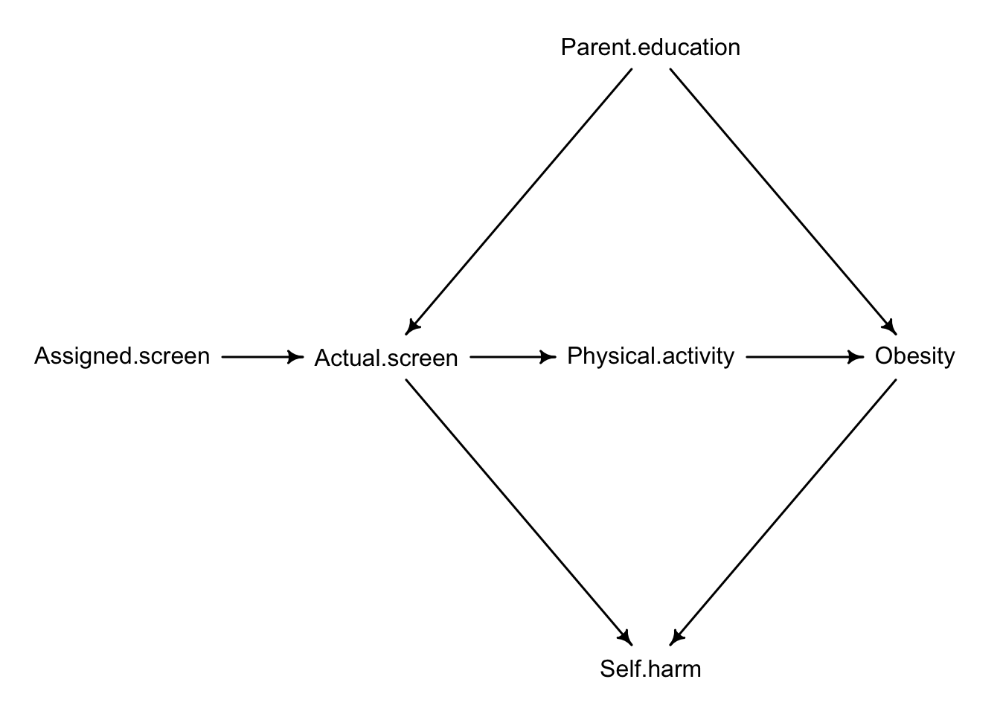

# Graphical Causal Models

I've made the case that science starts with a clear research question, and we've explored some characteristics of what defines a good research question. I've also suggested that many (maybe most) scientific research studies have a primary goal of testing a causal hypothesis. In this chapter, we will take a closer look at causal questions. Designing scientific studies to address causal questions can be extremely challenging. Overcoming those challenges requires a clearly stated scientific model of the causal effects being hypothesized. Describing your scientific model and stating your causal assumptions with a graph is the focus of this chapter, and a theme that we will come back to as we explore the particulars of research design and statistics in the remainder of the book.


## Directed acyclic graphs (DAGs)

There are two general approaches to **causal inference**: the potential outcomes framework ([Neyman 1923](https://www.jstor.org/stable/2245382), [Rubin 2005](https://www.jstor.org/stable/27590541)) and the graphical causal model framework ([Pearl 2000](https://bayes.cs.ucla.edu/BOOK-2K/)). In this book, we will use graphical causal models to guide our approach to causal inference. I find that the graphical representation of causal models provides for a smoother entry to the ideas of causal inference for students in an introductory statistics course.

The graphical causal modeling framework uses **directed acyclic graphs (DAGs)** to visualize the causal assumptions of a hypothesis. Let's work through an example. Suppose you are interested in the causal effect of living near urban greenspace on mental health. In cities, greenspaces are simply areas where natural vegetation occurs, such as forest. This is a forward causal question with a clearly defined cause (greenspace) and effect (mental health). The hypothesis is that living near greenspace reduces the risk of mental health disorders, perhaps by alleviating anxiety, or encouraging physical activity. Causal effects of one variable on another can involve multiple mechanisms.

Let's assume that we can measure whether or not people live near greenspace. We define `greenspace` as a nominal variable where individuals live either "near greenspace" or "not near greenspace". In reality, proximity to greenspace can be measured on a continuum, but for now let's keep it simple and define proximity categorically. Let's also assume that `mental.health` is a binary, categorical variable. People either have a mental health disorder, or they don't.

Our causal hypothesis is represented as a DAG in Figure \@ref(fig:c10c01). This kind of graph has nodes that represent variables, and arrows between nodes that illustrate the flow of causation. Based on how we've talked about our research question to this point, we have a really simple DAG. The nodes are greenspace and mental health, and there's a directional arrow from greenspace to mental health. The direction of the arrow shows the direction of causality. This DAG implies that greenspace directly influences mental health. Because there are no other variables between these variables, we define the effect of greenspace on mental health as a **direct effect**.


``` r
dag1 <- dagitty("dag {greenspace -> mental.health}")
coordinates(dag1) <- list(x = c(greenspace = 0, mental.health = 1), y = c(greenspace = 0, mental.health = 0))
drawdag(dag1)
```

<div class="figure" style="text-align: center">

<p class="caption">(\#fig:c10c01)Initial DAG for the causal effect of greenspace on mental health.</p>
</div>

Our hypothesis is that greenspace *reduces* the risk of mental health disorders, but note there's no indication of the nature of the causal effect in the DAG. DAGs simply illustrate assumed causal effects. DAGs do not assume anything about the form of the causal relationship between variables (e.g., positive vs. negative relationship, linear vs. non-linear relationship).

::: {.alert .alert-block .alert-info}
<b>Drawing DAGs</b>

In this chapter and throughout the book I will create figures of DAGs in R with the `dagitty` and `rethinking` packages. The relationship between variables are defined by the `dagitty` function, with the arrow `->` identifying the direction of causality between variables. You can use the `coordinates` function to customize the arrnangement of the variables in the plot along x- and y-axes.

I also highly recommend the [dagitty website](https://www.dagitty.net/), where you can draw DAGs directly in your internet browser.
:::

Life is rarely so simple as assumed in our initial DAG. Notably, the DAG assumes that greenspace is the only significant cause of mental health. The emphasis on significant is purposeful. In reality, there may be hundreds of causes of mental health. Most outcomes in biology are like this with multiple possible causes. However, DAGs focus on the most important causes. If there's a particular mutation on a gene that increases the risk of a mental health disorder by 0.001%, we probably don't need to include that in the DAG because the effect is trivial. Additionally, because we are focusing on mental health as an outcome, we don't necessarily need to include variables that are causally affected by mental health. Overall, some discretion about the variables to include in DAGs is warranted, because otherwise DAGs would be too complex to be useful ([Huntington-Klein 2022](https://theeffectbook.net/)). All models are simplifications.

Suppose that we collect some idea, and we find that 18% of individuals who don't live near greenspace have been diagnosed with a mental health disorder, whereas 11% of individuals who live near greenspace have a mental health disorder. The absolute risk [^c10n01] of a mental health disorder is 7% lower for individuals who live near greenspace. Is that difference caused by greenspace? Not necessarily! Why not? We need to consider the possibility that there is a common cause of greenspace and mental health. In other words, the people who live near greenspace differ in other ways from the people who don't live near greenspace, and these differences might contribute to mental health outcomes. One such possibility is socioeconomic status (SES). SES is very likely a cause of living near greenspace because wealthy people can afford to live near greenspace. SES might also be a cause of mental health because wealthy people have good access to healthcare. Figure \@ref(fig:c4c2) adds SES to the DAG.

[^c10n01]: **Absolute risk** is the probability that an event occurs, here expressed as a percentage. Absolute risk can be contrasted with **relative risk**, which is the proportional risk of one outcome relative to another. For example, if the absolute risk of a mental health disorder is 18% for the "near greenspace" group and 11% for the "not near greenspace" group, then the relative risk of living near greenspace is 0.11/0.18 = 0.61. This means that it is 0.61 times less likely to be diagnosed with a mental health disorder when living near greenspace relative to not living near greenspace. Relative risk and absolute risk are often reported in the medical literature, but note that relative risk doesn't tell you anything about the absolute risk. One useful way of comparing risk between groups on the absolute risk scale is the **absolute risk reduction**, which just the difference in absolute risk between groups. That's the 7% that I referenced in the text.


``` r
dag2 <- dagitty("dag {greenspace -> mental.health;
                      SES -> greenspace;
                      SES -> mental.health}")
coordinates(dag2) <- list(x = c(greenspace = 0, SES = 1, mental.health = 2), 
                          y = c(greenspace = 0, SES = -1, mental.health = 0))
drawdag(dag2)
```

<div class="figure" style="text-align: center">

<p class="caption">(\#fig:c10c02)DAG with the confounding variable SES added.</p>
</div>

The new DAG in Figure \@ref(fig:c10c02) clearly identifies SES as a common cause of both greenspace and mental health. This means the causal relationship between greenspace and mental health is confounded by SES. We call SES a **confounding variable** because it affects both the explanatory and response variables, ultimately confusing our interpretation of the relationship between greenspace and mental health. Remember that the risk of having a mental health disorder was 7% lower for people who live close to greenspace. It's possible that difference is due to a causal effect of greenspace on mental health, but it's also possible that some or all of the risk difference is due to the confounding effect of SES. Confounding variables can create associations between variables that are not causal.

Let me show you what I mean with the help of a data simulation. The risk probabilities of having a mental health disorder that I previously mentioned were generated by simulating data in R. Here's the code, followed by an explanation:


``` r
set.seed(122)

## simulate socioeconomic status (ses)
ses <- rbinom(n = 1000, size = 1, prob = 0.5)

## simulate green space access (grn) based on ses
grn <- rbinom(n = 1000, size = 1, prob = ifelse(ses == 1, 0.8, 0.2))

## simulate mental health status (mnt) based on ses
mnt <- rbinom(n = 1000, size = 1, prob = ifelse(ses == 1, 0.1, 0.2))
```

I assumed that we have a dataset of $n = 1000$ people, and for each person, I first randomly determined if they are of high or low socioeconomic status. I did this using a function called `rbinom`. The arguments of the `rbinom` function include the number of observations (`n = 1000`), the number of trials (`size = 1`), and the probability of "success" (`prob = 0.5`). What this means is that for each of the 1000 individuals, I determine a single time whether they are of high or low SES, each with a probability of 0.5. This produces the variable `ses`, a vector of 0 and 1 values, where 0 represents "low ses" and 1 represents "high ses". Because I set the probability of success to 0.5, there should be about a 50/50 split of low and high ses individuals. It won't necessarily be exactly 50%, because the function is drawing values randomly. It's basically like flipping a coin 1000 times and counting heads and tails.

Once the ses variable was generated, I then generated the greenspace access variable, called `grn`. This was also generated with the `rbinom` function, where a 1 represents "near greenspace" and 0 represents "not near greenspace". I used the `ifelse` function to specify that the probability of being near greenspace was 0.8 for individuals of high ses and 0.2 for individuals of low ses. Finally, I generated a variable for mental health outcome, `mnt`, where 1 represents individuals who have a mental health disorder, and 0 represents individuals who don't have a mental health disorder. I assumed the probability of a mental health disorder was 0.1 for individuals of high ses and 0.2 for individuals of low ses. The only other part of the code chunk above is the `setseed` function, which allows you to simulate the exact same dataset that I simulated, as long as you use the same `setseed` number (122). 

Now I want you to notice something important. Because we are simulating data, I had to make some assumptions about what the probability of a mental health disorder would be for individuals of high and low ses and individuals who are near or not near greenspace. In this simulation, I assumed that mental health risk is *only* affected by SES. There is no direct effect of greenspace access on mental health risk based in this simulation. Let's see what happens when we compare the probability of a mental health disorder between greenspace access based on this simulated dataset. We can do that with the `table` function:


``` r
table(mnt, grn)
```

```
##    grn
## mnt   0   1
##   0 421 436
##   1  90  53
```

Here we see a **contingency table** showing the number of individuals in each category of mental health status and greenspace. Greenspace, the explanatory variable, is located at the top of the table, where the column for `grn` = 0 represents not near greenspace, and the column for `grn` = 1 represents individuals who live near greenspace. The rows represent the categories of mental health status, where `mnt` = 0 are the individuals who don't have a mental health disorder, and `mnt` = 1 are the individuals who have a mental health disorder. You can determine the totals in each category manually, or you can wrap the table function in a function called `addmargins`:


``` r
addmargins(table(mnt, grn))
```

```
##      grn
## mnt      0    1  Sum
##   0    421  436  857
##   1     90   53  143
##   Sum  511  489 1000
```

With the addmargins function, we can see there were 511 people who don't live near greenspace and 489 people who do live near greenspace. We can also see the totals for mental health disorders: 143 people out of the 1000 have a mental health disorder. With this information, we can now compute the probability of a mental health disorder for the two categories of greenspace. This is exactly what a researcher might be tempted to do to assess whether living near greenspace causally affect mental health risk:


``` r
p.mnt.g0 <- 90/511 #mental health risk when greenspace = 0
p.mnt.g0
```

```
## [1] 0.1761252
```

``` r
p.mnt.g1 <- 53/489 #mental health risk when greenspace = 1
p.mnt.g1
```

```
## [1] 0.1083845
```

So we see exactly what I told you earlier. Of the 1000 people in the dataset, 18% of people not near greenspace had a mental health disorder, and 11% of people near greenspace had a mental health disorder (I'm rounding to two decimal places). One might be tempted to infer that the causal effect of greenspace is the 7% difference between these probabilities. But it's not! I know it's not, **because I simulated the data under the assumption greenspace access has no effect on mental health risk**. The only effect on mental health risk was SES. So why is there a 7% difference in risk probability with respect to greenspace? That difference is driven entirely by the confounding effect of SES in this simulation. High SES increases the chance that an individual lives near greenspace, and high SES decreases the chance of a mental health disorder. We can see this in the data:


``` r
addmargins(table(grn, ses))
```

```
##      ses
## grn      0    1  Sum
##   0    393  118  511
##   1     81  408  489
##   Sum  474  526 1000
```

``` r
81/474 #probability of near greenspace when ses is low
```

```
## [1] 0.1708861
```

``` r
408/526 #probability of near greenspace when ses is high
```

```
## [1] 0.7756654
```

``` r
addmargins(table(mnt,ses))
```

```
##      ses
## mnt      0    1  Sum
##   0    376  481  857
##   1     98   45  143
##   Sum  474  526 1000
```

``` r
98/474 #mental health risk when ses is low
```

```
## [1] 0.2067511
```

``` r
45/526 #mental health risk when ses is high
```

```
## [1] 0.08555133
```

Here we see that the probability of living near greenspace was 17% for low SES and 78% for high SES, and the probability of a mental health disorder was 21% for low SES and 9% for high SES. In this dataset, the people of low SES with a greater risk of a mental health disorder also tend to not live near greenspace.

OK - Who cares? Well, if you want to design a study to investigate whether or not greenspace has a causal effect on mental health, you'd get the wrong answer if you simply compared the raw risk of mental health disorders between people who do and do not live near greenspace. The DAG makes this clear, identifying SES as a confounding variable. If you want to get the right answer, the DAG shows us that we need to take into consideration the socioeconomic status of people. If we don't take SES into consideration, then the relationship we observe between greenspace and mental health will include a mix of the real causal effect of greenspace on mental health *and* the noncausal association via SES. ***DAGs make our causal assumptions clear and inform how we should design a study and conduct analyses to isolate the causal effects of interest***.

Later in the book we will learn more about what it means to take a variable "into consideration" when estimating a causal effect of some other variable, but let me briefly show you with this example. Basically, we need to look at the relationship between greenspace and mental health risk *while holding SES constant*. In other words, we need to compare the mental health risk between greenspace levels within the different categories of SES. Let's do this and see what we find. First, let's combine our variables into a dataframe, and then subset the dataset into two datasets, one for people of low SES, and another for people of high SES:


``` r
d <- cbind.data.frame(ses, grn, mnt) #create a data frame with all 3 variables
lo.ses <- d[d$ses == 0,]
hi.ses <- d[d$ses == 1,]
```

Now, let's compare the mental health risk between greenspace levels within each dataset. First, the individuals of low SES:


``` r
addmargins(table(lo.ses$mnt, lo.ses$grn,
                 dnn=c("mnt", "grn"))) #dnn argument adds names to the table
```

```
##      grn
## mnt     0   1 Sum
##   0   310  66 376
##   1    83  15  98
##   Sum 393  81 474
```

``` r
83/393 #mental health risk for not near greenspace
```

```
## [1] 0.2111959
```

``` r
15/81 #mental health risk for near greenspace
```

```
## [1] 0.1851852
```

Here we see a less than 3% difference in mental health risk between the levels of greenspace access. We'll learn that the difference we observe here is not a real causal effect; rather it's due entirely to what we'll call **sampling error**. More on that later.

How about the individuals of high SES?


``` r
addmargins(table(hi.ses$mnt, hi.ses$grn,
                 dnn=c("mnt", "grn"))) 
```

```
##      grn
## mnt     0   1 Sum
##   0   111 370 481
##   1     7  38  45
##   Sum 118 408 526
```

``` r
7/118 #mental health risk for not near greenspace
```

```
## [1] 0.05932203
```

``` r
38/408 #mental health risk for near greenspace
```

```
## [1] 0.09313725
```

Again, only about a 3% difference in mental health risk between the levels of greenspace access, but this time in the opposite direction (greater magnitude of risk when near greenspace). In other words, when we hold SES constant and look for an effect of greenspace access, we find no consistent effect.

This is a nice example showing how the causal assumptions about a system can be communicated in a DAG, which then informs how one proceeds to analyze the data. We will also examine how a DAG can inform how the data should be collected in the first place. More on that in the next chapter. For now, let's formalize some aspects about the structure of DAGS.

## Three causal structures in DAGs

There are three main types of causal structures that are identifiable in DAGs. Let's work through each. In each case, assume there is an explanatory variable X and a response variable Y, and the primary interest is in understanding the causal effect of X on Y.

### The fork: confounders

Forks have the structure $X \gets Z \to Y$, where Z is a confounding variable. You've already seen the fork: $greenspace \gets SES \to mental.health$. Here SES is a common cause of greenspace and mental health, and I showed how a confounding variable can create a noncausal association between the explanatory and response variables. Because SES increases greenspace access and reduces the likelihood of mental health disorders, the risk of a mental health disorder will be lower for people who live close to greenspaces than those far from greenspaces. In other words, confounders can generate spurious relationships between the explanatory and response variable, meaning they have to be taken into account when trying to understand the causal effect of X on Y.

Confounders can also mask patterns in the data generated from real causal effects. Suppose a researcher is interested in the causal effect of sunscreen use on skin cancer risk: $sunscreen \to cancer$. The researcher collects data on both variables from medical records and finds no relationship; the probability of skin cancer is the same regardless of the use of sunscreen. Surely sunscreen reduces the chance of skin cancer, right?

When building a DAG, ***it is essential to include any variable that causally affects at least two other variables in the DAG***. Can you think of any variables that would causally affect sunscreen use and skin cancer risk? Here's a likely one: sun exposure. Sun exposure is a known risk factor for skin cancer, and people vary in their sun exposure based on where they live, work, and their lifestyle. Sun exposure might also causally affect sunscreen use. Perhaps people who have high sun exposure are more likely to use sunscreen. Do you see the issue here? Let's look at the DAG in Figure \@ref(fig:c10c11):

<div class="figure" style="text-align: center">

<p class="caption">(\#fig:c10c11)DAG for effects of sunscreen use and sun exposure on skin cancer risk.</p>
</div>

If exposure increases the use of sunscreen and increases the risk of skin cancer, then that can generate an unexpected pattern of skin cancer being more common with sunscreen use! But let's say that sunscreen does have a direct causal effect of reducing skin cancer risk. If both forces are at play - the direct effect of sunscreen reducing cancer risk, and the confounding effect of sun exposure increasing sunscreen use and cancer risk - then you might not find any relationship at all between cancer risk and sunscreen use. In other words, sometimes confounders will **mask** a true causal effect, specifically if the pattern of the association between X and Y generated by the confounder is the opposite direction of the pattern of the association between X and Y generated by the direct effect.

***Identifying confounders on back-door paths:*** Confounders can be identified by finding **back-door paths** from the explanatory variable to the response variable. A back-door path is any path in the DAG that starts with an arrow pointing into the explanatory variable and ends with an arrow pointing into the response variable. Forks create backdoor paths: $sunscreen \gets exposure \to cancer$.

Back-door paths can include more than two pathways. Consider a researcher trying to understand the causal effect of exercise on recovery time from a respiratory virus. Of course there are multiple potential common causes of exercise and viral recovery time. Figure \@ref(fig:c10c12) shows a DAG that includes the expected causal effect of exercise on recovery time, but also general health knowledge and vaccination status. See if you can find the back-door path between exercise and recovery.

<div class="figure" style="text-align: center">

<p class="caption">(\#fig:c10c12)DAG for causal effect of exercise on recovery time from a respiratory virus.</p>
</div>

The back-door path is $exercise \gets knowledge \to vaccine \to recovery$. The confounder here is health knowledge. People with a lot of health knowledge might exercise more and be more likely to get vaccinated, and vaccination time can reduce recovery time. If that's the case, health knowledge confounds the relationship between exercise and recovery time. In this case, the back-door path includes more than one intervening node between the explanatory and response variable.

***Dealing with confounders:*** When there's a back-door path identified in a DAG that will confound the relationship between the explanatory and response variable, that pathway must be blocked or controlled. The options for blocking back-door paths involving confounders include study design and statistical analysis and will be addressed in coming chapters.

### The pipe: mediators

Let's continue examining the last DAG on viral recovery time to illustrate the next causal structure: the **pipe**. The pipe has a standard structure of $X \to Z \to Y$. The variable Z is called a **mediator**, because the causal effect of X on Y is mediated (at least in part) by Z. You've probably noticed this structure in some of the DAGs we've explored so far. For example, the path $knowledge \to exercise \to recovery$ is a pipe. Here, the causal effect of health knowledge is mediated by exercise. Essentially, the causal effect of knowledge is transmitted to viral recovery via exercise level. The path $knowledge \to vaccine \to recovery$ is also a pipe. In this case, vaccination is a mediator transmitting the causal effect of knowledge to recovery.

When the causal effect of a variable X on Y involves a mediator Z, we call the causal effect of X on Y an **indirect effect**. A causal effect of X on Y can involve multiple indirect effects. Thus, one can examine the indirect effect of knowledge on recovery via exercise, or the indirect effect of knowledge on recovery via vaccination. Note that there is no direct effect of knowledge on recovery in this model.

Causal effects of a variable X on Y can also involve direct and indirect effects. Consider an ecologist asking whether the amount of forest habitat in a landscape causally affects bird species diversity. The researcher hypotheses that forest can affect species diversity in two ways. First, forest area can directly affect species diversity because the amount of forest affects the amount of resources available for birds (e.g., food, nesting sites). Second, forest area can indirectly affect species diversity by affecting the degree of habitat fragmentation. When forest area declines, the remaining forest becomes spatially fragmented, and fragmentation can have a direct effect on diversity by limiting the immigration of new species. Figure \@ref(fig:c10c13) shows a DAG reflecting these ideas.

<div class="figure" style="text-align: center">

<p class="caption">(\#fig:c10c13)DAG for causal effect of forest area and fragmentation on bird diversity.</p>
</div>

In this case, forest area has a direct effect on diversity and an indirect effect on diversity via the mediator fragmentation. The sum of a variables direct and indirect effects is called the **total effect**.

***Dealing with mediators:*** When the causal effect of X on Y involves a pipe, generally there is no need to do anything about the mediator. A mediator is an important component of the causal effect of the explanatory variable of interest. If I want to know the total effect of forest area on bird species diversity, then I should make sure that area can affect bird diversity in all the ways I hypothesize, including the direct effect and the indirect effect via fragmentation. If I block the effect of fragmentation on diversity as part of the research design or analysis, then I am blocking part of the causal effect of forest area on diversity. This is called **post-treatment bias**. The "bias" part of this phrase means that you would get the wrong answer if you wanted to know the total effect of area on diversity but blocked the effect of fragmentation. If you want to know either the total (or indirect effect) of a treatment variable (another term for an explanatory variable), then you need to let the causal effect of that treatment variable be transmitted through its mediators.

In some circumstances it is OK to block a mediators effect. For example, suppose I was specifically interested in the direct effect of forest area on bird diversity, independent of its effect via fragmentation. In that case, I would want to design the study or analysis in a way to block the pipe involving fragmentation, leaving only the direct effect of area on diversity.

### The inverted fork: colliders

Imagine a researcher asks whether people who have serious illnesses (e.g., heart disease, cancer, autoimmune disorders) are more likely to be infected with COVID-19 than people who don't have serious illnesses. The researcher conducts the study by examining patient records from a local hospital and finds a surprising result: there's a **negative association** between serious illnesses and COVID-19. In other words, people who have serious illnesses appear **less** likely to have COVID-19 than those without a serious illnesses. But there's one problem with this analysis: it's not correct! Let's explore why with a simulated dataset.

Assume that serious illness status and COVID-19 status are binary categorical variables, and additionally assume that having a serious illness **increases** the probability of having COVID-19. Let's also assume that having a serious illness or COVID-19 increases the probability of someone being admitted to the hospital. Figure \@ref(fig:c10c14) shows a DAG reflecting these assumptions.

<div class="figure" style="text-align: center">

<p class="caption">(\#fig:c10c014)DAG for the causal effect of serious illness on COVID infection status.</p>
</div>

And now here's the R code to generate some data based on the stated assumptions, using the `rbinom` function to simulate binary data just like in the example on greenspace and mental health outcomes. 


``` r
set.seed(123)

## simulate illness status
ill <- rbinom(n = 1000, size = 1, prob = 0.2)

## simulate covid status based on illness status
cov <- rbinom(n = 1000, size = 1, prob = ifelse(ill == 1, 0.2, 0.1))

## simulate hospital status based on illness status and covid status
hos <- rbinom(n = 1000, size = 1, prob = ifelse(ill == 1 & cov == 1, 0.29, 
                                         ifelse(ill == 1 & cov == 0, 0.25,
                                         ifelse(ill == 0 & cov == 1, 0.05, 0.01))))
```

Here are the quantitative assumptions we've made in this simulated dataset of 1000 people:

1.  The baseline probability of someone having a serious illness is 20%.
2.  Serious illness increases the risk of COVID infection. The probability of a COVID infection is 20% for those with a serious illness and 10% for everyone else.
3.  Serious illness and COVID both increase the chance of being admitted to the hospital. The baseline probability of someone without a serious illness or COVID being admitted to the hospital is assumed to be 1%. A serious illness increases the risk by 24%, and a COVID infection increases the risk by 4%. Thus, if someone has COVID but no serious illness (`ill == 0 & cov == 1`), their chance of being in the hospital is 5%. If someone has a serious illness but not COVID (`ill == 1 & cov == 0`), their chance of being in the hospital is 25%. If someone has a serious illness and COVID (`ill == 1 & cov == 1`), their chance of being in the hospital is 29%.

Now let's replicate the researcher's analysis by filtering the dataset to only include hospitalized patients, and then we will examine the relationship between serious illness and COVID status:


``` r
d <- cbind.data.frame(ill, cov, hos) #create a data frame with all 3 variables
hos.patients <- d[d$hos == 1,] #extract the observations for the hospital patients

addmargins(table(hos.patients$ill, hos.patients$cov,
                 dnn = c("ill", "cov")))
```

```
##      cov
## ill    0  1 Sum
##   0    8  4  12
##   1   47 12  59
##   Sum 55 16  71
```

From the filtered dataset, we can see that we have a total of 71 hospital records. Of the 71 patients, 47 patients have a serious illness but not COVID, 4 patients have COVID but not a serious illness, and 12 patients have a serious illness and COVID. Does having a serious illness increase the risk of COVID?

If we simply compute the probability of COVID for people with and without a serious illness, here's what we find. The probability of COVID is 12/59 = 20% for people with a serious illness and 4/12 = 33% for people without a serious illness. That's right. Among hospitalized patients, people without a serious illness appear more likely to have COVID than those with a serious illness, the opposite of the true relationship in the general population based on our simulated model.

This counterintuitive result arises from **collider bias**. Take another look at the DAG and note that both serious illness and COVID status causally affect hospital admission: $Illness \to Hospital \gets COVID$. This causal structure is called an inverted fork: $X \to Z \gets Y$, where the variable Z is called a **collider** because it is causally affected by both X and Y. Hospital admission is a collider, where a patient is most likely to be admitted if they have a serious illness or COVID.

***Dealing with colliders:*** Colliders only create problems when a researcher blocks or controls for the collider Z in the pathway $X \to Z \gets Y$ as part of the research design or analysis. That's exactly what's happening with our example case of filtering the dataset to only individuals who were admitted to the hospital. When conditioning on hospital admissions in this way, a spurious relationship is generated between serious illness and COVID status.

Think about it this way. When we restrict the analysis to hospitalized patients, the two causes of hospitalization compete in a away to explain why patients were admitted. If a patient doesn't have COVID, they must have had a serious illness. If a patient doesn't have a seriuos illness, they must have had COVID. This creates a spurious negative relationship between serious illness and COVID status, even though the true relationship in the general population is just the opposite.

Collider bias is a type of **selection bias** in that it's driven by analyzing relationships between variables within a certain group. The world is full of these kind of examples. Why do ex-partners tend to either be attractive or intelligent, but not both? In this case the sample is restricted only to the people you dated in the past. If an ex wasn't particularly attractive, they were probably intelligent. If an ex wasn't intelligent, they were probably attarctive. Individuals who were neither attractive nor intelligent never made it into the pool of individuals you'd choose to go on a date with!

So beware of colliders. When you are interested in the causal relationship between X and Y, and X and Y both affect Z, generally avoid filtering the dataset by Z!

## Closing backdoor paths

Drawing a DAG is a really useful way of being explicit about your scientific model, but it can also inform how you should go about designing your study and analyzing data. That's ultimately why we're covering graphical causal diagrams before we jump into statistics. DAGs represent your causal assumptions, and everything else - design, analysis, inference - follows from that. Science before statistics!

Once you have a DAG in hand, you can evaluate it to identify problematic pathways, basically any causal path that confounds the causal effect of interest. The causal pathways of interest start with a particular explanatory variable X and end with an outcome variable Y, and the arrows between X and Y should be forward facing. We will call these pathways **directed paths**, which are causal and of primary interest. This might involve a direct effect of X on Y, $X \to Y$, indirect effects of X on Y $X \to Z \to Y$, or both (the total effect). Problematic pathways are **back-door paths**, which are paths that connect X to Y but start with an arrow pointing into X. A fork structure with a confounder is the classic example. Back-door paths are noncausal and must be blocked. Finally, some paths between X and Y will start with a directed path out of X but end with a collider. If there's a collider on a pathway between X and Y, that pathway is noncausal but is already blocked. No further action is needed.

Let's take a look at an example. Figure \@ref(fig:c10c17) shows a DAG where the interest is in understanding the causal effect of screen time on obesity in pediatric patients ([Williams et al. 2018](https://www.nature.com/articles/s41390-018-0071-3)). The DAG includes three other relevant variables, parent education, physical activity, and self-harm. This DAG represents a scientific hypothesis about the causal relationship between screen time and obesity, but it also includes other relevant pathways that are noncausal but could generate a spurious association between screen time and obesity. To understand how best to proceed with the design and analysis phase of the research, one would start by listing all the pathways between screen time and obesity, then identify the causal pathways of interest and the noncausal pathways. Given a list of all the pathways, causal and noncausal, one can then determine if any action needs to be taken to block the noncausal pathways from generating spurious associations.

<div class="figure" style="text-align: center">

<p class="caption">(\#fig:c10c17)DAG for the causal effect of screen time on obesity in pediatric patients.</p>
</div>

Below I list every path connecting the explanatory variable (screen time) to the response variable (obesity). For each path, we identify whether it is directed, back-door, or blocked via a collider. Given this information, one can decide which variables should be controlled during the design or analysis phase, and which variables should be left alone.

-   $Screen.time \to Physical.activity \to Obesity$: Here we have a pipe. This is a forward causal pathway involving an indirect effect of screen time on obesity via physical activity. The hypothesis here is that the more time a child spends on a screen, the less time they are being physically active, and the more likely they will be obese. This is a causal pathway of interest, so we wouldn't want to block it. It would be a mistake to block or condition on physical activity, because that's assumed to be an essential component of the causal mechanism linking screen to obesity. Blocking physical activity would be an example of post-treatment bias.

-   $Screen.time \gets Parent.education \to Obesity$: This is a back-door path because it involves an arrow pointing into the explanatory variable. The causal structure is a fork, where parent education is a confounder. Thus, this is a non-causal path that will generate a spurious association between screen time and obesity. We need to block the effect of parent education on obesity during the design or analysis phase of the research.

-   $Screen.time \to Self.harm \gets Obesity$: This is a path involving a collider. Note that both screen time and obesity are assumed to have direct effects on self-harm. Collider paths are blocked by default, so no action is necessary. It would be a mistake to design the research or conduct the analysis in a way that conditions on self-harm (for example, by only analyzing individuals who have a history of self-harm), because that would generate a noncausal association between screen time and obesity.

There you have it. With a DAG in hand, you can identify all the potential paths bewteen the explanatory and response variable, and determine for each whether not they need to be blocked. We will examine the methods of blocking available when we explore study designs and linear models later in the book.

## Like all models, DAGs require assumptions

The great value of using DAGs is that they make causal assumptions crystal clear. Based on those assumptions and the causal structures observed in a DAG, one can design a data colleciton scheme or analyze the data in a way that increases the chance of obtaining an unbiased estimate of the causal effect of interest. But like all models, DAGs are simplifications of nature and have their own assumptions. Here are some important ones:

1.  Causal effects in DAGs cannot be bidirectional. They must be **directed** from one variable to another.

2.  DAGs cannot have cycles. In other words, you can't have a causal effect structure like this where you start with a causal effect of variable X and have a chain of causal effects that end back at X: $X \to Y \to Z \to X$. Cycles or loops are not allowed. DAGs are most beneficial to represent static causal models. If your scientific hypothesis is more dynamic, involving time and feedback loops, other tools for causal inference will often be necessary.

3.  All variables with non-trivial effects should be included. This is most important when two variables have a shared cause, like Z here: $X \gets Z \to Y$. The reason it's important to include common causes is because such confoudners need to be blocked by design or in the analysis to get an unbiased estimate of the relationship between X and Y. Unobserved or unmeasured confounders will lead to biased conclusions, although there are  methods to help address unobserved confounders.

4.  Building on the previous point, using a DAG to inform research design and analysis does not magically make any association you find a causal relationship. Leaving non-trivial variables out of the DAG, particularly confounders, will make causal conclusions from the DAG invalid. Domain knowledge becomes extremely important when designing a DAG to ensure that it adequately represents prior knowledge about the science of the research question.

So DAGs have assumptions and limits like any model, but they are a very useful method for an initial exploration of the tools of causal inference. We'll build on this foundation moving forward.

So far we have examined the importance of identifying a clear research question and communicating the causal assumptions related to the research question with a DAG. I've tried to make the case that defining clear research questions and developing an explicit scientific model as a DAG will help inform how one goes about designing research to collect and analyze data. In the next two chapters, we will begin to look at some basic elements of research design given a question and DAG in hand. We'll first explore our options for different types studies we can conduct, and then we'll explore the concept of sampling to collect data and some principles we can apply to maximize the quality of our dataset and the inferences we make from the data. Let's begin with study design.

## Types of Study Designs

Consider the last research question from Chapter 4 on graphical causal models: Does screen time affect obesity in children? The hypothesis here is that screen time increases obesity due to reduced physical activity. Time is a zero sum game. Children who spend four hours on a screen each day are not spending those four hours being physically active, and increased risk of obesity may be a consequence of reduced physical activity. In the terms of a DAG in Figure \@ref(fig:c10c18), the expectation is that screen time indirectly increases obesity by reducing physical activity, where physical activity is a mediator.

<div class="figure" style="text-align: center">

<p class="caption">(\#fig:c10c18)DAG for the causal effect of screen time on obesity in pediatric patients.</p>
</div>

The DAG from Chapter 4 also includes two additional variables that are causally related the explanatory and response variable. Screen time and obesity are both expected to have direct effects on self-harm. Because self-harm is a collider in this DAG, and the path $Screen.time \to Self.harm \gets Obesity$ is blocked by default. In other words, when we design the research, we should **not** attempt to do anything additionally in our research design to block the self-harm outcome. Doing so would actually create a noncausal association between screen time and obesity.

The other relevant path in the DAG is $Screen.time \gets Parent.education \to Obesity$. This is a back-door path with a confounding effect of parent education. Here the idea is that parents with a lot of education about health will know something about the risks of screen time and the risks of obesity, and they may take actions to minimize screen time and obesity in their children through mechanisms other than physical activity. For example, perhaps the parents who restrict screen time are also likely to restrict their children's diet to the most health foods. If that were the case, you might find a positive association between obesity and screen time. But that positive association wouldn't reflect the causal effect of screen time.

Given this DAG and the potential confounding effect of parental education, how do we proceed to design the study? There are two general types of study designs we can use: experimental and observational research.

## Experimental studies

***Experiments*** are essentially the gold standard for scientific research when the goal is causal explanation. There are two key elements of experiments. First, the researcher manipulates the explanatory variable. In other words, individuals in the experiment are assigned particular values of the explanatory variable, often referred to as the **treatment**. Second, the particular values of the explanatory varaible are **randomly assigned** to individuals in the experiment. This element is called **randomization**, and it is really the defining feature of an experiment.

Why is randomization so important? Let's consider this question in the context of the research question on screen time and obesity. The DAG shows that parent education is a confounding variable. Thus, the concern is that kids who have low levels of screen time have parents with high levels of education, and those parents with high education parent in other ways (besides screen time) to minimize the chance that their kids will be obese. If the researcher is interested in the effect of screen time on obesity, then the confounding effect of parent education must be controlled. And that's what randomization does.

Suppose the researcher enrolls 200 kids into the study. The researcher decides that she will assign three possible levels of screen time: 0, 5, or 10 hours per week. These different levels of screen time will be assigned to each participant randomly. For example, the researcher might have a list of each individual's name (or more likely, an identification code), and for each individual she could pick a piece of paper out of a hat indicating one of the three treatment levels. Or, she can use 21st-century technology and assign one of the three treatment levels in R:


``` r
set.seed(123)
## create ID codes for each participant
id <- 1:200

## define the three treatment levels (0 = none, 5 = low, 10 = high)
trt.levels <- c("none", "low", "high")

## randomly assign each individual to a treatment
trt <- sample(trt.levels, 200, replace = TRUE)

## combine into a dataframe
d <- cbind.data.frame(id, trt)
head(d)
```

```
##   id  trt
## 1  1 high
## 2  2 high
## 3  3 high
## 4  4  low
## 5  5 high
## 6  6  low
```

The `sample` function was used to randomly assign each of the 200 participants to one of the three treatment levels [^ch10n02]. Here's why randomization is the key feature of an experiment: If the treatment levels are randomly assigned to each individual, then there will be no relationship between the screen time of each participant and their parent's education level. A participant with who has highly educated parents will have an equal chance of being assigned to each of the three levels of screen time. In other words, experiments remove the influence of confounding variables on the explanatory variable. If the researcher used an experiment in this way, the DAG would be revised to eliminate the $Parent.education \to Screen.time$ effect as seen in Figure \@ref(fig:c10c20).

[^ch10n02]: The `replace` = TRUE argument just means that the sampling is done "with replacement". That means if the first person is assigned the "high" treatment, the next person can also be assigned the "high" treatment.

<div class="figure" style="text-align: center">

<p class="caption">(\#fig:c10c20)DAG for the causal effect of screen time on obesity in pediatric patients when using an experimental study design.</p>
</div>

In this revised DAG, there is no longer a back-door path confounding the relationship between screen time and obesity. The research would randomly assign the levels of screen time, let enough time pass to observe the expected effect, and then record the value of the outcome variable, obesity (likely as the change in obesity from the start to the end of the study).

Random assignment of the explanatory varaible to individuals in an experiment not only helps control for confounding variables the researcher is aware of, but also unobserved confounders. Even with extensive domain knowledge, it's hard to think about every possible confounding variable and to include each one in the DAG. Randomization breaks the association between the explanatory varaible and unobserved confounders too.

Experiments are sometimes referred to as **randomized controlled trials (RCTs)**, emphasizing the essential component of randomization when attempting to infer a causal effect of an explanatory variable. The "controlled" part of the RCT name often refers to a **control group**, which is a group that does not receive the standard treatment. Control groups are often essential as a baseline for comparison. In the experiment described here on screen time and obesity, the "none" category of screen time is the control group. However, experiments don't always need a control group as traditionally defined. For example, suppose that instead of "none", "low", and "high", we just dropped the "none" category and assigned individuals to one of two treatment levels: low and high screen time. The researcher would still randomly assign these two levels of screen time to participants and then compare the change in obesity between the two groups. The "low" treatment functions as the baseline for comparison. A researcher might not include a traditional control group (complete absence of the treatment) if that's not a realistic value in the target population of interest, such as if the study is being conducted on a population where virtually no children have exactly zero screen time.

Although experiments are the goal standard of causal inference, correct causal inference isn't a guarantee. One problem researchers face is when participants in an experiment don't comply with their treatment instructions. This kind of issue can be common in experiments requiring behavioral compliance of people (e.g., psychology; [Rohrer 2023](https://compass.onlinelibrary.wiley.com/doi/epdf/10.1111/spc3.12948)). For example, imagine that some individuals who were assigned to the "none" treatment still give their kids some screen time. When compliance is a potential issue, researchers should collect data on both the treatment level randomly assigned *and* the treatment level actually received. Hopefully participatns are honest, and the person assigned to the "none" treatment level reports their actual screen time.

But even if people are honest and report their actual screen time, the noncompliance introduces significant complication for the analysis. Although the treatment levels were randomly assigned to participants, the noncompliance may not be random. What if noncompliance is affected by parental education? In this case, perhaps the most highly educated parents enforce stricter screen time limitations than the treatment they were assigned, where as parents with less education may be more likely to relax a strict limitation and allow their kids to have more screen time. The DAG in Figure \@ref(fig:c10c21) below is modified to reflect this possibility, now including a variable for the actual screen time experienced by the participants, and a direct causal effect of parent education on actual screen time. The researcher might have been aware of noncompliance and collected data on *actual* screen time, but it would be a mistake to simply analyze the relationship between obesity and actual screen time. Why? There's a backdoor path from actual screen time to obesity via the confounder, parent education. Even in an experimental context, correctly analyzing the causal effect of screen time in this example would require an analysis that controls for the effect of parental education on actual screen time.

<div class="figure" style="text-align: center">

<p class="caption">(\#fig:c10c21)Revised DAG including actual screen time.</p>
</div>

So, experiments aren't a guarantee of safe causal inference, even when treatments are randomly assigned. Moreover, sometimes conducting experiments can be challenging, or even impossible. Imagine you're an economist studying the effect of the minimum wage on employment. It's impossible to randomly assign different minimum wages to different municipalities. If you're a biologist studying the effect of urbanization on biodiversity, you can't randomly assign areas that do and do not become urbanized. Sometimes experiments can't be done because they're unethical. If you're a psychologist studying the effect of parenting style and child personality, you can't randomly assign babies to different parenting styles. In cases like these, researchers have to rely on observational designs, which we turn to next.

## Observational studies

When researchers collect data without randomly assigning levels of the explanatory variable to individuals, they are conducting an ***observational study***. The key element making a study observational is when the researcher has no role in determining how the data arose. The data arose naturally and are observed and recorded by the reseacher. Sometimes you have to take what you can get.

How would an observational design be conducted to address our research question on screen time and obesity. There's a couple ways such a study could proceed. One approach would be to enroll individuals into a study and track their screen time and obesity over time. This kind of design is called a **prospective study**, which is simply a study that is planned in advance. Another approach would be to analyze existing data on screen time and obesity. Perhaps a dataset was previously collected by these factors by another researcher, or by a medical doctor in their own practice. This kind of design is called a **retrospective study**, referring to the fact that the data being analyzed were generated in the past. Both of these designs have the common element of the data arising naturally on their own without the researcher randomly assigning levels of screen time.

In some ways observational studies are much easier to pull off, particularly if a dataset is already available. But observational designs can present significant challenges in interpretation. Because the levels of the explanatory variable are not randomly assigned, any back-door path involving a confounding variable is unblocked in an observational design. Sure, it might be easy to record screen time and obesity for a bunch of kids, but remember parental education? Kids that have knowledgeable parents might limit their screentime and enforce a diet that minimizes obesity. In that case, one would find a positive relationship between screen time and obesity, not because of a causal effect of screen time, but because of confounding effect of parental education. This is exactly what people mean when they say "correlation is not necessarily causation". In addition to generating noncausal correlations, it's also important to remember that confounders can also mask real relationships.

So how do we proceed to make causal inferences with an observational design? One needs to have a clear scientific model of their system that makes causal assumptions clear, such as with a DAG. With a well-defined DAG that identifies likely back-door paths and confounders, one can then block those paths during the analysis phase. We won't learn the methods to do that until later in the book, but at this point it's important to understand that the researcher must identify potential confounders *and* measure them in order to apply the methods we'll use to block back-door paths during analysis. That's why researchers should start by defining a DAG before the data are collected.

### Pros and cons of prospective vs. retrospective studies (planned)

