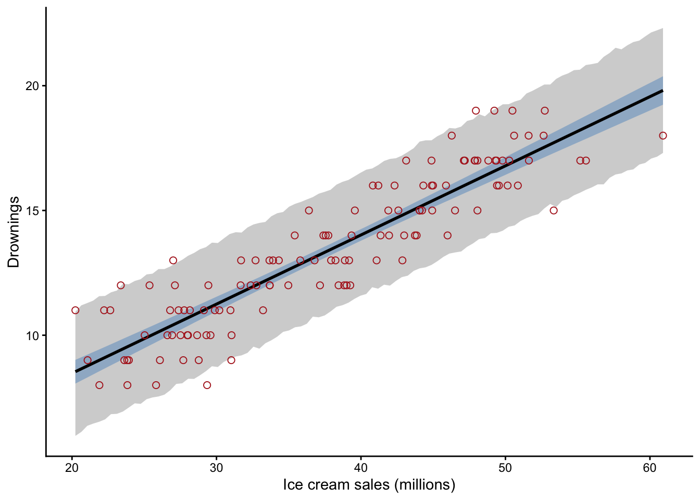
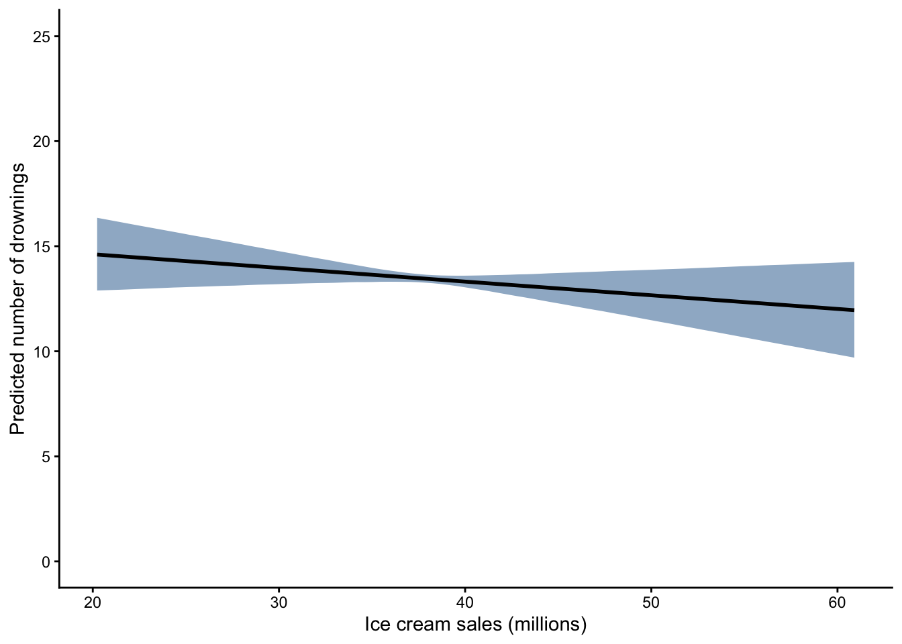
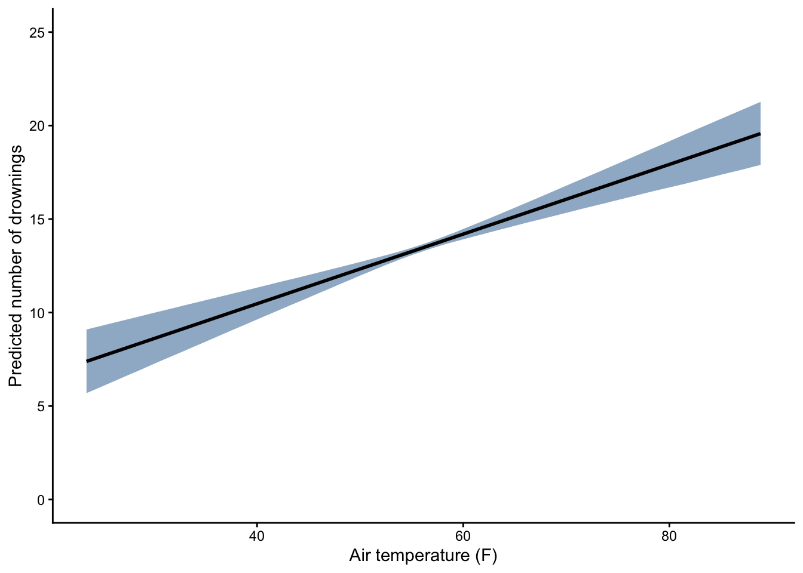

# Causal inference with linear models


I like ice cream. A lot. So I became alarmed when I saw the graph below, suggesting that the number of drownings in the United States is positively related to ice cream sales.

<div class="figure" style="text-align: center">

<p class="caption">(\#fig:c11c01, )TODO: caption.</p>
</div>

Why would the number of drownings be related to ice cream sales? Well, one hypothesis is that ice cream consumption causally increases risk of drowning. Perhaps eating a lot of ice cream compromises one's ability to swim. The DAG below represents this hypothesis.

<div class="figure" style="text-align: center">

<p class="caption">(\#fig:c11c02, )Initial DAG for the causal effect of greenspace on mental health.</p>
</div>

The DAG here shows that the number of drownings (D) is indirectly affected by ice cream sales (IC) via the mediators ice cream consumption (C) and swimming performance (SP), which are unobserved. If this DAG was correct, we would expect that the number drownings is related to ice cream sales. We have monthly data available on those measurements as seen in the graph above, but we should build a linear model to more rigorously examine the relationship than by simply eye balling it. Here's our statistical model. Note we're mean-centering the monthly ice-cream sales:

$$
\begin{array}{l}
d_i \sim \mathrm{Normal}(\mu_i, \sigma) \\
\mu_i = \alpha + \beta (x_i-\bar{x} ) \\ 
\alpha \sim \mathrm{Normal}(13, 2) \\
\beta \sim \mathrm{Normal}(0, 2) \\
\sigma \sim \mathrm{Uniform}(0, 5)
\end{array}
$$ 

For the sake of brevity, I'll skip the presentation of a prior predictive check and move right onto fitting the model. W


``` r
#mean center ice cream sales
d$sales.c <- d$ice_cream_sales_millions - mean(d$ice_cream_sales_millions)

library(brms)
#specify model formula
m1.formula <- bf(drownings ~ 1 + sales.c,
                family = gaussian) 

#specify priors
m1.prior <- c(prior(normal(13, 2), class = Intercept),
              prior(normal(0, 0.25), class = b),
              prior(uniform(0, 5), class = sigma, lb=0, ub=5))
              
#compute the posterior
m1 <- brm(data = d,
         formula = m1.formula,
         prior = m1.prior,
         refresh = 0,
         seed=123)
```

```
## Running /Library/Frameworks/R.framework/Resources/bin/R CMD SHLIB foo.c
## using C compiler: ‘Apple clang version 17.0.0 (clang-1700.0.13.3)’
## using SDK: ‘MacOSX15.4.sdk’
## clang -arch arm64 -std=gnu2x -I"/Library/Frameworks/R.framework/Resources/include" -DNDEBUG   -I"/Library/Frameworks/R.framework/Versions/4.5-arm64/Resources/library/Rcpp/include/"  -I"/Library/Frameworks/R.framework/Versions/4.5-arm64/Resources/library/RcppEigen/include/"  -I"/Library/Frameworks/R.framework/Versions/4.5-arm64/Resources/library/RcppEigen/include/unsupported"  -I"/Library/Frameworks/R.framework/Versions/4.5-arm64/Resources/library/BH/include" -I"/Library/Frameworks/R.framework/Versions/4.5-arm64/Resources/library/StanHeaders/include/src/"  -I"/Library/Frameworks/R.framework/Versions/4.5-arm64/Resources/library/StanHeaders/include/"  -I"/Library/Frameworks/R.framework/Versions/4.5-arm64/Resources/library/RcppParallel/include/"  -I"/Library/Frameworks/R.framework/Versions/4.5-arm64/Resources/library/rstan/include" -DEIGEN_NO_DEBUG  -DBOOST_DISABLE_ASSERTS  -DBOOST_PENDING_INTEGER_LOG2_HPP  -DSTAN_THREADS  -DUSE_STANC3 -DSTRICT_R_HEADERS  -DBOOST_PHOENIX_NO_VARIADIC_EXPRESSION  -D_HAS_AUTO_PTR_ETC=0  -include '/Library/Frameworks/R.framework/Versions/4.5-arm64/Resources/library/StanHeaders/include/stan/math/prim/fun/Eigen.hpp'  -D_REENTRANT -DRCPP_PARALLEL_USE_TBB=1   -I/opt/R/arm64/include -isysroot /Applications/Xcode.app/Contents/Developer/Platforms/MacOSX.platform/Developer/SDKs/MacOSX15.4.sdk    -fPIC  -falign-functions=64 -Wall -g -O2  -isysroot /Applications/Xcode.app/Contents/Developer/Platforms/MacOSX.platform/Developer/SDKs/MacOSX15.4.sdk -c foo.c -o foo.o
## In file included from <built-in>:1:
## In file included from /Library/Frameworks/R.framework/Versions/4.5-arm64/Resources/library/StanHeaders/include/stan/math/prim/fun/Eigen.hpp:22:
## In file included from /Library/Frameworks/R.framework/Versions/4.5-arm64/Resources/library/RcppEigen/include/Eigen/Dense:1:
## In file included from /Library/Frameworks/R.framework/Versions/4.5-arm64/Resources/library/RcppEigen/include/Eigen/Core:19:
## /Library/Frameworks/R.framework/Versions/4.5-arm64/Resources/library/RcppEigen/include/Eigen/src/Core/util/Macros.h:679:10: fatal error: 'cmath' file not found
##   679 | #include <cmath>
##       |          ^~~~~~~
## 1 error generated.
## make: *** [foo.o] Error 1
```

``` r
#values 
x_vals <- seq(min(d$sales.c), max(d$sales.c), length.out=100)

#mean prediction
y.mu <- fitted(m1, newdata=data.frame(sales.c = x_vals))
fit <- cbind.data.frame(sales.c = x_vals, y.mu)
fit$ice_cream_sales_millions <- fit$sales.c + mean(d$ice_cream_sales_millions)

#individual prediction
y <- predict(m1, newdata=data.frame(sales.c = x_vals))
pred <- cbind.data.frame(sales.c = x_vals, y)
pred$ice_cream_sales_millions <- pred$sales.c + mean(d$ice_cream_sales_millions)

#now plot; geom_line adds the posterior mean line
ggplot(d, aes(x = ice_cream_sales_millions, y = drownings)) +
  geom_ribbon(data = pred, fill = "grey83",
              aes(x = ice_cream_sales_millions, y = Estimate, ymin = Q2.5, ymax = Q97.5)) +
    geom_smooth(data = fit, stat = "identity",
              fill = "slategray3", color = "black", alpha = 1, linewidth = 1,
              aes(x = ice_cream_sales_millions, y = Estimate, ymin = Q2.5, ymax = Q97.5)) +
  geom_point(shape = 1, size = 2, color = "firebrick") +
  labs(x = "Ice cream sales (millions)", y = "Drownings") +
  theme_classic()
```

<div class="figure" style="text-align: center">

<p class="caption">(\#fig:c11c03)TODO: caption.</p>
</div>

From the model we see the expected increase in drownings per every one million more ice cream sales is 0.28 with a 95% credible interval of 0.26 to 0.30. In other words, we confirmed what we saw with our eyes. The average number of drownings per month is positively related to ice cream sales. This means ice cream causes drownings, right?

Well, no. Good for you if you've remained skeptical to this point. We've confirmed here that there is indeed a positive association between drownings per month and ice cream sales. But that doesn't mean the association is causal. Just because we have a DAG doesn't make the association we find causal. The scientific hypothesis represented by our DAG might be wrong. And in this case, it's almost certainly wrong. Here's a DAG representing an alternative hypothesis:

<div class="figure" style="text-align: center">

<p class="caption">(\#fig:c11c04, )Initial DAG for the causal effect of greenspace on mental health.</p>
</div>

What does this DAG say? First, we see the same causal pathway that we saw before from ice cream sales to drowning via consumption and swimming performance. But now we've added another pathway by which drownings is linked to ice cream sales. The new causal pathway shows that air temperature (T) affects ice cream sales, which makes sense as people tend to eat more ice cream when it's warm. Air temperature also affects the number of swimmers (S), which is an unobserved variable. People are more likely to swim when it's warm! Numerically we expect more drownings when there's more swimmers, so there's a direct effect of swimmers on drownings.

Do you see the issue here? There are two pathways linking ice cream sales to drownings. One is a causal pathway via ice cream consumption and swimming performance, and the other is a backdoor path via temperature and number of swimmers. Temperature here is a confounder! If we want to test the causal effect of ice cream sales on drownings, we would need to adjust for temperature. Recall from Chapter 10 that we can identify adjustment sets necessary when testing the causal effect of one variable on another:


``` r
#testing the total effect of ice cream sales on drownings
adjustmentSets(dag2, exposure="IC", outcome="D", effect = "total")
```

```
## { S }
## { T }
```

Here we see we can adjust for temperature or the number of swimmers, but as the number of swimmers is unobserved, we would have to adjust for temperature.

But what does it mean to adjust for a variable? When we do an experiment, we know that randomization breaks the kind of confounding observed in our second DAG. But in an observational design we can't do that. Instead, we approach the process of adjustment with our statistical models. This chapter shows you how to do that.

## Linear models with multiple predictor variables

So we have two DAGs that link ice cream sales to drownings. In the first DAG, there's only one causal pathway between ice cream sales and drownings. Based on that DAG, any relationship we observe between drownings and ice cream sales must be due to that causal pathway. The second DAG adds a backdoor path and suggests that at least part of the association between drownings and ice cream sales may be due to confounding with temperature. If the second DAG is correct, we should still find a relationship bewteen drownings and ice cream sales when we adjust for temperature. Fortunately we can adjust for temperature by including it in a linear model along with ice cream sales to predict drownings.

### Generic linear model with two predictors

Remember that the simple linear model has two parameters: an intercept and a slope representing the association between the response and explanatory variables of interest. But we can expand the linear model to include *multiple* explanatory variables. A linear model with multiple predictors is commonly called a **multiple regression** model. For example, here's a multiple regression model with two explanatory variables:

$\mu_i = \alpha + \beta_1 x1_{i} + \beta_2 x2_{i}$

Let's walk through what each of these terms represents:

-   $\mu_i$: This is the expected mean value of the response variable for any individual with a values of $x1_{i}$ and $x2_{i}$.

-   $\alpha$: This is still the intercept term. In our linear model it represents the expected value of the response variable when the values of both $x1$ and $x2$ are 0.

-   $\beta_1$: This is the slope for the relationship of Y to $x1_{i}$ *when holding* $x2_{i}$ (and any other predictor we might add to the model) constant.

-   $\beta_2$: This is the slope for the relationship of Y to $x2_{i}$ *when holding* $x1_{i}$ (and any other predictor we might add to the model) constant.

-   $x1_{i}$: This is the observed value of variable $x1$ for observation *i*

-   $x2_{i}$: This is the observed value of variable $x2$ for observation *i*

The model can be expanded to incorporate any number of additional predictor variables, each with a slope $\beta$ while holding other predictors constant.

### Multiple regression model for the ice cream and drownings example

Let's apply this model to our question about the causal effect of ice cream sales on drownings. We want to know if drownings is related to ice cream sales when controlling for the confounder, air temperature. Here's our statistical model:

$$
\begin{array}{l}
d_i \sim \mathrm{Normal}(\mu_i, \sigma) \\
\mu_i = \alpha + \beta_{c} (c_i-\bar{c}) + \beta_t (t_i-\bar{t})\\ 
\alpha \sim \mathrm{Normal}(13, 2) \\
\beta_c \sim \mathrm{Normal}(0, 0.25) \\
\beta_t \sim \mathrm{Normal}(0, 0.25) \\
\sigma \sim \mathrm{Uniform}(0, 5)
\end{array}
$$

Let's walk through each line of the model to ensure we know what everything means!

-   $\hat{d}_i$: This is the expected mean number of drownings for each observation *i* with values $c_i$ ice cream sales and $t_i$ for temperature. In other words, given specific values of ice cream sales and temperature, this is the predicted mean number of drownings. We could look at the expected number of drownings for any combination of the values of ice cream sales and temperature.

-   $\alpha$: This is the intercept term. Note that we are mean-centering ice cream sales and temperature, so the intercept represents the expected number of drownings when ice cream sales and air temperature are both at their means.

-   $\beta_c$: This is the slope for the relationship of drownings to ice cream sales *when temperature is held constant*.

-   $\beta_A$: This is the slope for the relationship of drownings to temperature *when ice cream sales are held constant*.

-   $c_i$: This is the observed value of ice cream sales for each observation *i*

-   $t_i$: This is the observed value of temperature for each observation *i*

The only thing that's really new about this model is the interpretation of the slopes. No longer are the slopes simply the expected change in the response variable for each one unit change in the explanatory variable. Rather, the slopes represent the expected change in the response variable per unit change in the explanatory variable *while holding other explanatory variables constant*.

Holding a variable constant is exactly what we mean by *adjusting* for a variable. If we want to test the causal effect of ice cream sales on drownings, we have to adjust for temperature, which means to hold it constant. You can think of temperature being held constant at *any* value. For example, if temperature was held constant at 70 degrees F, how much would drownings change with each unit increase in ice cream sales. *That* is the interpretation of $\beta_c$. It's basically allowing us to look at the association between drownings and ice cream sales while shutting down the back-door path through temperature. The model asks, if I know the value of temperature, is there any relationship between drowning and ice cream sales? It doesn't' matter what value temperature is being held constant at. It could be 70 degrees, or 80 degrees, or 30.5 degrees. In this model, the estimated slope for ice cream sales would be the same at any value of temperature. What matters most is that the association between drownings and ice cream - as measured by the slope - is being estimated while holding temperature constant. The slope for temperature is interpreted in the same way. If I know the value of ice cream sales, is there any relationship between drownings and temperature?

### Prior predictive check

As usual we should conduct a prior predictive check of our model.


``` r
n <- 100

set.seed(123)

#intercept
alpha.sim <- rnorm(n, mean = 13, sd = 2)

#slopes
beta.c.sim <- rnorm(n, mean = 0, sd = 0.25)
beta.t.sim <- rnorm(n, mean = 0, sd = 0.25)

#values of c (ice cream sales)
c_vals <- seq(min(d$sales.c), max(d$sales.c), length.out = 100)

# Create a data frame with all lines
lines_df <- expand.grid(c_vals = c_vals, sim = 1:n)
lines_df$y <- alpha.sim[lines_df$sim] + 
              beta.c.sim[lines_df$sim] * lines_df$c_vals + 
              beta.t.sim[lines_df$sim] * 0

#plot
ggplot(lines_df, aes(x = c_vals+mean(d$ice_cream_sales_millions), y = y, group = sim)) +
  geom_line(alpha = 0.3, color = "blue") + 
  labs(x = "Ice cream sales (millions)",
       y = "Drownings") + 
  theme_classic()
```

<div class="figure" style="text-align: center">

<p class="caption">(\#fig:c11c06)TODO: caption.</p>
</div>

Compared to the last chapter, note that we now have to include a term in our model for the additional predictor variable. Just as we specify values for the predictor of interest, we have to specify values for the other predictor variables. One common approach is to hold other predictor variables constant at their mean while examining what the priors imply about other model terms. And that's what I've done here. Notice that I'm plotting what the priors imply about the relationship between drownings and ice cream sales (`c_vals`) while setting the value of temperature to 0, which is the mean on the mean-centered scale. Our priors aren't perfect, as we can see some negative values of drownings implied. We could consider tightening up the priors for the slopes, but my sense (without having much domain knowledge here) is that these priors are already pretty conservative, in that they say there's a 95% probability that the change in drownings per unit change in ice cream sales (or temperature) is no more than 0.5 while holding the other predictor variable constant. We'll proceed with these priors.

### Fitting the multiple regression model

Let's go ahead and estimate the parameters in the multiple regression model, and then we will focus on interpretation. Specifying a multiple regression model in brms is simple. All we need to do is specify all the predictors in the model, separated by the `+` operator.


``` r
#mean center temp
d$temp.c <- d$temperature_F - mean(d$temperature_F)

#specify model formula
m2.formula <- bf(drownings ~ 1 + sales.c + temp.c,
                family = gaussian) 

#specify priors
m2.prior <- c(prior(normal(13, 2), class = Intercept),
              prior(normal(0, 0.25), class = b), #applies to all slopes
              prior(uniform(0, 5), class = sigma, lb=0, ub=5))
              
#compute the posterior
m2 <- brm(data = d,
         formula = m2.formula,
         prior = m2.prior,
         refresh = 0,
         seed=123)
```

```
## Running /Library/Frameworks/R.framework/Resources/bin/R CMD SHLIB foo.c
## using C compiler: ‘Apple clang version 17.0.0 (clang-1700.0.13.3)’
## using SDK: ‘MacOSX15.4.sdk’
## clang -arch arm64 -std=gnu2x -I"/Library/Frameworks/R.framework/Resources/include" -DNDEBUG   -I"/Library/Frameworks/R.framework/Versions/4.5-arm64/Resources/library/Rcpp/include/"  -I"/Library/Frameworks/R.framework/Versions/4.5-arm64/Resources/library/RcppEigen/include/"  -I"/Library/Frameworks/R.framework/Versions/4.5-arm64/Resources/library/RcppEigen/include/unsupported"  -I"/Library/Frameworks/R.framework/Versions/4.5-arm64/Resources/library/BH/include" -I"/Library/Frameworks/R.framework/Versions/4.5-arm64/Resources/library/StanHeaders/include/src/"  -I"/Library/Frameworks/R.framework/Versions/4.5-arm64/Resources/library/StanHeaders/include/"  -I"/Library/Frameworks/R.framework/Versions/4.5-arm64/Resources/library/RcppParallel/include/"  -I"/Library/Frameworks/R.framework/Versions/4.5-arm64/Resources/library/rstan/include" -DEIGEN_NO_DEBUG  -DBOOST_DISABLE_ASSERTS  -DBOOST_PENDING_INTEGER_LOG2_HPP  -DSTAN_THREADS  -DUSE_STANC3 -DSTRICT_R_HEADERS  -DBOOST_PHOENIX_NO_VARIADIC_EXPRESSION  -D_HAS_AUTO_PTR_ETC=0  -include '/Library/Frameworks/R.framework/Versions/4.5-arm64/Resources/library/StanHeaders/include/stan/math/prim/fun/Eigen.hpp'  -D_REENTRANT -DRCPP_PARALLEL_USE_TBB=1   -I/opt/R/arm64/include -isysroot /Applications/Xcode.app/Contents/Developer/Platforms/MacOSX.platform/Developer/SDKs/MacOSX15.4.sdk    -fPIC  -falign-functions=64 -Wall -g -O2  -isysroot /Applications/Xcode.app/Contents/Developer/Platforms/MacOSX.platform/Developer/SDKs/MacOSX15.4.sdk -c foo.c -o foo.o
## In file included from <built-in>:1:
## In file included from /Library/Frameworks/R.framework/Versions/4.5-arm64/Resources/library/StanHeaders/include/stan/math/prim/fun/Eigen.hpp:22:
## In file included from /Library/Frameworks/R.framework/Versions/4.5-arm64/Resources/library/RcppEigen/include/Eigen/Dense:1:
## In file included from /Library/Frameworks/R.framework/Versions/4.5-arm64/Resources/library/RcppEigen/include/Eigen/Core:19:
## /Library/Frameworks/R.framework/Versions/4.5-arm64/Resources/library/RcppEigen/include/Eigen/src/Core/util/Macros.h:679:10: fatal error: 'cmath' file not found
##   679 | #include <cmath>
##       |          ^~~~~~~
## 1 error generated.
## make: *** [foo.o] Error 1
```

``` r
plot(m2)
```

<div class="figure" style="text-align: center">

<p class="caption">(\#fig:c11c07)TODO: caption.</p>
</div>

Our initial plot of the posteriors and the traceplots look good. It looks like each of the four parameters has converged. Let's take a look at the model summary:


``` r
print(m2)
```

```
##  Family: gaussian 
##   Links: mu = identity 
## Formula: drownings ~ 1 + sales.c + temp.c 
##    Data: d (Number of observations: 120) 
##   Draws: 4 chains, each with iter = 2000; warmup = 1000; thin = 1;
##          total post-warmup draws = 4000
## 
## Regression Coefficients:
##           Estimate Est.Error l-95% CI u-95% CI Rhat Bulk_ESS Tail_ESS
## Intercept    13.45      0.10    13.26    13.64 1.00     3122     2018
## sales.c      -0.07      0.05    -0.16     0.03 1.00     2086     1836
## temp.c        0.19      0.03     0.13     0.24 1.00     2095     1763
## 
## Further Distributional Parameters:
##       Estimate Est.Error l-95% CI u-95% CI Rhat Bulk_ESS Tail_ESS
## sigma     1.04      0.07     0.91     1.18 1.00     2631     2070
## 
## Draws were sampled using sampling(NUTS). For each parameter, Bulk_ESS
## and Tail_ESS are effective sample size measures, and Rhat is the potential
## scale reduction factor on split chains (at convergence, Rhat = 1).
```

Thus looks like the output of a linear model with a single predictor, except now we have a row for the intercept and each predictor in the regression coefficients section. The posterior mean slope for ice cream sales is now -0.07, with the 95% credible interval overlapping 0 (-0.16, 0.03). Conversely, the posterior mean slope for temperature is 0.19, with a 95% credible interval from 0.13 to 0.24, notably all in positive territory.

So what does this mean? The estimated slope for ice cream sales is *very* different than it was when we fit a simple linear model with ice cream sales being the only predictor. In this model, our interpretation is that when we hold temperature constant, there's not a consistent change in drownings when we change ice cream sales. The posterior mean is actually negative, which would imply that when we hold temperature constant, drownings actually *declines* for every unit increase in ice cream sales. But because the posterior distribution broadly overlaps 0, there's a lot of uncertainty about this association when we hold temperature constant. This tells us that although ice cream sales are predictive of drownings (when not accounting for temperature), ice cream sales don't seem to have a *causal* effect on drownings. Phew! I'm ready for some Ben and Jerry's.

What about the coefficient for temperature. Our interpretation there is that when we hold ice cream sales constant, there *is* value in knowing what tmeperature it is. Drowings appear to increase as temperature increases while holding ice cream sales constant. That's of course no surprise. A pistachio gelato on the Italian Riviera in July is sounding pretty good right now.

### Prediction plots for multiple regression models

Consider our multiple regression model, which has drownings as the response variable and both ice cream sales and air temperature as the predictor variables. We want to know what the predictive power of ice cream sales is once we condition on air temperature. Of course the regression model output says there's no additional predictive power of ice cream scales when holding temperature constant, but how do we visualize that?

The idea here is that we can use our model to predict values of the response variable given particular values of the explanatory variables. In other words, what would we predict the number of drownings to be given particular values of ice cream sales and air temperature. Because we have a multiple regression model, we can make predictions of drownings for *any* combination of predictor values, even ones we haven't seen.

As an example, consider that the average July temperature is 76 F in the United States. July is also National Ice Cream Month, and let's say it's a banner month for ice cream sales with 60 million ice cream sales. What would the predicted number of drownings be under these circumstances? We can easily compute the predicted drownings when the temperature is 76 F and the number of ice cream sales is 60 for each sample of the posterior, and then summarize the outcome:


``` r
#extract the posterior samples
m.post <- as_draws_df(m2)
y.pred <- m.post$b_Intercept + 
          m.post$b_sales.c*(60-mean(d$ice_cream_sales_millions)) +
          m.post$b_temp.c*(76-mean(d$temperature_F))

#summarize
mean(y.pred)
```

```
## [1] 15.74188
```

``` r
quantile(y.pred, probs=c(0.025, 0.975))
```

```
##     2.5%    97.5% 
## 14.56280 16.94698
```

Here we see the mean of the posterior prediction is 15.74 drownings, with a 95% credible interval of 14.56 to 16.95. I wanted to walk through that example to show you that making predictions of a response variable is as simple as plugging in values of the explanatory variable. We could use the `fitted` function to make a prediction like that much more efficiently:


``` r
y.pred <- fitted(m2, newdata=data.frame(sales.c = 60 - mean(d$ice_cream_sales_millions),
                                        temp.c = 76 - mean(d$temperature_F)))
y.pred
```

```
##      Estimate Est.Error    Q2.5    Q97.5
## [1,] 15.74188 0.5928937 14.5628 16.94698
```

The most common way of graphically displaying the output of a multiple regression is to predict what would happen to the response variable as we change the value of one predictor while holding other predictors constant. This is essentially what a true experiment attempts to do, but of course not all research questions can be analyzed with an experiment (certainly not this one).

Let's look at an example. What would happen to the number of drownings if we change ice cream sales but hold air temperature constant at its average?


``` r
#values of mean-centered ice cream sales to predict on
x.pred <- seq(from=min(d$sales.c), to=max(d$sales.c), length.out=100)

#make the predictions
y.pred <- fitted(m2, newdata=data.frame(sales.c = x.pred,
                                        temp.c = 0))
y.pred <- cbind.data.frame(sales.c = x.pred, y.pred)

#put ice cream sales back on actual scale
y.pred$sales <- y.pred$sales.c + mean(d$ice_cream_sales_millions)

#now plot the relationship
ggplot(y.pred) +
  geom_smooth(data = y.pred, stat = "identity",
              fill = "slategray3", color = "black", alpha = 1, linewidth = 1,
              aes(x = sales, y = Estimate, ymin = Q2.5, ymax = Q97.5)) +
  labs(x = "Ice cream sales (millions)", y = "Predicted number of drownings") +
  ylim(0, 25) +
  theme_classic()
```

<div class="figure" style="text-align: center">

<p class="caption">(\#fig:c11c11)TODO: caption.</p>
</div>

Here we see that if we hold the air temperature constant at its mean, there appears to be a mild decrease in the number of drownings. But note there's a lot of uncertainty around the posterior mean estimate as indicated by the 95% credible interval in blue. You could fit some pretty flat or even weakly positive slopes in that credible interval. 

What if we did the opposite, holding the number of ice cream sales constant at its mean while varying air temperature? Let's see:


``` r
#values of mean-centered temperature to predict on
x.pred <- seq(from=min(d$temp.c), to=max(d$temp.c), length.out=100)

#make the predictions
y.pred <- fitted(m2, newdata=data.frame(temp.c = x.pred,
                                        sales.c = 0))
y.pred <- cbind.data.frame(temp.c = x.pred, y.pred)

#put ice cream sales back on actual scale
y.pred$temp <- y.pred$temp.c + mean(d$temperature_F)

#now plot the relationship
ggplot(y.pred) +
  geom_smooth(data = y.pred, stat = "identity",
              fill = "slategray3", color = "black", alpha = 1, linewidth = 1,
              aes(x = temp, y = Estimate, ymin = Q2.5, ymax = Q97.5)) +
  labs(x = "Air temperature (F)", y = "Predicted number of drownings") +
  ylim(0, 25) +
  theme_classic()
```

<div class="figure" style="text-align: center">

<p class="caption">(\#fig:c11c12)TODO: caption.</p>
</div>

Here we shoudl expect drownings to strongly increase with air temperature while holding ice cream sales constant. Remember that in our DAG we assumed temperature affects drownings by mediating the number of swimmers or along the ice cream sales pathway. Because we are holding ice cream sales constant, the prediction plot repesents the causal effect of air temperature on drownings via the indirect pathway involving the number of swimmers. We could generate another plot that represents the total effect of air temperature on predicted number of drownings, but we would need a different linear model that estimates the total effect. In the current linear model, the effect of temperature is estimated while holding ice cream sales constant. 


## DAG-informed predictors, categorical variables, what multiple regression is doing with predictor residual plot
